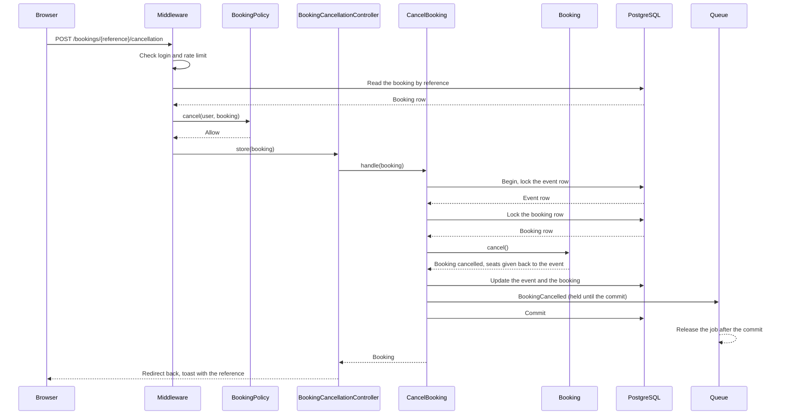
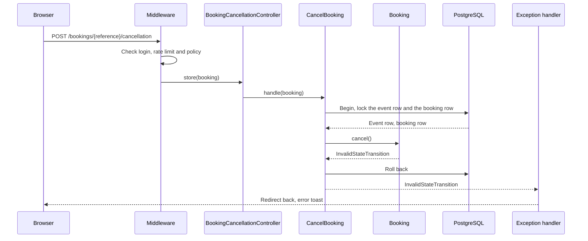
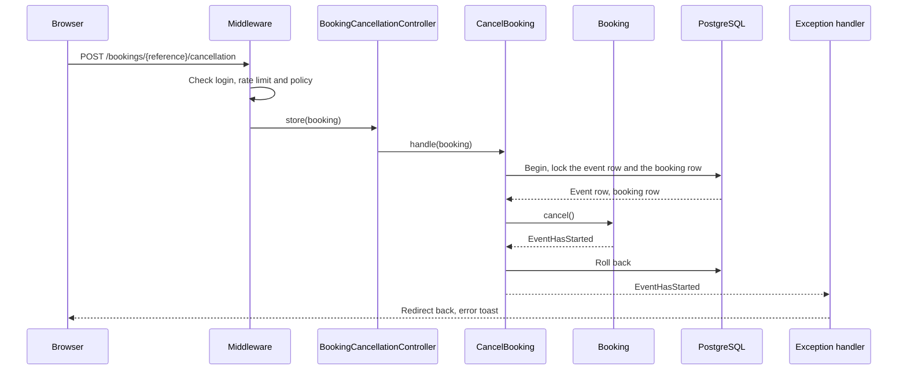
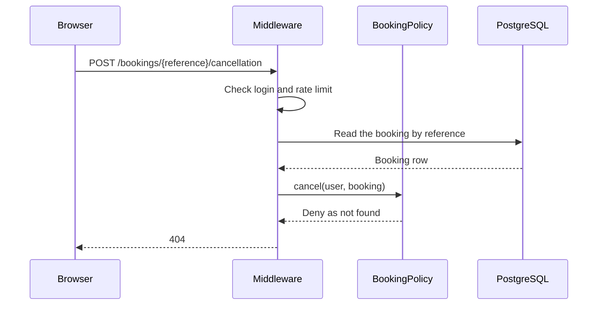
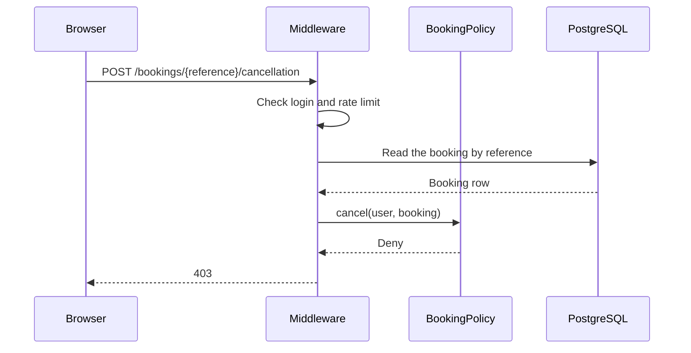

# CancelBooking

Cancels a booking of the user (`POST /bookings/{reference}/cancellation`). The
"Cancel" button is on the "My bookings" page and in the booking box on the event page.

The URL uses the booking reference, not the numeric ID (`{booking:reference}`). An
unknown reference gives 404.

Before the controller runs:

- The `auth` middleware sends visitors to the login page.
- The `bookings` rate limiter allows 10 requests each minute for each user. It is the
  same limiter as for `ReserveSeats`.
- The `cancel` ability of `BookingPolicy` checks that the user made the booking (BR-B9).
  A person who cannot see the booking gets 404, so that other bookings stay unknown.
  The organizer of the event can see the booking, but gets 403.

The Action starts a transaction. It locks the event row first and the booking row
second. `ReserveSeats` also locks the event row first, so the two Actions always lock
in the same order.

`Booking::cancel()` checks the rules on the locked rows, in this order:

1. The booking is confirmed (BR-B10, `BookingStatus::canTransitionTo()`). Otherwise:
   `InvalidStateTransition`.
2. The event has not started (BR-B10). Otherwise: `EventHasStarted`.

Then the model sets the status to `cancelled`, sets `cancelled_at`, and gives the seats
back to the event with `Event::releaseSeats()` (BR-B11). The available seats never go
above the capacity. The Action saves the event and the booking.

When the user sends the same request two times, the second request waits for the
lock. Then it reads a cancelled booking and stops with `InvalidStateTransition`. Thus,
the seats go back to the event only one time.

After the cancel, the user can book the same event again (BR-B12).

The controller redirects back to the page of the request (the fallback is "My
bookings"), with a toast that shows the reference. If the model throws an exception,
the transaction rolls back. The handler in `bootstrap/app.php` turns the exception into
a redirect back with an error toast.

After the saves, the Action sends the `BookingCancelled` notification to the attendee
(BR-N2). The notification is queued and marked "after commit", so the queue keeps the
job until the transaction commits. On a rollback, the queue drops the job and no email
goes out (BR-N6). The worker sends the email. It tries 3 times, with a wait of 10 and
then 60 seconds between the tries.

The queue puts the job on Redis right after the database commit. If Redis fails at that
moment, the booking is cancelled, but the request ends with an error and no email goes
out. The attendee then sees the cancelled booking on "My bookings". A full Redis outage
stops the request earlier, because sessions and rate limits also use Redis.

When an event is cancelled, `CancelEvent` cancels the bookings itself and does not use
this Action. Thus, those attendees get no `BookingCancelled` email. They get the
`EventCancelled` email.

## The booking is cancelled

## The booking is not confirmed

## The event has started

## The person cannot see the booking

## The organizer of the event tries to cancel

