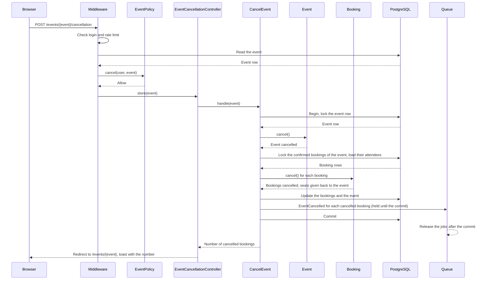
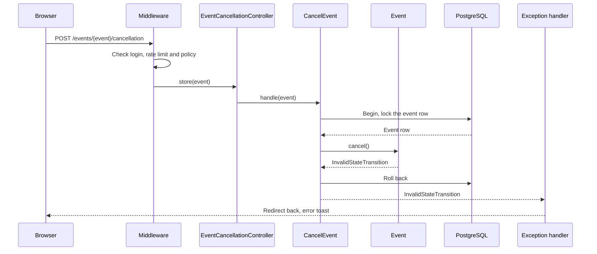
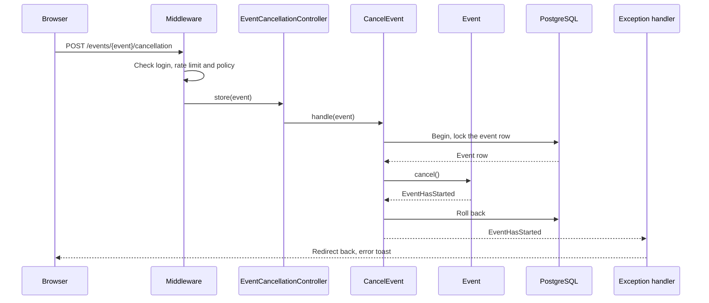
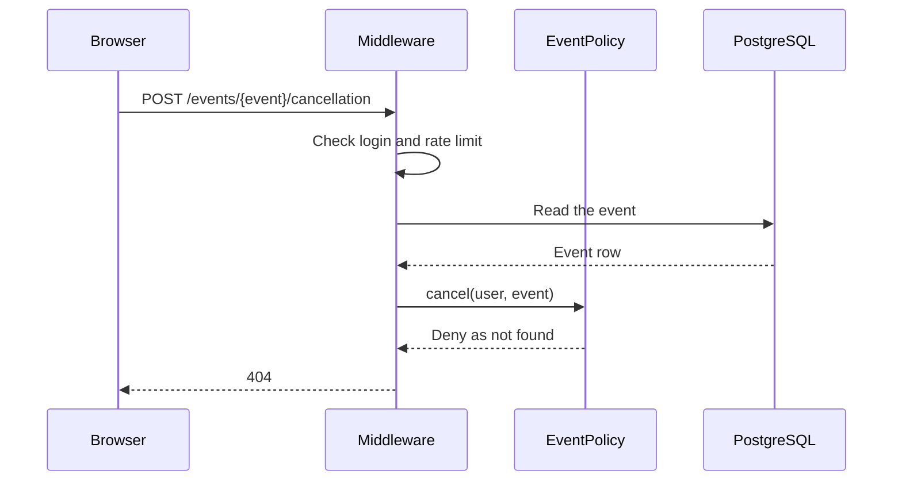
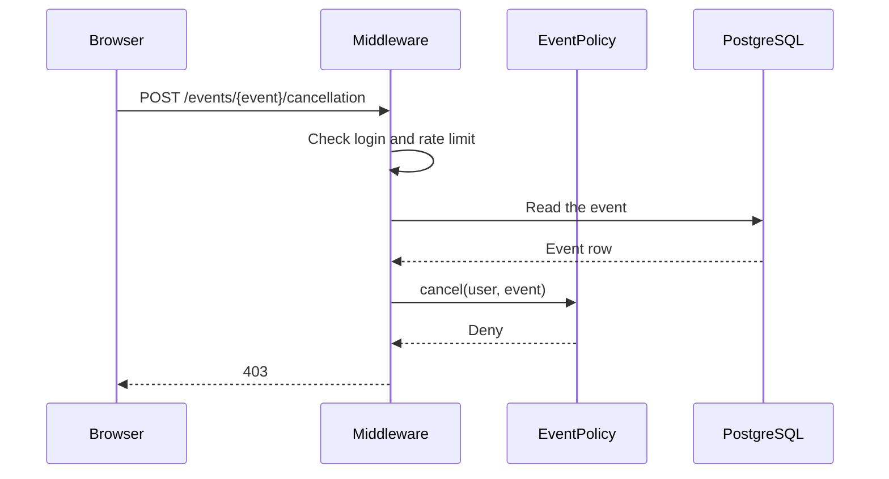

# CancelEvent

Cancels an event and all its confirmed bookings (`POST /events/{event}/cancellation`).
The "Cancel event" button is on the event page.

Before the controller runs:

- The `auth` middleware sends visitors to the login page.
- The `event-writes` rate limiter allows 20 requests each minute for each user. It is
  the same limiter as for the other changes to events.
- The `cancel` ability of `EventPolicy` checks the person. The organizer of the event
  and admins can cancel it (BR-E11, BR-A1). A person who cannot see the event gets 404,
  so that hidden events stay unknown. Other users get 403.

The Action starts a transaction. It locks the event row first, and then the confirmed
bookings of the event. `ReserveSeats` and `CancelBooking` also lock the event row
first, so all three Actions lock in the same order.

`Event::cancel()` checks the rules on the locked row, in this order (BR-E12):

1. The event is a draft or published (`EventStatus::canTransitionTo()`). Otherwise:
   `InvalidStateTransition`.
2. The event has not started. Otherwise: `EventHasStarted`.

Then the model sets the status to `cancelled` and sets `cancelled_at`.

The Action cancels each confirmed booking with `Booking::cancel()` (BR-E13). Each
booking gets the status `cancelled` and `cancelled_at`, and its seats go back to the
event (BR-B11). After the cancel, the available seats are equal to the capacity, so the
event shows 0 booked seats. Bookings that were cancelled before do not change. The
Action saves the bookings and the event, and returns the number of cancelled bookings.

A booking request for the same event at the same time waits for the lock on the event
row. Then it reads a cancelled event and stops with `EventNotBookable`.

The controller redirects to the event page with a toast that tells how many bookings
were cancelled. If the model throws an exception, the transaction rolls back. The
handler in `bootstrap/app.php` turns the exception into a redirect back with an error
toast.

On "My bookings", the bookings of a cancelled event show the badge "Event cancelled".

The Action loads the confirmed bookings together with their attendees. After the saves,
it sends the `EventCancelled` notification to the attendee of each booking that it
cancelled (BR-N3). Bookings that were cancelled before get no email. The attendees get
no `BookingCancelled` email. The notifications are queued and marked "after commit", so
the queue keeps the jobs until the transaction commits. On a rollback, the queue drops
the jobs and no email goes out (BR-N6). The worker sends the emails. It tries each email
3 times, with a wait of 10 and then 60 seconds between the tries.

The queue puts the jobs on Redis right after the database commit. If Redis fails at that
moment, the event is cancelled, but the request ends with an error and some or all
emails do not go out. A full Redis outage stops the request earlier, because sessions
and rate limits also use Redis.

## The event is cancelled

## The status does not allow the cancel

## The event has started

## The person cannot see the event

## The person is not the organizer or an admin

