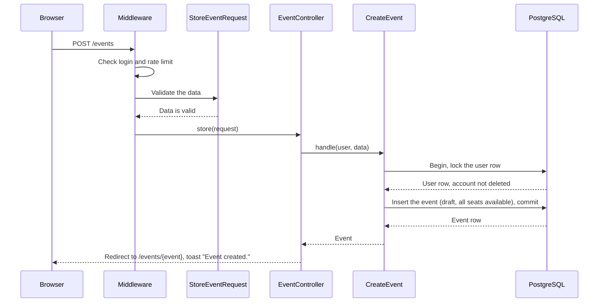
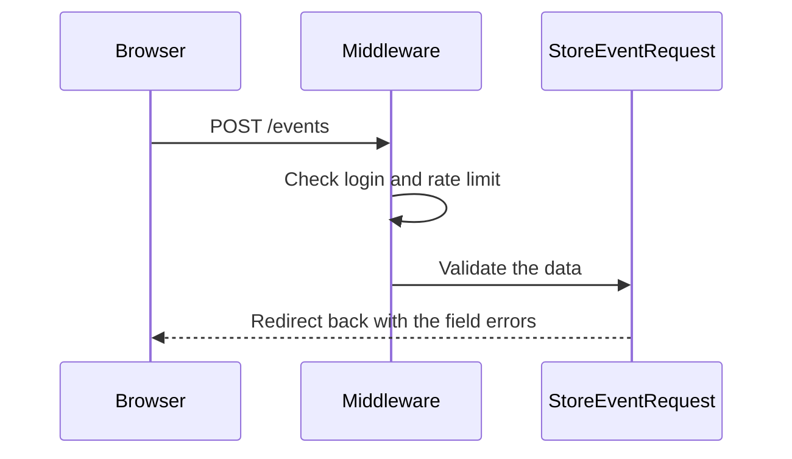
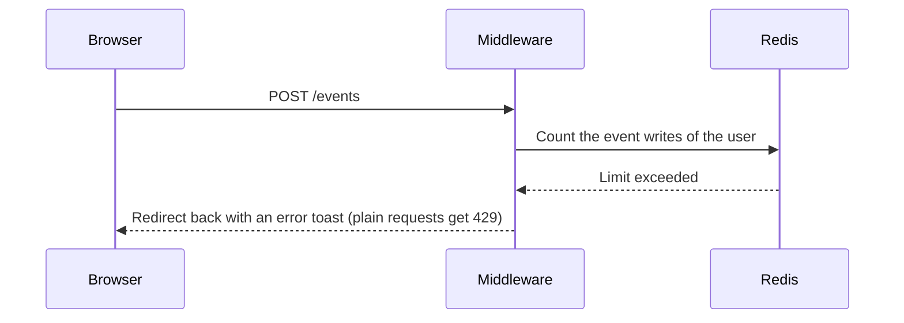

# CreateEvent

Creates a draft event for the logged-in user (`POST /events`). The user is the
organizer of the event (BR-E1). All seats are available.

Before the controller runs:

- The `auth` middleware sends visitors to the login page.
- The `event-writes` rate limiter allows 20 event writes each minute for each user.
- `StoreEventRequest` validates the data: the capacity is from 1 to 10,000 (BR-E2) and
  the start time is in the future (BR-E3).

The Action starts a transaction and locks the user row first. It refuses with
`AccountDeleted` when the user deleted the account (BR-U5). An account delete
(`DeleteAccount`) locks the same row, so a new event cannot slip in while the delete
runs.

The form sends the start time in UTC. The browser converts the local time of the
organizer before it sends the form.

## The event is created

## The data is not valid

## The user made too many event writes

