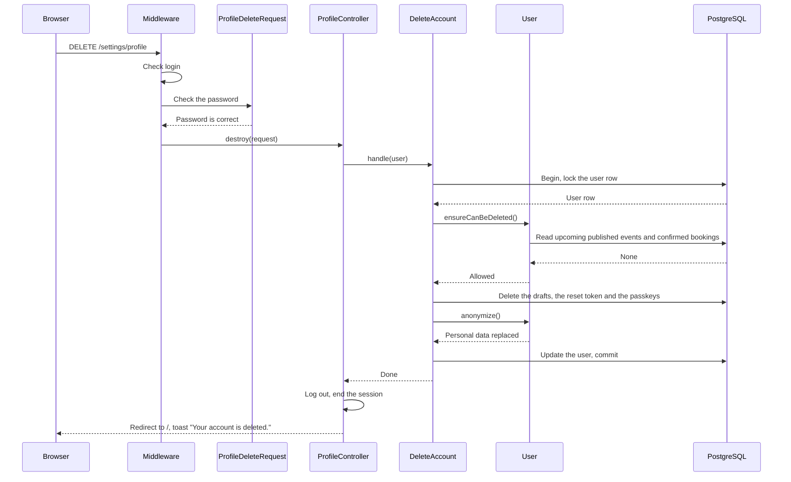
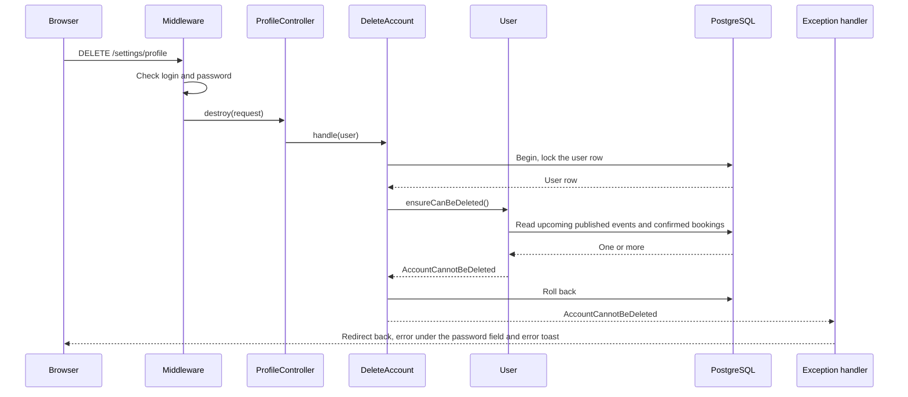
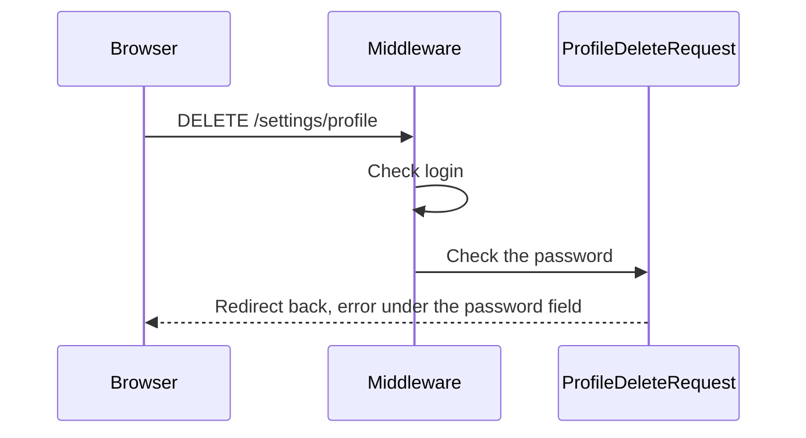

# DeleteAccount

Deletes the account of the logged-in user (`DELETE /settings/profile`). The "Delete
account" section is on the profile settings page. The system keeps the user row and
removes the personal data, so that events and bookings keep their history (BR-U4).

Before the controller runs:

- The `auth` middleware sends visitors to the login page.
- `ProfileDeleteRequest` checks the current password. A wrong password gives an error
  under the password field, and the Action does not run.

## What the Action does

The Action runs one transaction, in this order:

1. It locks the user row. `ReserveSeats`, `CreateEvent` and `PublishEvent` also lock the
   user row first. Thus, a booking, a new event or a publish cannot slip in while the
   delete runs. When the delete commits first, those requests read the anonymized user
   and refuse with `AccountDeleted`.
2. `User::ensureCanBeDeleted()` checks the rules:
    1. The user organizes no published event that has not started (BR-U1).
    2. The user has no confirmed booking for an event that has not started (BR-U2).
3. It deletes the draft events of the user (BR-U3). Drafts have no bookings.
4. It deletes the password reset token of the old email, if there is one.
5. It deletes the passkeys of the user.
6. `User::anonymize()` replaces the name with "Deleted user" and the email with
   `deleted-user-{id}@deleted.invalid`. It removes the password, the "remember me"
   token and the two-factor data, and sets `anonymized_at`. Then the Action saves the
   user.

What stays: cancelled events, events that have started, and all bookings. They show the
name "Deleted user". Nobody can register an email on the `deleted.invalid` domain, so the
placeholder email is always free.

The lock order is the user row first, then event rows. The Actions that lock only event
rows (`CancelBooking`, `CancelEvent`, `UpdateEvent`, `DeleteEvent`) never wait for a user
row, so the locks cannot wait for each other in a circle.

After the Action, the controller logs the user out, ends the session, and redirects to
the home page with the toast "Your account is deleted.".

If a rule blocks the delete, the model throws `AccountCannotBeDeleted` and the
transaction rolls back. Nothing changes. The handler in `bootstrap/app.php` redirects
back. The message shows under the password field in the open dialog and as an error
toast. The user stays logged in.

## After the delete

A deleted user cannot get back in (BR-U5):

- Password login fails: the password is empty, and the old email no longer exists.
- "Remember me" fails: the remember token is empty, so no cookie matches it.
- Passkey login fails: the Action deleted the passkeys.
- A session that is still open on another device ends at its next request. The
  middleware `LogOutDeletedUser` (web group) logs it out and redirects to the login page,
  with no message.
- A password reset finds no user for the old email. For the placeholder email, it sends
  nothing.
- The user gets no more email. `User::routeNotificationForMail()` returns no address for
  a deleted user, also for an email that was queued before the delete.

## The account is deleted

## The delete is blocked

## The password is wrong

