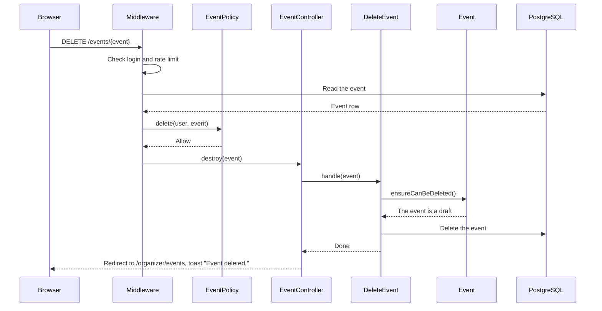
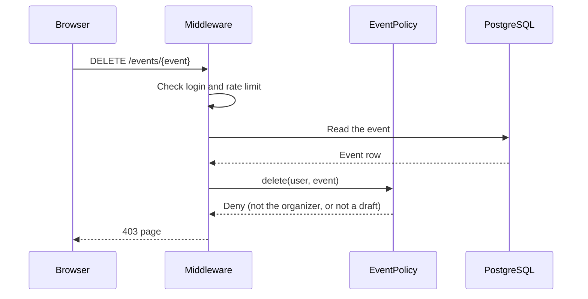
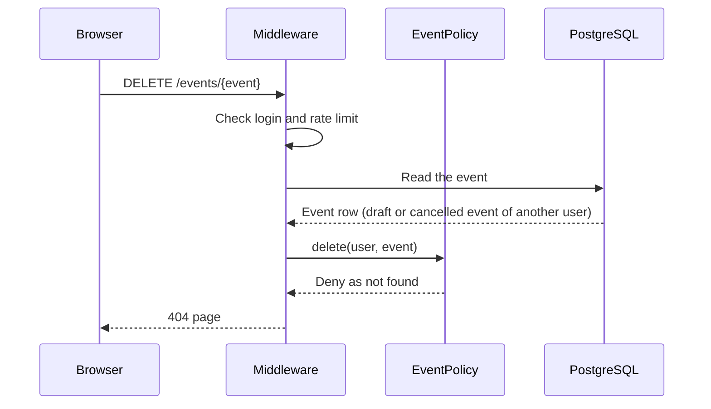
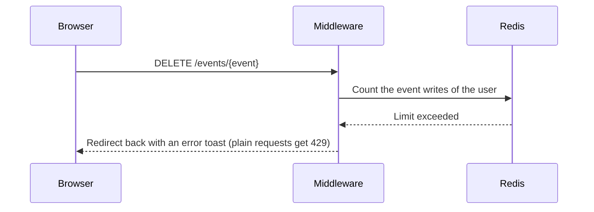

# DeleteEvent

Deletes a draft event (`DELETE /events/{event}`). After the delete, the user sees the
"My events" page.

Before the controller runs:

- The `auth` middleware sends visitors to the login page.
- The `event-writes` rate limiter allows 20 event writes each minute for each user.
- The `delete` ability of `EventPolicy` checks the person and the event. Only the
  organizer can delete the event, and only when it is a draft (BR-E17). A person who
  cannot see the event gets 404, so that hidden events stay unknown. Other refusals
  give 403.

The Action calls `Event::ensureCanBeDeleted()` before the delete. The policy already
refuses events that are not drafts, so this check is a last line of defense. If it
fails, the model throws `InvalidStateTransition`, and the handler in
`bootstrap/app.php` shows an error toast.

The Action makes one delete, with no transaction. A draft has no bookings, so no other
rows depend on it. The start time does not matter: a draft that has started can be
deleted.

## The event is deleted

## The person cannot delete the event

## The person cannot see the event

## The user made too many event writes

