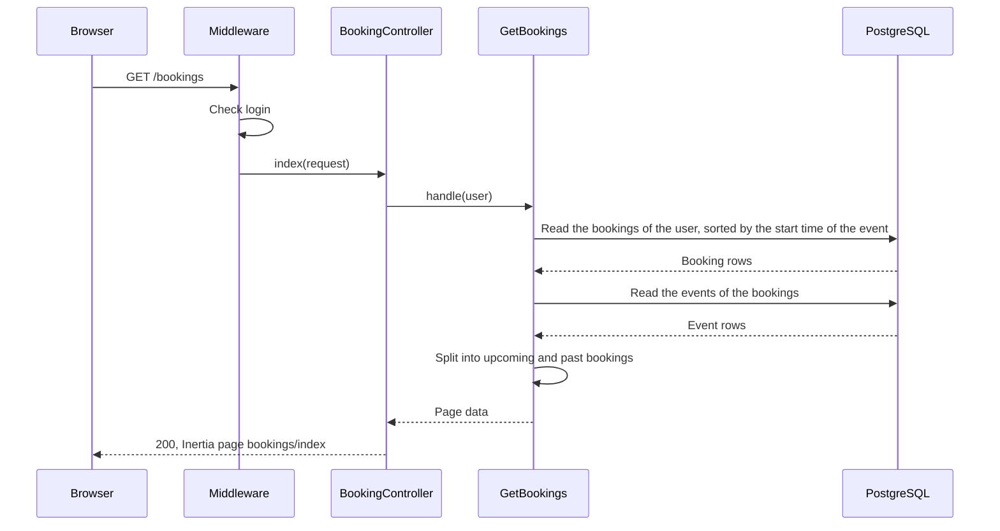
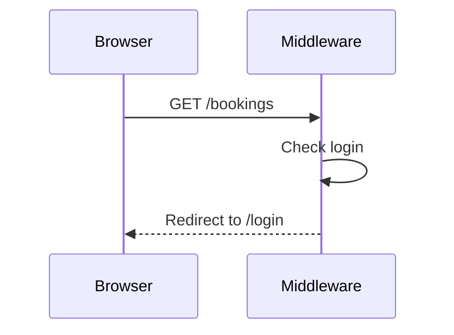

# GetBookings

Gets the bookings of the logged-in user for the "My bookings" page (`GET /bookings`).

The page shows only the bookings of the user, confirmed and cancelled. Admins and
organizers also see only their own bookings on this page. The organizer of an event sees
the attendees of the event on another page (`GetEventAttendees`).

The route has only the `auth` middleware. It needs no policy check, because the query
reads only the bookings with the `user_id` of the user (BR-B13).

The Action joins the `events` table to sort the bookings by the start time of the event,
and then by the booking ID. Then it loads the event of each booking and splits the
bookings:

- "Upcoming": the bookings of events that have not started, earliest event first.
- "Past": the bookings of events that have started, most recent event first. An event
  that starts now has started (`Event::hasStarted()`).

For each booking, the page shows the event title (a link to the event page), the start
time, the venue, the number of seats, the booking reference and the status.

## The bookings are shown

## The person is not logged in

