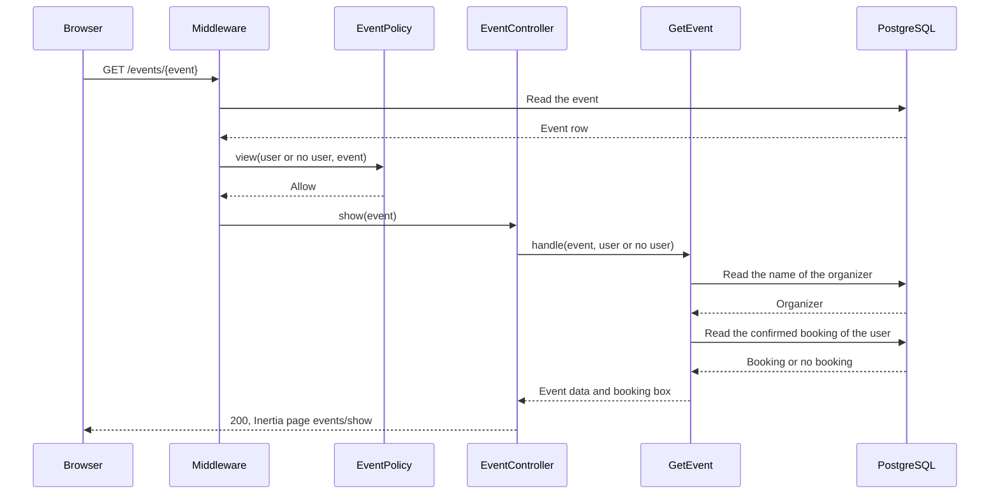
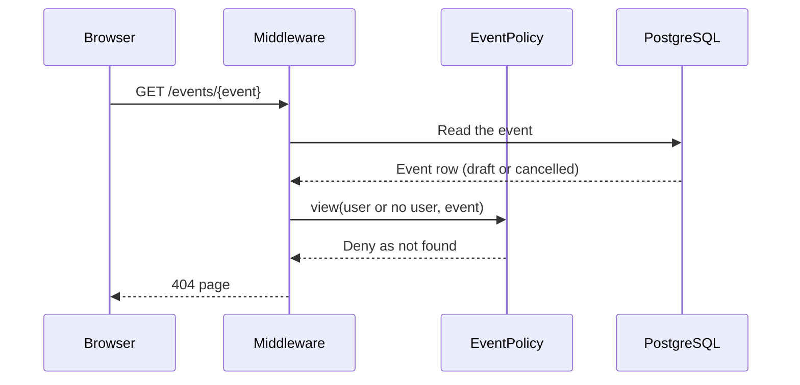
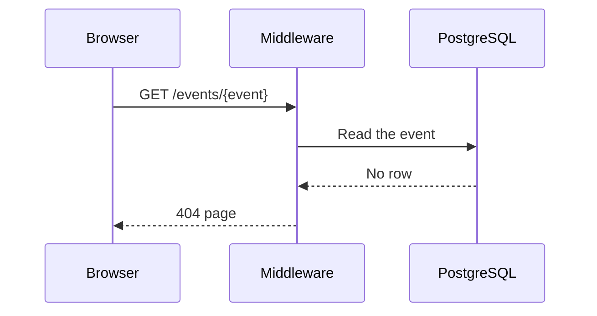

# GetEvent

Gets the data for the page of one event (`GET /events/{event}`).

The route checks the `view` ability of `EventPolicy` before the controller runs. A
person who cannot see the event gets a 404 response, the same as for an event that does
not exist. Thus, nobody can find hidden events by trying event IDs.

| Event status | Who can see it                                    | Rules         |
| ------------ | ------------------------------------------------- | ------------- |
| Published    | Everyone, also visitors                           | BR-E14        |
| Draft        | The organizer and admins                          | BR-E15, BR-A4 |
| Cancelled    | The organizer, admins and users who had a booking | BR-E16, BR-A4 |

The middleware step includes the route model binding: Laravel reads the event row from
PostgreSQL before the policy check.

## The booking box

The page also shows a booking box. What it shows depends on the person:

| State       | When                                                                     | Rules        |
| ----------- | ------------------------------------------------------------------------ | ------------ |
| `booked`    | The user has a confirmed booking. The box shows the seats and reference  | BR-B4        |
| `available` | The user can book now. The form allows at most 4 seats or the seats left | BR-B2, BR-B6 |
| `login`     | A visitor, and the event is bookable. The box shows a login link         | BR-B1        |
| `sold_out`  | The event is published, has not started and has no seats left            | BR-B2        |
| No box      | Drafts, cancelled and started events, and the organizer of the event     | BR-B2, BR-B3 |

The edit page uses the same Action with no user, and uses only the event data.

## The event is shown

## The person cannot see the event

## The event does not exist

The route accepts only numeric IDs. For an ID that is not a number, for example
`/events/abc`, the router gives the 404 page before it reads the database.

