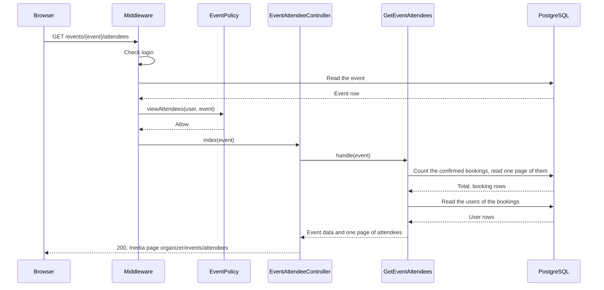
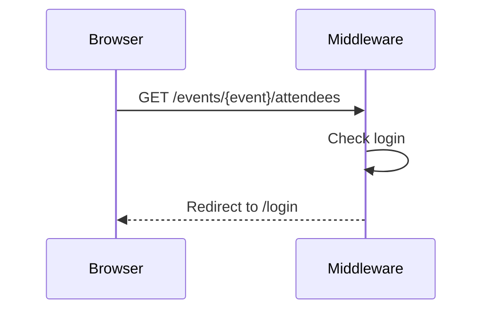
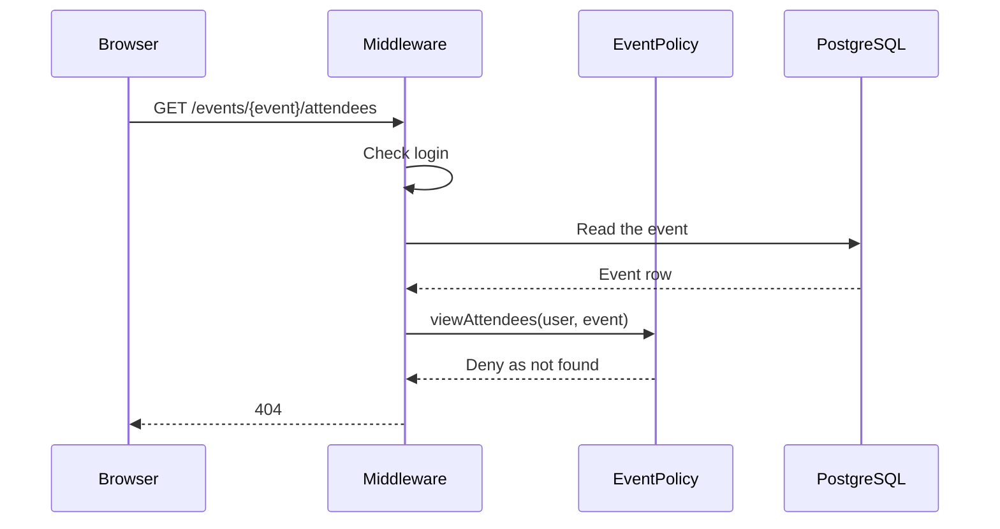
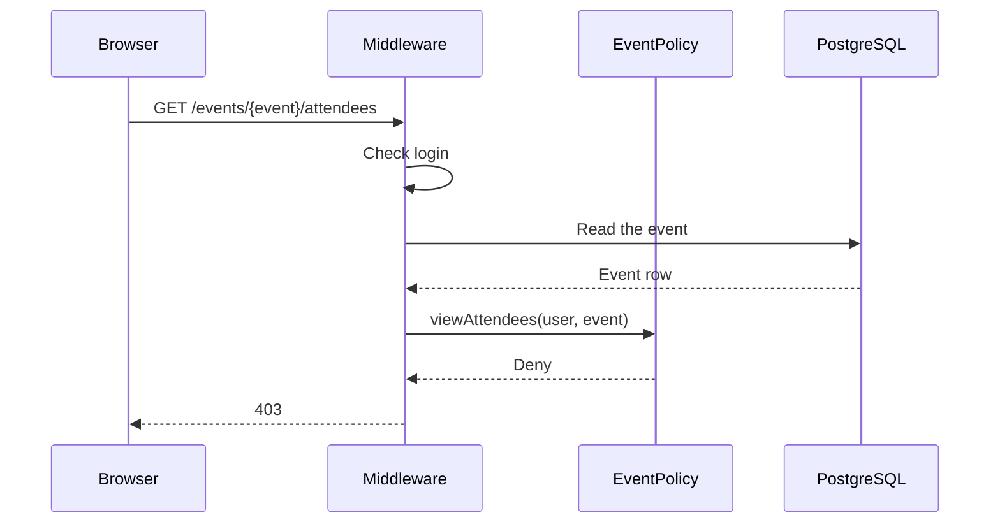

# GetEventAttendees

Gets the attendee list of one event (`GET /events/{event}/attendees`). The list shows
the people who hold seats for the event. The organizer of the event and admins can open
it (BR-A2).

Before the controller runs:

- The `auth` middleware sends visitors to the login page.
- The `viewAttendees` ability of `EventPolicy` checks the person. A person who cannot
  see the event gets 404, so that hidden events stay unknown. A person who can see the
  event, but is not the organizer or an admin, gets 403.

The Action reads only the confirmed bookings of the event, with the name and email of
each user. Cancelled bookings do not show. The first booking comes first (then the
booking ID). The list has 50 rows on each page; the page number comes from the `page`
query parameter.

The page shows a summary line: the number of attendees (all pages, not only the current
page) and the booked seats of the event (capacity − available seats). For each booking,
the table shows the name, the email, the seats, the reference and the time of the
booking. An event with no confirmed bookings shows "No attendees yet."

The event page ("Attendees" button, `can.viewAttendees`) and each row of "My events"
link to this page.

## The attendees are shown

## The person is not logged in

## The person cannot see the event

## The person is not the organizer or an admin

