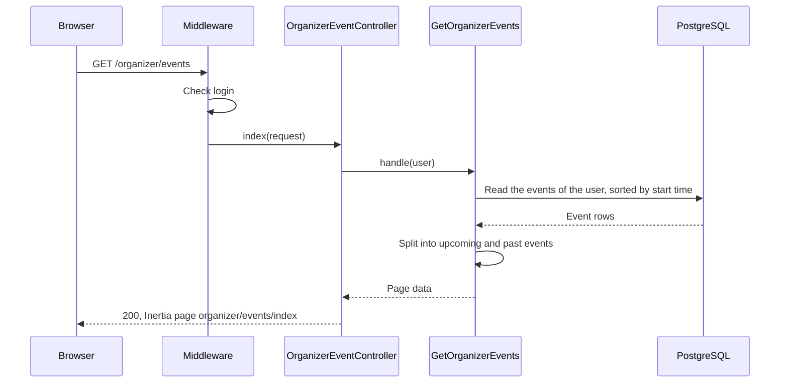
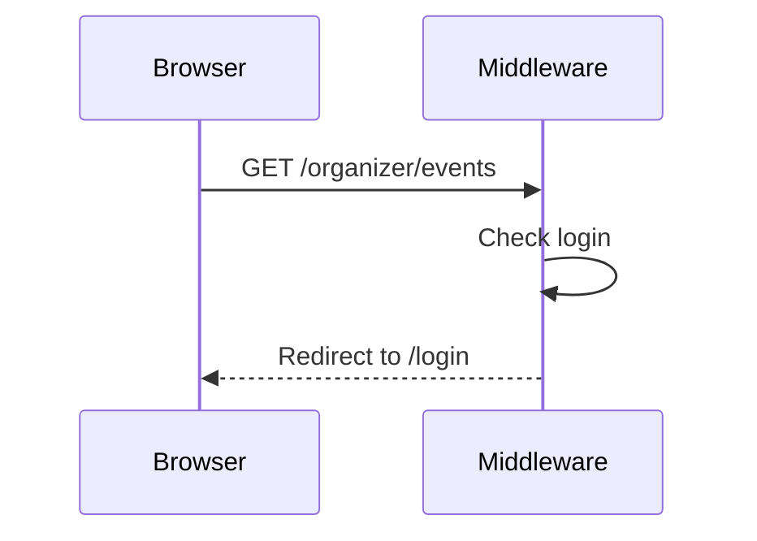

# GetOrganizerEvents

Gets the events of the logged-in user for the "My events" page
(`GET /organizer/events`).

The page shows only the events of the user, with all statuses. Admins also see only
their own events on this page.

The Action reads the events with one query, sorted by start time. Then it splits them:

- "Upcoming": the events that have not started, earliest first.
- "Past": the events that have started, most recent first. An event that starts now
  has started.

For each event, the page shows the title, the status, the start time and the booked
seats (capacity − available seats).

## The events are shown

## The person is not logged in

