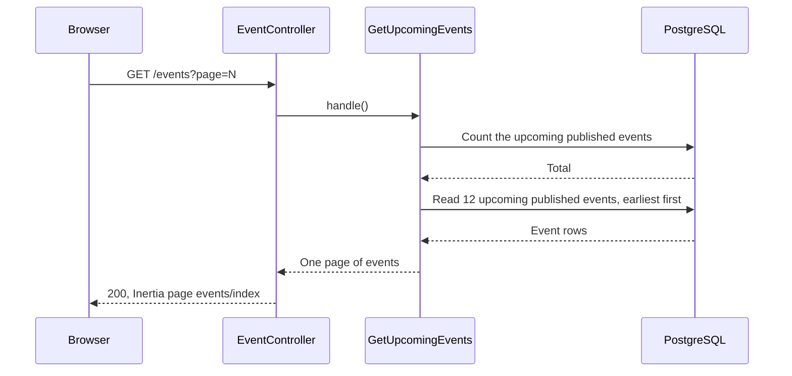
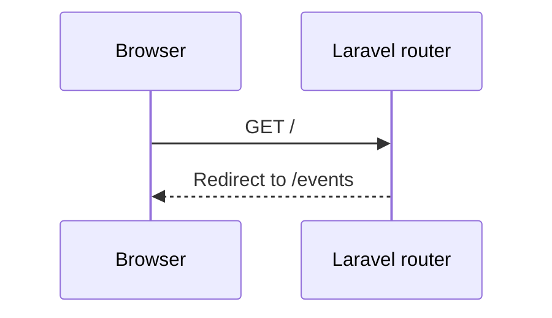

# GetUpcomingEvents

Gets one page of the upcoming published events for the public list
(`GET /events`). The home page `/` redirects to this list.

Everyone can see the list, also visitors (BR-E14). It shows only published events that
have not started. Drafts (BR-E15), cancelled events (BR-E16) and started events are not
in the list. An event that starts now has started.

The Action uses the model scopes `published()` and `upcoming()`, so that the index
`events(status, starts_at)` can serve the query. It sorts by start time, earliest
first, and then by ID. Each page has 12 events. The page number comes from the `page`
query parameter (`/events?page=2`).

A sold-out event stays in the list. The page shows "Sold out" for it.

## The list is shown

## The home page

