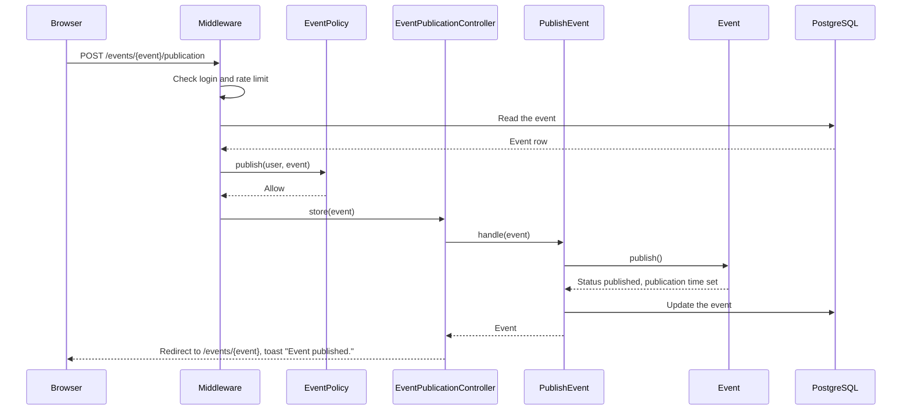
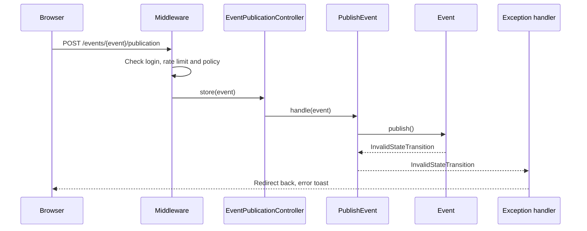
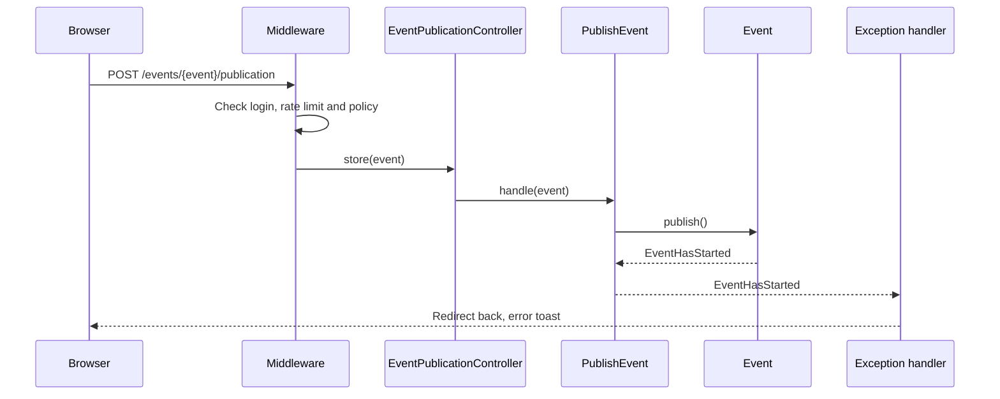
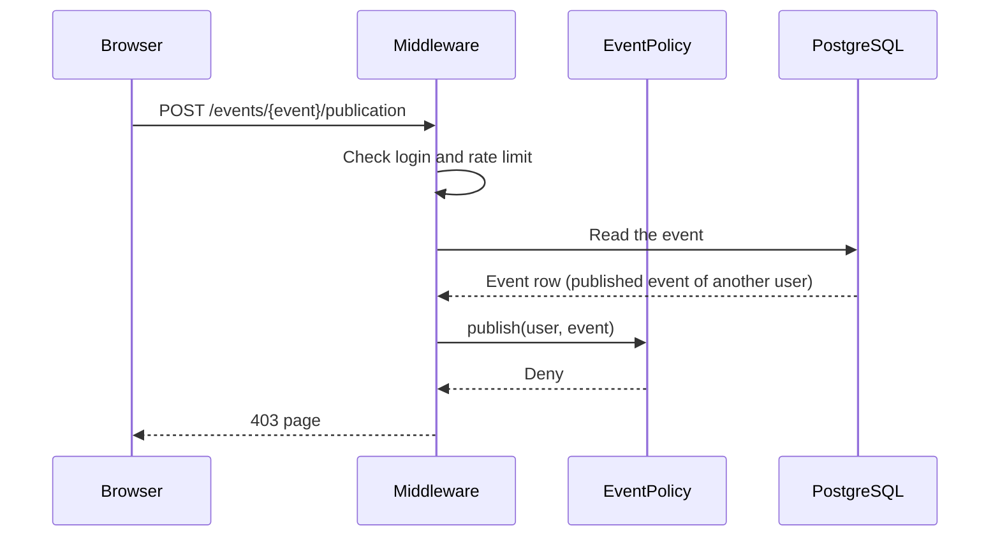
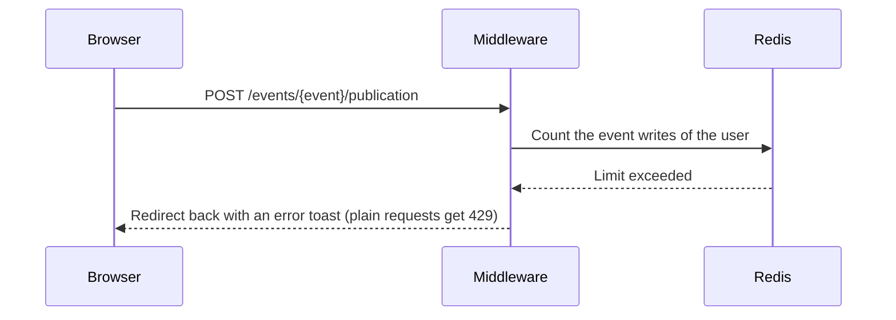

# PublishEvent

Publishes a draft event (`POST /events/{event}/publication`). After this, everyone can
see the event (BR-E14).

Before the controller runs:

- The `auth` middleware sends visitors to the login page.
- The `event-writes` rate limiter allows 20 event writes each minute for each user.
- The `publish` ability of `EventPolicy` checks the person. Only the organizer can
  publish the event (BR-E9, BR-A3). A person who cannot see the event gets 404, so that
  hidden events stay unknown. Other refusals give 403.

`Event::publish()` checks the event (BR-E10). The event must be a draft
(`EventStatus::canTransitionTo()`), and its start time must be in the future.
Otherwise the model throws `InvalidStateTransition` or `EventHasStarted`. The handler
in `bootstrap/app.php` turns them into a redirect back with an error toast.

The Action makes one update, with no transaction. If two publish requests come at the
same time, both set the same status.

## The event is published

## The event is not a draft

## The event has started

## The person is not the organizer

## The person cannot see the event

## The user made too many event writes

