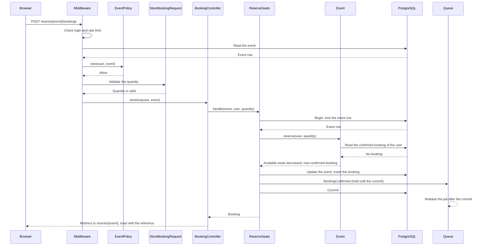
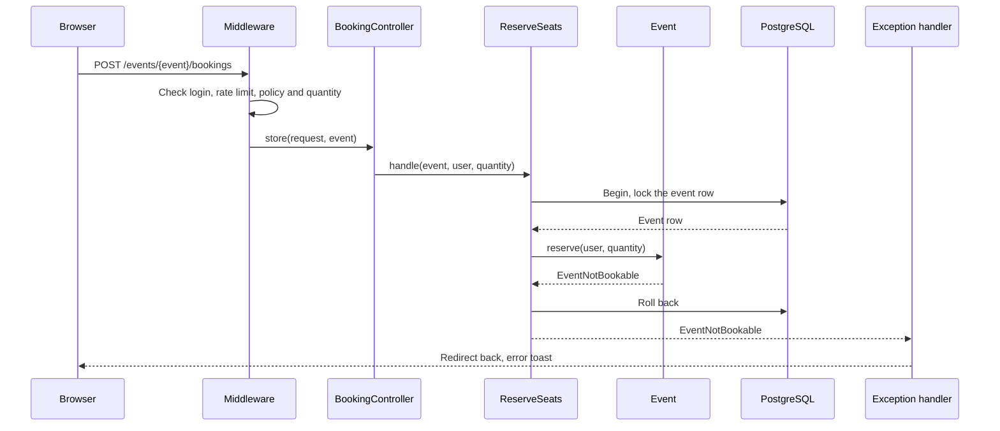
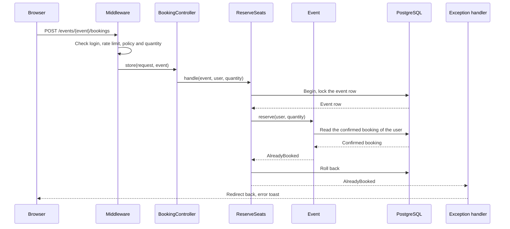

# ReserveSeats

Books seats of an event for the user (`POST /events/{event}/bookings`). The form is on
the event page.

Before the controller runs:

- The `auth` middleware sends visitors to the login page (BR-B1).
- The `bookings` rate limiter allows 10 booking requests each minute for each user.
- The `view` ability of `EventPolicy` checks that the user can see the event. A user
  who cannot see the event gets 404, so that hidden events stay unknown.
- `StoreBookingRequest` validates the quantity: an integer from 1 to 4 (BR-B5).

The Action starts a transaction and locks the event row. Parallel requests for the same
event wait for the lock, one after the other. Thus, two users never get the same last
seat (BR-B14), and two requests of the same user cannot make two bookings (BR-B4).

`Event::reserve()` checks the rules on the locked row, in this order:

1. The event is published (BR-B2). Otherwise: `EventNotBookable`.
2. The event has not started (BR-B2). Otherwise: `EventNotBookable`.
3. The user is not the organizer (BR-B3). Otherwise: `EventNotBookable`.
4. The user has no confirmed booking for the event (BR-B4). Otherwise: `AlreadyBooked`.
   A cancelled booking does not count (BR-B12).
5. The quantity is not more than the available seats (BR-B2, BR-B6). Otherwise:
   `NotEnoughSeats`.

Then the model decreases the available seats (BR-B7) and gives a new confirmed booking.
The Action saves the event and the booking. On insert, the model gives the booking a
unique ULID reference (BR-B8). If the model throws an exception, the transaction rolls back. The
handler in `bootstrap/app.php` turns the exception into a redirect back with an error
toast. For `NotEnoughSeats`, the error also shows under the "Seats" field.

After the saves, the Action sends the `BookingConfirmed` notification to the attendee
(BR-N1). The notification is queued and marked "after commit", so the queue keeps the
job until the transaction commits. On a rollback, the queue drops the job and no email
goes out (BR-N6). The worker sends the email. It tries 3 times, with a wait of 10 and
then 60 seconds between the tries.

## The seats are booked

## The event cannot be booked

## The user already has a booking

## Not enough seats

