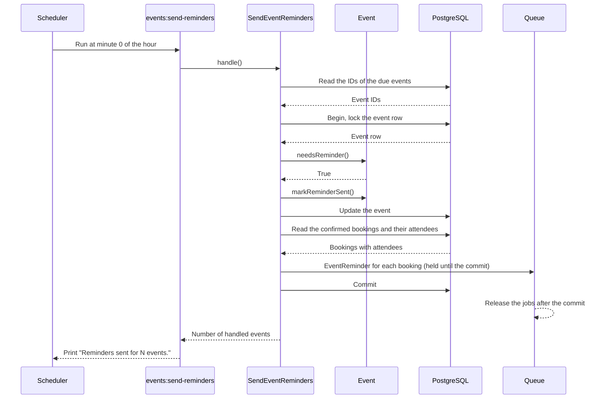
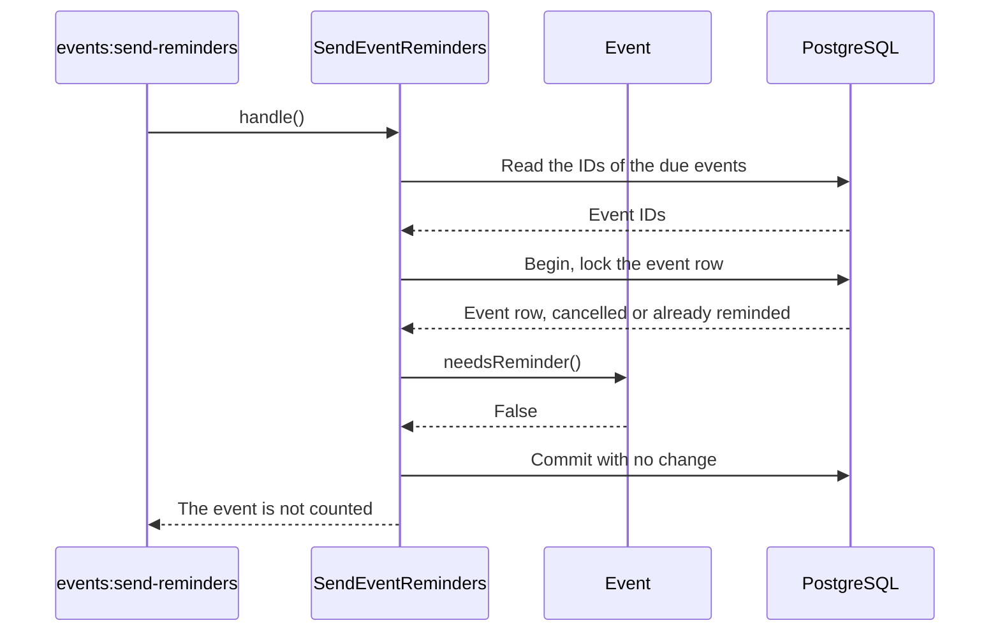
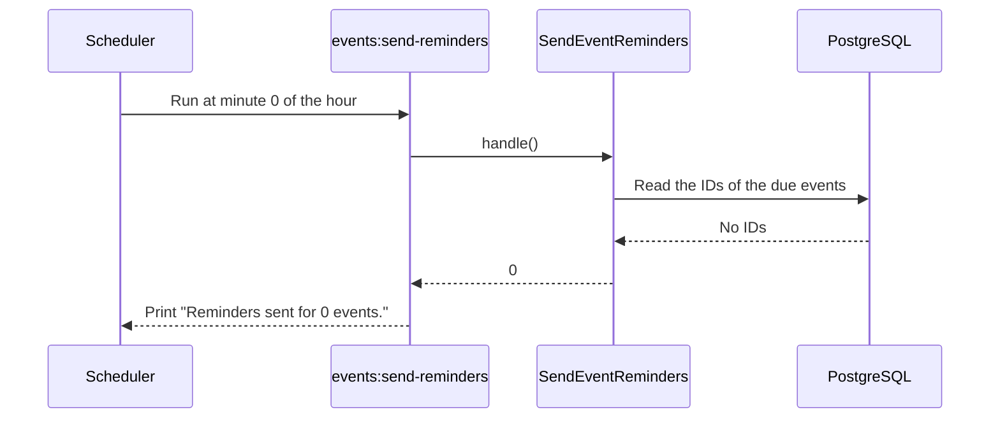

# SendEventReminders

Sends a reminder email to the attendees of the events that start in the next 24 hours
(BR-N4). The reminder for an event goes out only one time (BR-N5).

## When it runs

The `scheduler` service runs `php artisan schedule:work`. The schedule in
`routes/console.php` starts the command `events:send-reminders` each hour, at minute 0.
`withoutOverlapping(60)` makes sure that two runs never go at the same time. Its lock
ends after 60 minutes at the latest, so a run that was killed cannot block the next
runs for longer. The command
calls the Action and prints the number of events, for example "Reminders sent for 2
events.". You can also start the command by hand.

Each run looks 24 hours ahead, and the command runs each hour. Thus, the reminder
arrives about 23 to 24 hours before the event starts. An event that is published less
than 24 hours before its start gets the reminder at the next run, within one hour.

## Which events get a reminder

An event is due when all of these are true:

1. The status is `published`. Drafts and cancelled events get no reminder.
2. The event has not started.
3. The event starts in the next 24 hours, or exactly 24 hours from now.
4. `reminder_sent_at` is empty.

The scope `Event::dueForReminder()` finds these events, and `Event::needsReminder()`
does the same checks for one event.

## What the Action does

The Action reads the IDs of the due events, the first start time first. Then it handles
each event in its own transaction, so that an error on one event does not undo the
others. For each event:

1. It locks the event row. `ReserveSeats`, `CancelBooking` and `CancelEvent` also lock
   the event row first. Thus, the bookings of the event cannot change while the Action
   holds the lock.
2. It calls `needsReminder()` again on the locked row. Between the first query and the
   lock, the event can change: another run can send the reminder first, or the
   organizer can cancel the event. In that case, the Action stops for this event and
   sends no email.
3. It calls `Event::markReminderSent()`, which sets `reminder_sent_at` (BR-N5), and saves
   the event.
4. It reads the confirmed bookings of the event together with their attendees, and sends
   the `EventReminder` notification to the attendee of each booking. Cancelled bookings
   get no email. The organizer gets no email.

A due event with no confirmed bookings is also marked. Thus, each due event is handled
one time, and the next run does not read it again.

The notifications are queued and marked "after commit", so the queue keeps the jobs
until the transaction commits. On a rollback, the queue drops the jobs and no email goes
out (BR-N6). The worker sends the emails. It tries each email 3 times, with a wait of 10
and then 60 seconds between the tries.

If an event causes an error, `rescue()` reports the error to the log, and the run goes
on with the next event. Without this, one event that always fails would stop the
reminders of all later events on each run. The event with the error keeps an empty
`reminder_sent_at`, so the next run tries it again while it is due.

The queue puts the jobs on Redis right after the database commit. If Redis fails at that
moment, the event is marked, but some or all emails do not go out. A full Redis outage
stops the run earlier.

When the organizer changes the start time after the reminder, the attendees get no
second reminder (BR-N5) and no other email (BR-N7). `UpdateEvent` does not change
`reminder_sent_at`.

## The reminders are sent

## The event changed after the query

## No event is due

