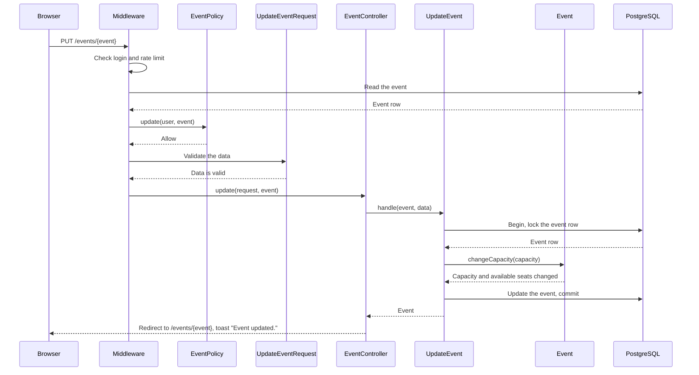
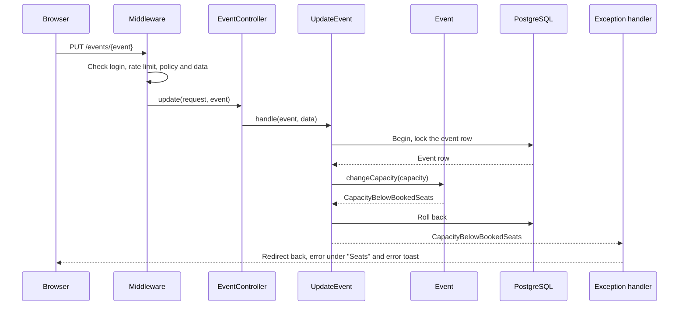
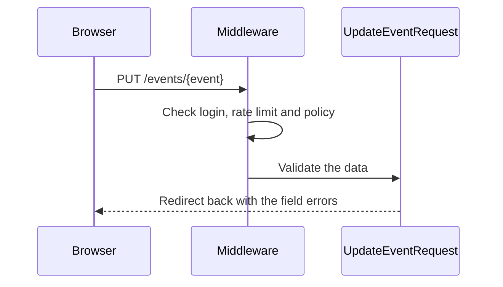
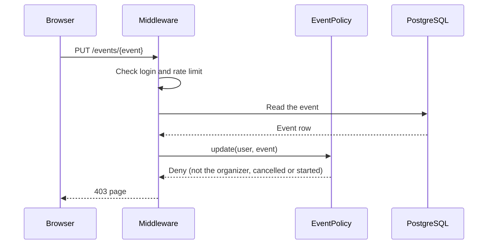
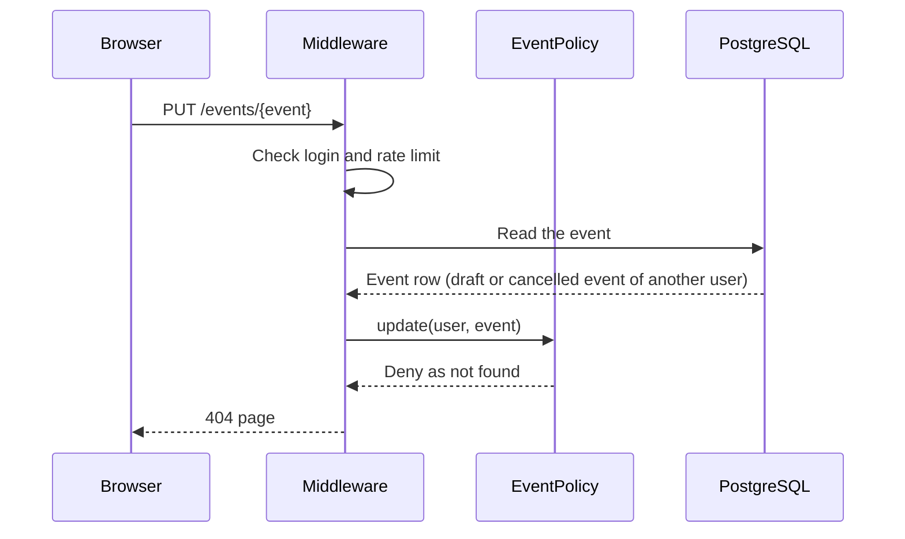
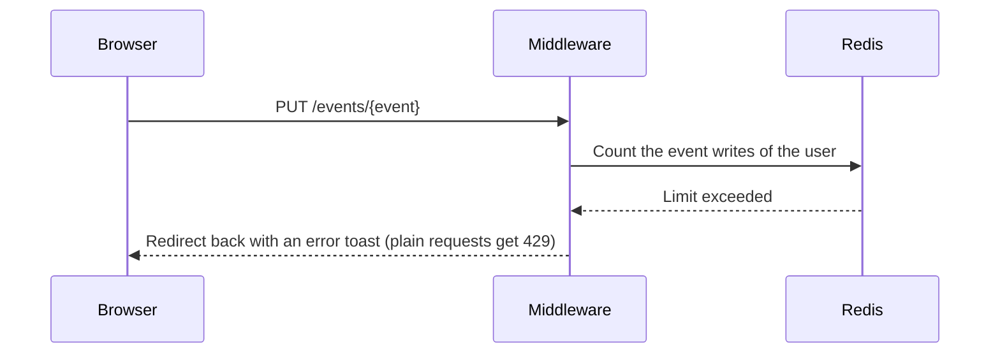

# UpdateEvent

Updates an event (`PUT /events/{event}`). The edit page is `GET /events/{event}/edit`.

Before the controller runs:

- The `auth` middleware sends visitors to the login page.
- The `event-writes` rate limiter allows 20 event writes each minute for each user.
- The `update` ability of `EventPolicy` checks the person and the event. Only the
  organizer can edit the event (BR-E4, BR-A3), and only when the event is not cancelled
  and has not started (BR-E5). A person who cannot see the event gets 404, so that
  hidden events stay unknown. Other refusals give 403.
- `UpdateEventRequest` validates the data with the same rules as the create form:
  the capacity is from 1 to 10,000 (BR-E2) and the start time is in the future (BR-E3).

The Action locks the event row in a transaction. `Event::changeCapacity()` changes the
available seats by the same number as the capacity (BR-E7, BR-E8). The new capacity
must not be less than the booked seats (BR-E6). Otherwise the model throws
`CapacityBelowBookedSeats`, and the transaction rolls back. The status of the event
does not change.

The handler in `bootstrap/app.php` turns each domain exception into a redirect back,
with an error toast and an error under the field. A JSON request gets 422 with the
message.

## The event is updated

## The capacity is less than the booked seats

## The data is not valid

## The person cannot edit the event

## The person cannot see the event

## The user made too many event writes

