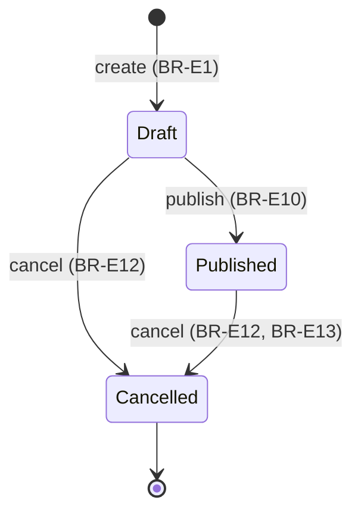
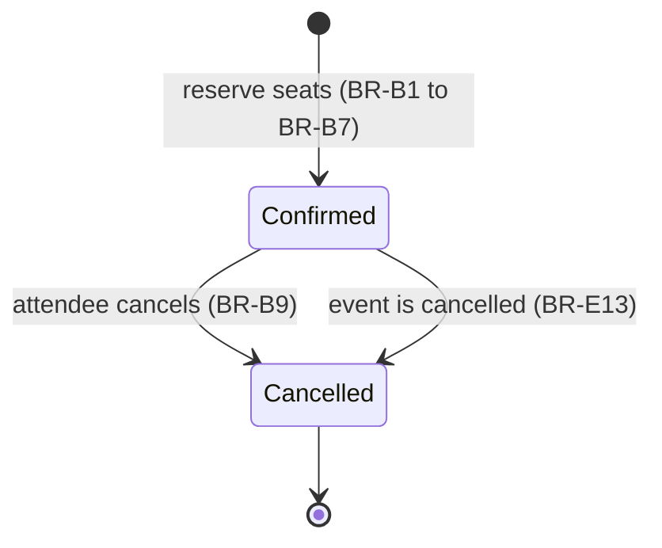

# Business Rules

This document gives the business rules of version 1. Each rule has an ID. The
sequence diagrams and the tests refer to these IDs.

The column "Enforced by" tells which part of the code makes the rule true:

- **Model**: a method on `Event` or `Booking`, or an enum. It throws a domain exception.
- **Policy**: `EventPolicy` or `BookingPolicy`. It gives a 403 response.
- **Request**: a FormRequest. It gives a validation error.
- **Database**: a constraint or an index. It is the last line of defense.

## Events

| ID | Rule | Enforced by |
|---|---|---|
| BR-E1 | A user can create an event. The new event is a draft. The user is the organizer of the event. | Action |
| BR-E2 | The capacity of an event must be 1 or more. | Request, Database |
| BR-E3 | The start time of a new event must be in the future. | Request |
| BR-E4 | Only the organizer can edit an event. | Policy |
| BR-E5 | Nobody can edit a cancelled event. | Policy |
| BR-E6 | The organizer can decrease the capacity. The new capacity must not be less than the booked seats. | Model |
| BR-E7 | When the capacity changes, the available seats change by the same number. | Model |
| BR-E8 | The available seats must be 0 or more, and not more than the capacity. | Model, Database |
| BR-E9 | Only the organizer can publish an event. | Policy |
| BR-E10 | The organizer can publish an event only when it is a draft and its start time is in the future. | Model |
| BR-E11 | The organizer or an admin can cancel an event. | Policy |
| BR-E12 | A user can cancel only a draft or a published event. | Model |
| BR-E13 | When a user cancels an event, the system cancels all its confirmed bookings. Each attendee gets a notification. | Action |
| BR-E14 | A published event is visible to all users. A draft or cancelled event is visible only to its organizer. | Policy |

## Bookings

| ID | Rule | Enforced by |
|---|---|---|
| BR-B1 | A user can book seats only for a bookable event (published, not started, with available seats). | Model |
| BR-B2 | The organizer cannot book seats for their own event. | Model |
| BR-B3 | A user can have only one confirmed booking for each event. | Model, Database |
| BR-B4 | The quantity of a booking must be from 1 to 4. | Request, Database |
| BR-B5 | The quantity must not be more than the available seats. | Model |
| BR-B6 | When a user books seats, the available seats decrease by the quantity. The booking is confirmed immediately. | Model |
| BR-B7 | Each booking gets a unique booking reference. | Model, Database |
| BR-B8 | Only the attendee can cancel their booking. | Policy |
| BR-B9 | The attendee can cancel a booking only when it is confirmed and the event has not started. | Model |
| BR-B10 | When a booking is cancelled, the available seats increase by the quantity. | Model |
| BR-B11 | After a user cancels a booking, the user can book the same event again. | Model, Database |
| BR-B12 | A booking is visible to the attendee and to the organizer of the event. | Policy |
| BR-B13 | Two users cannot book the same last seat. Only one booking succeeds. | Action (row lock), Database |

## Admins

| ID | Rule | Enforced by |
|---|---|---|
| BR-A1 | An admin can cancel any event (see BR-E11). | Policy |
| BR-A2 | An admin can see the attendee list of any event. | Policy |
| BR-A3 | An admin cannot edit or publish events of other users. | Policy |

## Notifications

| ID | Rule | Enforced by |
|---|---|---|
| BR-N1 | When a booking is confirmed, the attendee gets a "booking confirmed" email. | Action |
| BR-N2 | When an attendee cancels a booking, the attendee gets a "booking cancelled" email. | Action |
| BR-N3 | When an event is cancelled, each attendee with a confirmed booking gets an "event cancelled" email. | Action |
| BR-N4 | Each day, attendees of events that start in the next 24 hours get a reminder email. | Scheduled command |
| BR-N5 | The system sends a notification only after the database commits the transaction. If the transaction fails, the system sends no email. | Action |

## State diagrams

### Event status

### Booking status

## Open questions

The spec does not answer these questions. Each question has a recommendation.
The owner decides.

| # | Question | Recommendation |
|---|---|---|
| Q1 | Can a visitor see the list of events and the event page? | Yes. Booking requires a login. A public list is better for a demo. |
| Q2 | Can the organizer edit or cancel an event after it starts? | No. After the start time, the event is read-only. |
| Q3 | When an event is cancelled, can its attendees still see the event page? | Yes. Attendees with a booking can see the event, so that they can see the cancellation. This changes BR-E14. |
| Q4 | Can the organizer change the start time of a published event? | Yes, but only to a time in the future. Attendees get no notification in v1. |
| Q5 | Does the system need a "past" status for events that already happened? | No. "Started" is calculated from the start time. A new status adds no value. |
| Q6 | Can the reminder be sent two times for the same event? | No. Store `reminder_sent_at` on the event, and send only when it is empty. |
| Q7 | Can an admin see drafts of other users? | Yes, so that the admin can moderate. This changes BR-E14. |
