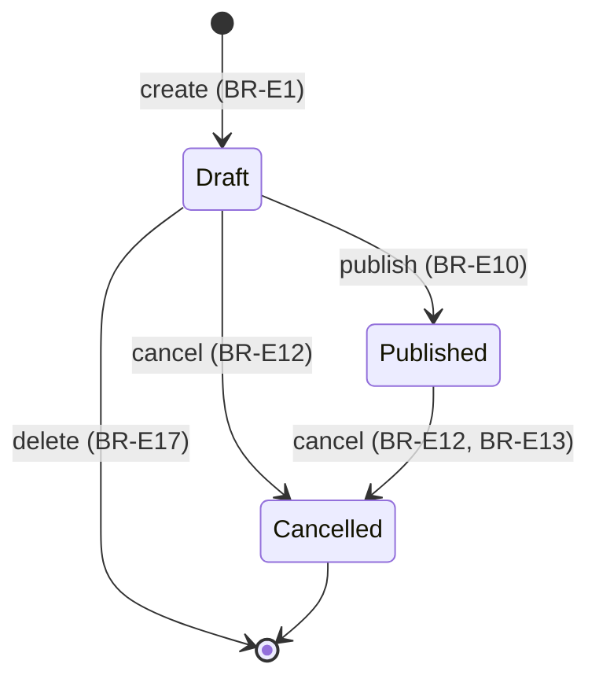
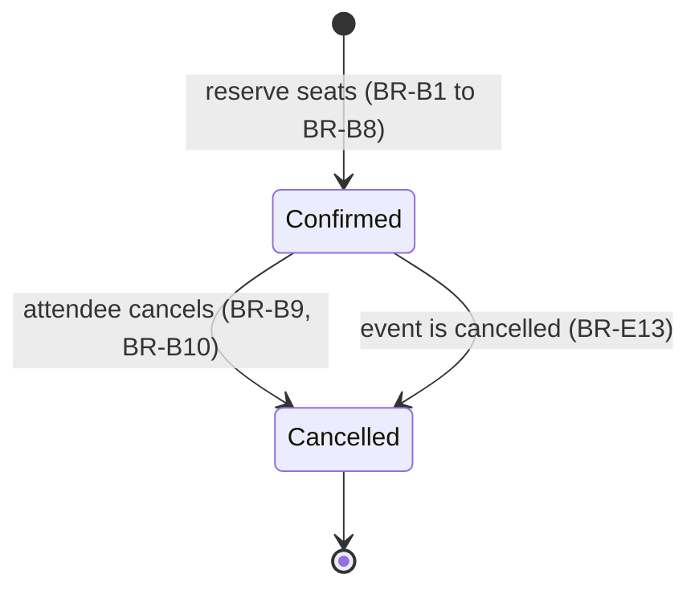

# Business Rules

This document gives the business rules of version 1. Each rule has an ID. The
sequence diagrams and the tests refer to these IDs.

The column "Enforced by" tells which part of the code makes the rule true:

- **Model**: a method on `Event` or `Booking`, or an enum. It throws a domain exception.
- **Policy**: `EventPolicy` or `BookingPolicy`. It gives a 403 response.
- **Request**: a FormRequest. It gives a validation error.
- **Middleware**: a route middleware, for example `auth`. It sends the visitor to the login page.
- **Database**: a constraint or an index. It is the last line of defense.

## Events

| ID | Rule | Enforced by |
|---|---|---|
| BR-E1 | A user can create an event. The new event is a draft. The user is the organizer of the event. | Action |
| BR-E2 | The capacity of an event must be 1 or more. | Request, Database |
| BR-E3 | When the organizer sets the start time (at create or at edit), the start time must be in the future. | Request |
| BR-E4 | Only the organizer can edit an event. | Policy |
| BR-E5 | Nobody can edit a cancelled event or a started event. | Policy |
| BR-E6 | The organizer can decrease the capacity. The new capacity must not be less than the booked seats. | Model |
| BR-E7 | When the capacity changes, the available seats change by the same number. | Model |
| BR-E8 | The available seats must be 0 or more, and not more than the capacity. | Model, Database |
| BR-E9 | Only the organizer can publish an event. | Policy |
| BR-E10 | The organizer can publish an event only when it is a draft and its start time is in the future. | Model |
| BR-E11 | The organizer or an admin can cancel an event. | Policy |
| BR-E12 | A user can cancel only a draft or a published event, and only before the event starts. | Model |
| BR-E13 | When a user cancels an event, the system cancels all its confirmed bookings. Each attendee gets a notification. | Action |
| BR-E14 | A published event is visible to everyone, also to visitors. | Policy |
| BR-E15 | A draft event is visible only to its organizer and to admins. | Policy |
| BR-E16 | A cancelled event is visible to its organizer, to admins and to users who had a booking for the event. | Policy |
| BR-E17 | The organizer can delete a draft event. Nobody can delete a published or cancelled event. | Policy, Model |

## Bookings

| ID | Rule | Enforced by |
|---|---|---|
| BR-B1 | A visitor cannot book seats. The visitor must log in first. | Middleware |
| BR-B2 | A user can book seats only for a bookable event (published, not started, with available seats). | Model |
| BR-B3 | The organizer cannot book seats for their own event. | Model |
| BR-B4 | A user can have only one confirmed booking for each event. | Model, Database |
| BR-B5 | The quantity of a booking must be from 1 to 4. | Request, Database |
| BR-B6 | The quantity must not be more than the available seats. | Model |
| BR-B7 | When a user books seats, the available seats decrease by the quantity. The booking is confirmed immediately. | Model |
| BR-B8 | Each booking gets a unique booking reference. | Model, Database |
| BR-B9 | Only the attendee can cancel their booking. | Policy |
| BR-B10 | The attendee can cancel a booking only when it is confirmed and the event has not started. | Model |
| BR-B11 | When a booking is cancelled, the available seats increase by the quantity. | Model |
| BR-B12 | After a user cancels a booking, the user can book the same event again. | Model, Database |
| BR-B13 | A booking is visible to the attendee and to the organizer of the event. | Policy |
| BR-B14 | Two users cannot book the same last seat. Only one booking succeeds. | Action (row lock), Database |

## User accounts

| ID | Rule | Enforced by |
|---|---|---|
| BR-U1 | A user cannot delete their account while they organize a published event that has not started. | Model |
| BR-U2 | A user cannot delete their account while they hold a confirmed booking for an event that has not started. | Model |
| BR-U3 | When a user deletes their account, the system deletes the draft events of the user. | Action |
| BR-U4 | When a user deletes their account, the system keeps the user row, so that events and bookings keep their history. The system replaces the name with "Deleted user", replaces the email with a unique placeholder and removes the password. | Action |
| BR-U5 | A deleted user cannot log in. | Model |

## Admins

| ID | Rule | Enforced by |
|---|---|---|
| BR-A1 | An admin can cancel any event (see BR-E11 and BR-E12). | Policy |
| BR-A2 | An admin can see the attendee list of any event. | Policy |
| BR-A3 | An admin cannot edit or publish events of other users. | Policy |
| BR-A4 | An admin can see draft and cancelled events of all users (see BR-E15 and BR-E16). | Policy |

## Notifications

| ID | Rule | Enforced by |
|---|---|---|
| BR-N1 | When a booking is confirmed, the attendee gets a "booking confirmed" email. | Action |
| BR-N2 | When an attendee cancels a booking, the attendee gets a "booking cancelled" email. | Action |
| BR-N3 | When an event is cancelled, each attendee with a confirmed booking gets an "event cancelled" email. | Action |
| BR-N4 | Each day, attendees of events that start in the next 24 hours get a reminder email. | Scheduled command |
| BR-N5 | The system sends the reminder for an event only one time. The event stores the send time in `reminder_sent_at`. | Scheduled command, Model |
| BR-N6 | The system sends a notification only after the database commits the transaction. If the transaction fails, the system sends no email. | Action |
| BR-N7 | When the organizer changes the start time of a published event, attendees get no notification in v1. | — |

## State diagrams

### Event status

### Booking status

