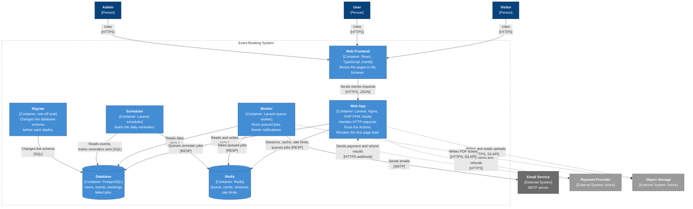

# C4 Level 2: Containers

This diagram shows the parts inside the Event Booking system. In C4, each part is a
"container": a program that runs on its own, or a data store. The C4 level 1 diagram
shows the system as one box. This diagram opens that box.

Dashed boxes and dashed lines show future parts and connections. Version 1 does not
use them.

## Diagram

## Containers

| Container    | Technology                            | Responsibility                                                                                                                                                                                         |
| ------------ | ------------------------------------- | ------------------------------------------------------------------------------------------------------------------------------------------------------------------------------------------------------ |
| Web Frontend | React, TypeScript, Inertia, shadcn/ui | Shows the pages in the browser. Sends the forms to the Web App. The Web App serves its files.                                                                                                          |
| Web App      | Laravel, Nginx, PHP-FPM, Node         | Handles all HTTP requests. Does authentication, authorization, validation and rate limits. Runs the Actions. Puts notifications on the queue. Renders the first page load on the server (Inertia SSR). |
| Worker       | Laravel queue worker                  | Takes jobs from the queue and runs them. In v1, all jobs send notifications. If a job fails three times, the Worker writes it to the `failed_jobs` table.                                              |
| Scheduler    | Laravel scheduler                     | Each day, finds the events that start in the next 24 hours. Puts a reminder job on the queue for each attendee (BR-N4, BR-N5).                                                                         |
| Migrate      | Laravel migrations                    | Runs one time before each deploy. Changes the database schema. Stops when the migrations are complete.                                                                                                 |
| Database     | PostgreSQL                            | Keeps all business data. It is the only source of truth. Its constraints enforce some rules (BR-E8, BR-B4, BR-B5).                                                                                     |
| Redis        | Redis                                 | Keeps the queue, the cache, the sessions and the rate-limit counters. The data in Redis is temporary.                                                                                                  |

## One image, four roles

The Web App, Worker, Scheduler and Migrate use the same Docker image. The first argument
of the container selects the role:

| Role        | Command                                                       |
| ----------- | ------------------------------------------------------------- |
| `web`       | supervisord: Nginx, PHP-FPM and the Inertia SSR server (Node) |
| `worker`    | `php artisan queue:work redis --tries=3 --max-time=3600`      |
| `scheduler` | `php artisan schedule:work`                                   |
| `migrate`   | `php artisan migrate --force`                                 |

Each role runs `php artisan optimize` first.

The Web Frontend is not a separate image. The build compiles it into two bundles. The
browser bundle is static files that the Web App serves. The Web App uses the SSR bundle
to render the first page load on the server. After that, the browser renders the pages.

## Future connections

| Connection                 | Feature      | Description                                                                                   |
| -------------------------- | ------------ | --------------------------------------------------------------------------------------------- |
| Web App → Payment Provider | Payments     | The Web App creates a payment when a user books a paid ticket. It also requests refunds.      |
| Payment Provider → Web App | Payments     | The provider sends the payment and refund results to a webhook endpoint on the Web App.       |
| Scheduler → Database       | Payments     | Each minute, the Scheduler cancels the pending bookings that passed their 30 minutes (BR-P8). |
| Web App → Object Storage   | File uploads | The Web App writes the files that users upload, and reads them back.                          |
| Worker → Object Storage    | PDF tickets  | The Worker makes the PDF tickets in a queued job and writes them to the storage.              |

## Not in this diagram

- **Vite dev server and Mailpit.** These run only in local development. Mailpit takes the place of the Email Service there.
