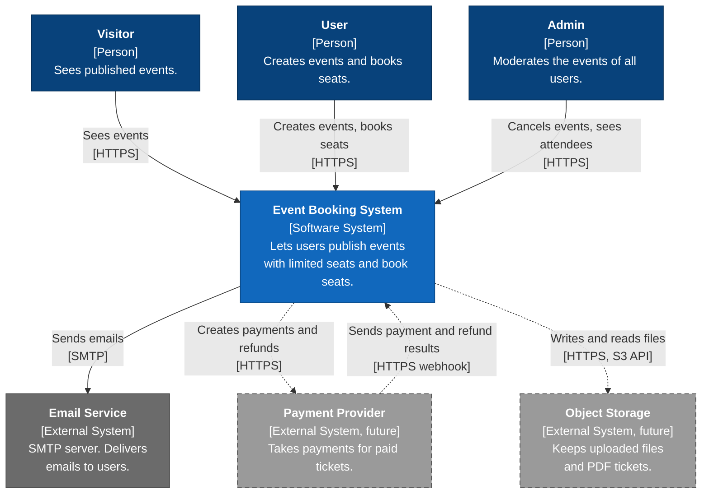

# C4 Level 1: System Context

This diagram shows the Event Booking system as one box. It shows the people who use
the system and the external systems that it connects to. It does not show the parts
inside the system. The C4 level 2 diagram shows these parts.

Dashed boxes and dashed lines show future external systems. Version 1 does not use them.

## Diagram

## People

| Person  | Description                                                                                                                       | Rules          |
| ------- | --------------------------------------------------------------------------------------------------------------------------------- | -------------- |
| Visitor | A person who is not logged in. A visitor can see published events. A visitor cannot book seats.                                   | BR-E14, BR-B1  |
| User    | A person who is logged in. A user can be the organizer of one event and an attendee of a different event.                         | BR-E1, BR-B2   |
| Admin   | A user with the admin flag. An admin can do all that a user can do. An admin can also cancel any event and see any attendee list. | BR-A1 to BR-A4 |

## External systems

| System           | Status | Description                                                                                                              | Protocol       |
| ---------------- | ------ | ------------------------------------------------------------------------------------------------------------------------ | -------------- |
| Email Service    | v1     | An SMTP server that the operator of the deployment supplies. In local development, Mailpit is the SMTP server.           | SMTP           |
| Payment Provider | Future | A payment service for paid tickets. The system creates a payment, and the provider sends the result back with a webhook. | HTTPS          |
| Object Storage   | Future | An S3-compatible file store. It keeps files that users upload and the PDF tickets that the system makes.                 | HTTPS (S3 API) |

## Not in this diagram

- **PostgreSQL and Redis.** These are parts of the system, so they are inside the system box. The C4 level 2 diagram shows them.
- **GitHub and GitHub Actions.** These build, test and scan the system. They are not used when the system runs.
