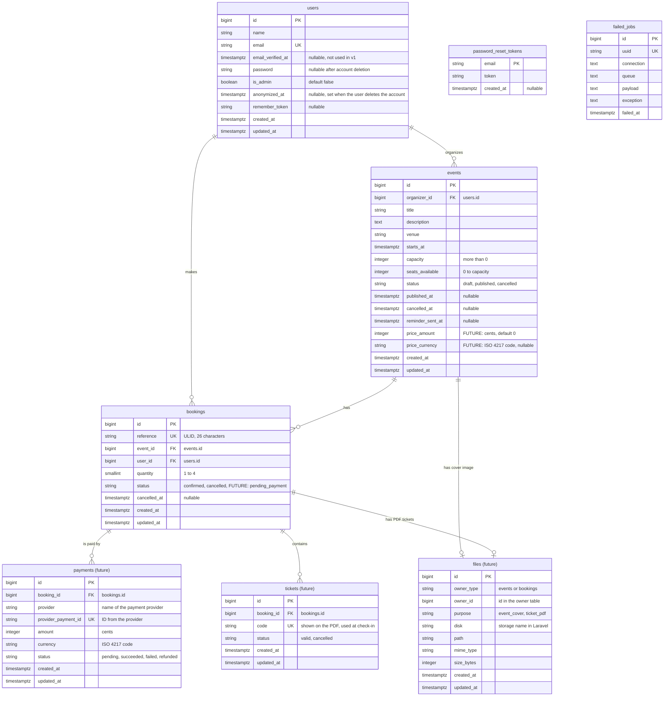

# ERD: Database Schema

This document shows the tables in PostgreSQL. It shows the tables of v1 and the
future tables in one diagram. The name of each future table ends with "(future)".
Comments that start with "FUTURE" mark future columns on v1 tables.

## Diagram

## Tables

| Table | Status | Description |
|---|---|---|
| `users` | v1 | The people with an account. The starter kit creates this table. We add `is_admin` and `anonymized_at`. |
| `events` | v1 | The events. Each event has one organizer. |
| `bookings` | v1 | The bookings. Each booking is for one event and one user. |
| `password_reset_tokens` | v1 | Laravel table. Keeps the tokens for the "forgot password" email. It has no foreign key to `users`. It uses the email. |
| `failed_jobs` | v1 | Laravel table. The Worker writes a job here when the job fails three times. |
| `payments` | Future | One row for each payment attempt. A booking can have more than one attempt, for example after a failed card payment. |
| `tickets` | Future | One row for each seat in a booking. Each ticket has a unique code for check-in. |
| `files` | Future | One row for each file in the Object Storage. A file belongs to an event (cover image) or to a booking (PDF tickets). |

## Relationships

| From | To | Type | On delete |
|---|---|---|---|
| `events.organizer_id` | `users.id` | Many events to one user | Restrict. The system never deletes a user row (BR-U4). |
| `bookings.user_id` | `users.id` | Many bookings to one user | Restrict. |
| `bookings.event_id` | `events.id` | Many bookings to one event | Restrict. Only a draft event can be deleted, and a draft event has no bookings (BR-E17, BR-B2). |
| `payments.booking_id` | `bookings.id` | Many payments to one booking | Restrict. |
| `tickets.booking_id` | `bookings.id` | Many tickets to one booking | Restrict. |
| `files.owner_type`, `files.owner_id` | `events.id` or `bookings.id` | Polymorphic. One file to one owner | No foreign key. The Action that deletes a draft event also deletes its files. |

## Constraints

These constraints make the database enforce some business rules. The models enforce the
same rules first, so that the user sees a clear message.

| Table | Constraint | Rule |
|---|---|---|
| `events` | `CHECK (capacity > 0)` | BR-E2 |
| `events` | `CHECK (seats_available >= 0 AND seats_available <= capacity)` | BR-E8 |
| `events` | `CHECK (status IN ('draft', 'published', 'cancelled'))` | Event status |
| `bookings` | `CHECK (quantity BETWEEN 1 AND 4)` | BR-B5 |
| `bookings` | `CHECK (status IN ('confirmed', 'cancelled'))` | Booking status |
| `bookings` | `UNIQUE (reference)` | BR-B8 |
| `bookings` | `UNIQUE (event_id, user_id) WHERE status = 'confirmed'` (partial index) | BR-B4, BR-B12 |
| `users` | `UNIQUE (email)` | One account for each email |

When payments come, the partial unique index on `bookings` must also include the status
`pending_payment`. Then a user cannot start a second booking while the first one waits
for payment.

## Indexes

| Table | Index | Used by |
|---|---|---|
| `events` | `(status, starts_at)` | The list of upcoming published events. The daily reminders. |
| `events` | `(organizer_id)` | The "My events" page. |
| `bookings` | `(user_id)` | The "My bookings" page. |
| `bookings` | `(event_id, status)` | The attendee list. The cancellation of all bookings of an event. |

## Laravel tables that we do not create

Redis keeps the sessions, the cache and the queue (see the C4 level 2 diagram). As a
result, we remove these default Laravel migrations: `sessions`, `cache`, `cache_locks`,
`jobs` and `job_batches`.

## Money

The future `price_amount` and `amount` columns keep money as a whole number of cents.
For example, 12.50 EUR is `1250` with the currency `EUR`. A whole number has no
rounding errors. An event with `price_amount = 0` is free, and its bookings do not use
the status `pending_payment`.
