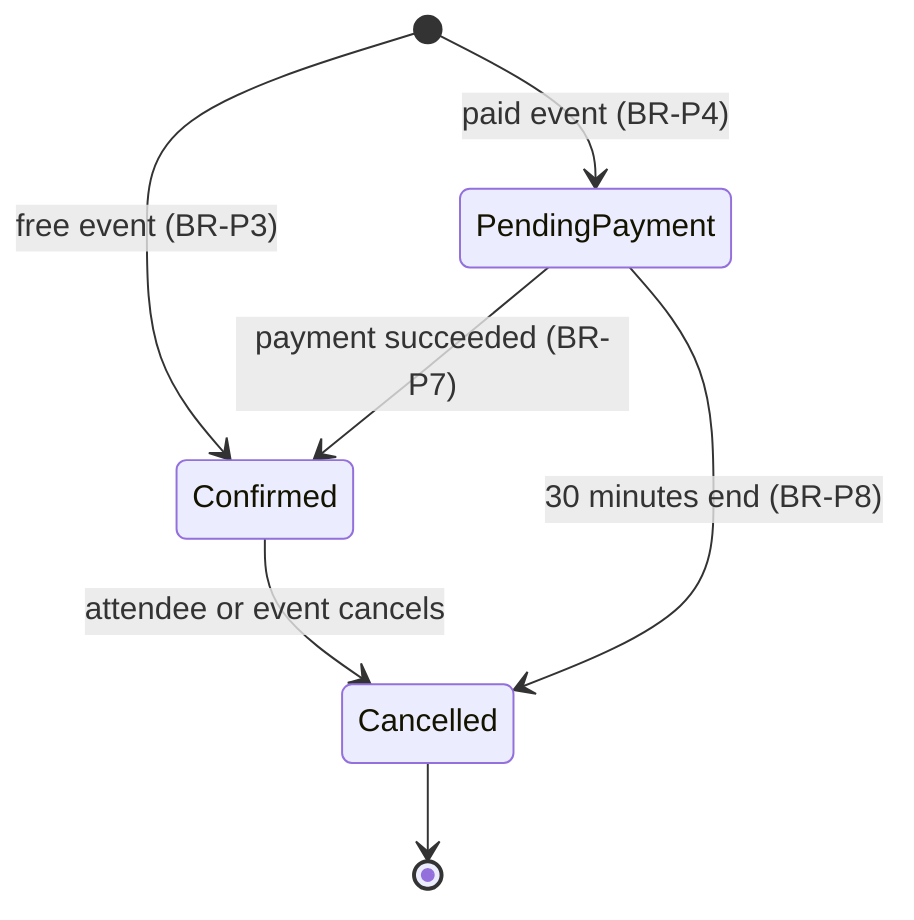
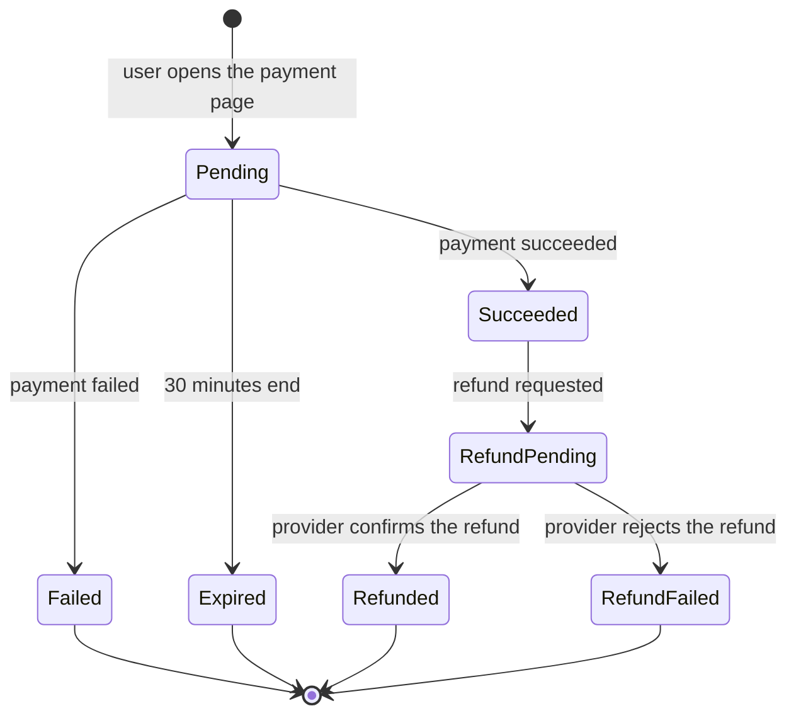

# Future Features

This document describes the features that come after v1. Version 1 does not implement
them. The ERD and the C4 diagrams already show the tables, the columns and the external
systems that these features use.

The rules in this document have IDs, like the rules of v1. They become active only when
the feature is implemented. The sequence diagrams come with the Actions of each feature,
in the same PR as the code.

## Payments

### Description

An organizer can give an event a price. A user who books seats for a paid event pays on
the page of the Payment Provider. The system confirms the booking when the payment
succeeds.

The Payment Provider is Stripe Checkout in test mode. Test mode uses test cards, and no
real money moves. The design uses the generic name "Payment Provider".

### Business rules

| ID | Rule | Enforced by |
|---|---|---|
| BR-P1 | An event has a price for each seat. The price is a whole number of cents with a currency code. A price of 0 means that the event is free. | Request, Database |
| BR-P2 | The organizer can set or change the price only while the event is a draft. After publication, the price does not change. | Model |
| BR-P3 | A booking for a free event follows the rules of v1. It is confirmed immediately. | Model |
| BR-P4 | A booking for a paid event starts with the status `pending_payment`. The seats of the booking are not available to other users. | Model |
| BR-P5 | The system holds the seats of a pending booking for 30 minutes. This is the same time as the payment page of the Payment Provider. | Action |
| BR-P6 | The amount to pay is the price multiplied by the quantity. | Model |
| BR-P7 | When the Payment Provider reports a successful payment, the system confirms the booking. The attendee gets the "booking confirmed" email (BR-N1). | Action |
| BR-P8 | When the 30 minutes end without a payment, the system cancels the booking and the seats become available again. A scheduled job does this each minute. | Scheduled job |
| BR-P9 | If a successful payment arrives after the system cancelled the booking, the system refunds the payment automatically. The user gets an email. | Action |
| BR-P10 | A user can have only one pending or confirmed booking for each event (BR-B4). | Model, Database |
| BR-P11 | The system accepts a webhook only when its signature is correct. | Middleware |
| BR-P12 | The system can receive the same webhook more than one time. It processes each payment result only one time. | Action |
| BR-P13 | The system never receives or keeps card data. The user enters card data only on the page of the Payment Provider. | — |

### Booking status with payments

### Payment status

## Refunds

### Description

An attendee of a paid event can get the money back in some cases. Refunds are not
immediate. The Payment Provider can need some days to return the money. For this
reason, the system tracks each refund until the Payment Provider confirms it.

### Business rules

| ID | Rule | Enforced by |
|---|---|---|
| BR-R1 | When a user cancels a paid event, each attendee with a confirmed booking gets a full refund. | Action |
| BR-R2 | When an attendee cancels a paid booking 7 days or more before the start time, the attendee gets a full refund. | Model |
| BR-R3 | When an attendee cancels a paid booking less than 7 days before the start time, the attendee gets no refund. The seats become available again. | Model |
| BR-R4 | An attendee can cancel a paid booking until the event starts, as in v1 (BR-B10). The 7-day limit applies only to the refund. | Model |
| BR-R5 | A refund is always the full amount of the payment. There are no partial refunds. | Model |
| BR-R6 | When a booking is cancelled, the booking status and the seats change immediately. The refund continues separately. | Action |
| BR-R7 | A refund starts with the payment status `refund_pending`. The Payment Provider reports the result with a webhook. The status then becomes `refunded` or `refund_failed`. | Action |
| BR-R8 | The attendee sees "Refund pending" on the "My bookings" page while the refund is not complete. | Read Action |
| BR-R9 | When the refund is complete, the attendee gets a "refund complete" email. | Action |
| BR-R10 | Admins see a list of the refunds with the status `refund_failed`. A person must solve each one with the Payment Provider. | Policy, Read Action |

### Effect on the cancel page

Before an attendee cancels a paid booking, the page shows whether the attendee gets a
refund. Less than 7 days before the start, the page tells the attendee that the
cancellation gives no refund.

## Schema

The ERD shows the tables and the columns of payments and refunds: the `payments` table,
`events.price_amount`, `events.price_currency` and `bookings.payment_expires_at`.
