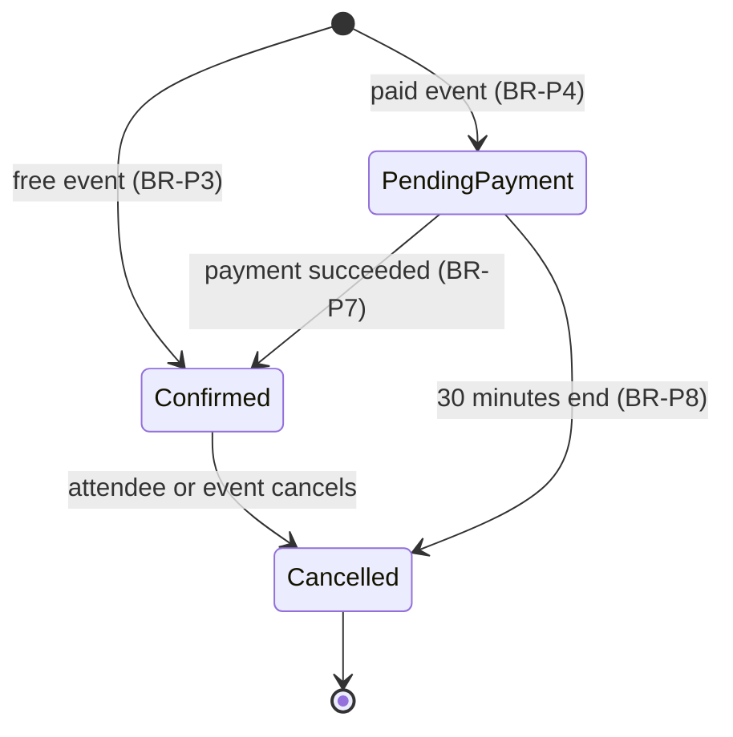
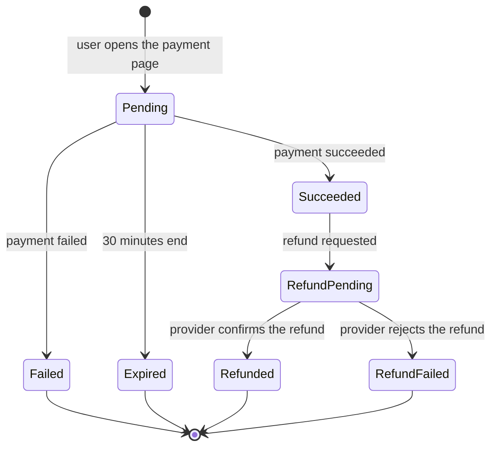

# Future Features

This document describes the features that come after v1. Version 1 does not implement
them. The ERD and the C4 diagrams already show the tables, the columns and the external
systems that these features use.

The rules in this document have IDs, like the rules of v1. They become active only when
the feature is implemented. The sequence diagrams come with the Actions of each feature,
in the same PR as the code.

## Payments

### Description

An organizer can give an event a price. A user who books seats for a paid event pays on
the page of the Payment Provider. The system confirms the booking when the payment
succeeds.

The Payment Provider is Stripe Checkout in test mode. Test mode uses test cards, and no
real money moves. The design uses the generic name "Payment Provider".

### Business rules

| ID     | Rule                                                                                                                                                   | Enforced by       |
| ------ | ------------------------------------------------------------------------------------------------------------------------------------------------------ | ----------------- |
| BR-P1  | An event has a price for each seat. The price is a whole number of cents with a currency code. A price of 0 means that the event is free.              | Request, Database |
| BR-P2  | The organizer can set or change the price only while the event is a draft. After publication, the price does not change.                               | Model             |
| BR-P3  | A booking for a free event follows the rules of v1. It is confirmed immediately.                                                                       | Model             |
| BR-P4  | A booking for a paid event starts with the status `pending_payment`. The seats of the booking are not available to other users.                        | Model             |
| BR-P5  | The system holds the seats of a pending booking for 30 minutes. This is the same time as the payment page of the Payment Provider.                     | Action            |
| BR-P6  | The amount to pay is the price multiplied by the quantity.                                                                                             | Model             |
| BR-P7  | When the Payment Provider reports a successful payment, the system confirms the booking. The attendee gets the "booking confirmed" email (BR-N1).      | Action            |
| BR-P8  | When the 30 minutes end without a payment, the system cancels the booking and the seats become available again. A scheduled job does this each minute. | Scheduled job     |
| BR-P9  | If a successful payment arrives after the system cancelled the booking, the system refunds the payment automatically. The user gets an email.          | Action            |
| BR-P10 | A user can have only one pending or confirmed booking for each event (BR-B4).                                                                          | Model, Database   |
| BR-P11 | The system accepts a webhook only when its signature is correct.                                                                                       | Middleware        |
| BR-P12 | The system can receive the same webhook more than one time. It processes each payment result only one time.                                            | Action            |
| BR-P13 | The system never receives or keeps card data. The user enters card data only on the page of the Payment Provider.                                      | —                 |

### Booking status with payments

### Payment status

## Refunds

### Description

An attendee of a paid event can get the money back in some cases. Refunds are not
immediate. The Payment Provider can need some days to return the money. For this
reason, the system tracks each refund until the Payment Provider confirms it.

### Business rules

| ID     | Rule                                                                                                                                                                     | Enforced by         |
| ------ | ------------------------------------------------------------------------------------------------------------------------------------------------------------------------ | ------------------- |
| BR-R1  | When a user cancels a paid event, each attendee with a confirmed booking gets a full refund.                                                                             | Action              |
| BR-R2  | When an attendee cancels a paid booking 7 days or more before the start time, the attendee gets a full refund.                                                           | Model               |
| BR-R3  | When an attendee cancels a paid booking less than 7 days before the start time, the attendee gets no refund. The seats become available again.                           | Model               |
| BR-R4  | An attendee can cancel a paid booking until the event starts, as in v1 (BR-B10). The 7-day limit applies only to the refund.                                             | Model               |
| BR-R5  | A refund is always the full amount of the payment. There are no partial refunds.                                                                                         | Model               |
| BR-R6  | When a booking is cancelled, the booking status and the seats change immediately. The refund continues separately.                                                       | Action              |
| BR-R7  | A refund starts with the payment status `refund_pending`. The Payment Provider reports the result with a webhook. The status then becomes `refunded` or `refund_failed`. | Action              |
| BR-R8  | The attendee sees "Refund pending" on the "My bookings" page while the refund is not complete.                                                                           | Read Action         |
| BR-R9  | When the refund is complete, the attendee gets a "refund complete" email.                                                                                                | Action              |
| BR-R10 | Admins see a list of the refunds with the status `refund_failed`. A person must solve each one with the Payment Provider.                                                | Policy, Read Action |

### Effect on the cancel page

Before an attendee cancels a paid booking, the page shows whether the attendee gets a
refund. Less than 7 days before the start, the page tells the attendee that the
cancellation gives no refund.

### Schema

The ERD shows the tables and the columns of payments and refunds: the `payments` table,
`events.price_amount`, `events.price_currency` and `bookings.payment_expires_at`.

## PDF tickets

### Description

Each confirmed booking gets one ticket for each seat. The system puts all the tickets of
a booking in one PDF file. The attendee gets the PDF with the "booking confirmed" email
and can download it from the "My bookings" page.

This feature applies to free and paid events.

### Business rules

| ID    | Rule                                                                                                                                                                                                               | Enforced by         |
| ----- | ------------------------------------------------------------------------------------------------------------------------------------------------------------------------------------------------------------------ | ------------------- |
| BR-T1 | When a booking becomes confirmed, the system creates one ticket for each seat, in the same transaction.                                                                                                            | Model               |
| BR-T2 | Each ticket has a unique code. The code is random, so that nobody can guess the code of a different ticket.                                                                                                        | Model, Database     |
| BR-T3 | After the commit, the Worker makes the PDF and writes it to the Object Storage. The booking keeps the path in `tickets_pdf_path`.                                                                                  | Action (queued job) |
| BR-T4 | The PDF has one page for each ticket. Each page shows the event title, the venue, the start time, the name of the attendee, the booking reference and the ticket code. The code is shown as text and as a QR code. | Action (queued job) |
| BR-T5 | The "booking confirmed" email (BR-N1) goes out after the PDF is ready. The PDF is attached to the email.                                                                                                           | Action (queued job) |
| BR-T6 | If the Worker cannot make the PDF after three attempts, the email goes out without the PDF. The job goes to the `failed_jobs` table.                                                                               | Action (queued job) |
| BR-T7 | Only the attendee can download the PDF of a booking.                                                                                                                                                               | Policy              |
| BR-T8 | The download link is temporary. It expires after 5 minutes.                                                                                                                                                        | Action              |
| BR-T9 | When a booking is cancelled, its tickets become cancelled. The system deletes the PDF from the Object Storage and clears `tickets_pdf_path`.                                                                       | Action              |

### Out of scope

Ticket check-in at the event is not part of this feature. The ticket code is stored and
printed, so that a later check-in feature does not need a change to the `tickets` table.

## Cover image

### Description

The organizer can add one cover image to an event. The image appears on the event list
and on the event page.

### Business rules

| ID    | Rule                                                                                                                                 | Enforced by |
| ----- | ------------------------------------------------------------------------------------------------------------------------------------ | ----------- |
| BR-C1 | The cover image must be a JPEG, PNG or WebP file of 2 MB or less. The system checks the content of the file, not only the file name. | Request     |
| BR-C2 | Only the organizer can add, replace or remove the cover image.                                                                       | Policy      |
| BR-C3 | The organizer can change the cover image only while the event has not started and is not cancelled (as BR-E5).                       | Policy      |
| BR-C4 | When the organizer replaces the image, the system deletes the old file from the Object Storage.                                      | Action      |
| BR-C5 | When the organizer removes the image, the system deletes the file and clears `cover_image_path`.                                     | Action      |
| BR-C6 | When the organizer deletes a draft event, the system also deletes its cover image (BR-E17).                                          | Action      |
| BR-C7 | The system gives each file a random name. It does not use the name of the uploaded file.                                             | Action      |
| BR-C8 | The image is visible to each person who can see the event (BR-E14 to BR-E16).                                                        | Policy      |
| BR-C9 | The system keeps the image as it is uploaded. It does not resize the image.                                                          | —           |

### Schema

The ERD shows the columns of these two features: the `tickets` table,
`bookings.tickets_pdf_path` and `events.cover_image_path`.

## Event change emails

### Description

When the organizer changes an important detail of a published event, the attendees get
an email. This feature replaces BR-N7 of v1.

### Business rules

| ID     | Rule                                                                                                                                               | Enforced by |
| ------ | -------------------------------------------------------------------------------------------------------------------------------------------------- | ----------- |
| BR-EC1 | When the organizer changes the start time or the venue of a published event, each attendee with a confirmed booking gets an "event changed" email. | Action      |
| BR-EC2 | The email shows the old value and the new value of each changed detail.                                                                            | Action      |
| BR-EC3 | When one edit changes the start time and the venue, the attendee gets one email, not two.                                                          | Action      |
| BR-EC4 | A change to the title, the description or the capacity sends no email.                                                                             | Action      |
| BR-EC5 | The system sends the email only after the database commits the transaction (as BR-N6).                                                             | Action      |

## Announcements

### Description

The organizer can write a message to all the attendees of an event, for example to tell
them about a change in the program. The system sends the message by email and shows it
on the event page.

### Business rules

| ID      | Rule                                                                                                                                                       | Enforced by         |
| ------- | ---------------------------------------------------------------------------------------------------------------------------------------------------------- | ------------------- |
| BR-AN1  | Only the organizer can send an announcement for an event.                                                                                                  | Policy              |
| BR-AN2  | An announcement has a subject of 150 characters or less and a plain-text body of 5000 characters or less.                                                  | Request             |
| BR-AN3  | The organizer can send an announcement only for a published event, until 24 hours after the start time.                                                    | Model               |
| BR-AN4  | The organizer can send 3 announcements or less for each event in each period of 24 hours.                                                                  | Model               |
| BR-AN5  | Each attendee with a confirmed booking gets the announcement by email, after the commit.                                                                   | Action              |
| BR-AN6  | The event page shows the announcements to the organizer, to the attendees with a confirmed booking and to admins. Users who book later can also read them. | Policy, Read Action |
| BR-AN7  | Nobody can edit or delete an announcement after it is sent. To correct a mistake, the organizer sends a new announcement.                                  | Model               |
| BR-AN8  | An admin can hide an announcement. A hidden announcement is not shown to attendees. The organizer and admins see it with the label "Hidden".               | Policy, Model       |
| BR-AN9  | Hiding an announcement does not change the emails that the system already sent.                                                                            | —                   |
| BR-AN10 | The system shows the body as plain text. It does not show HTML from the body.                                                                              | Read Action         |

### Schema

The ERD shows the `announcements` table.
