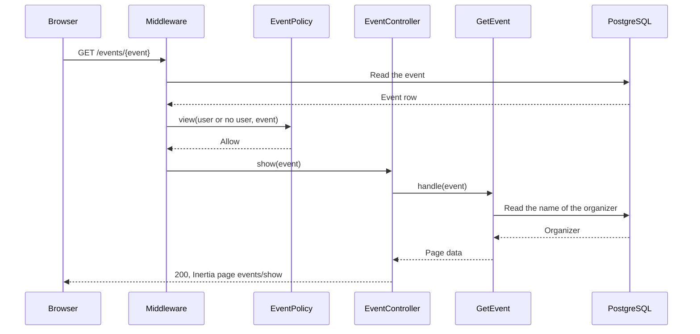
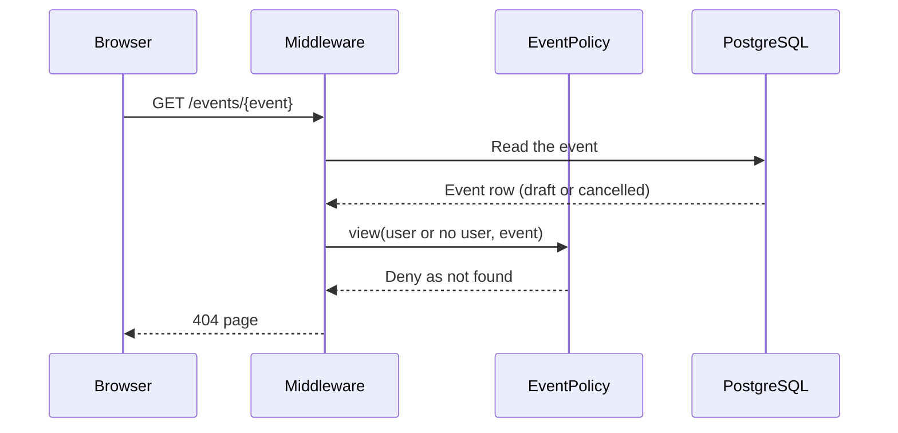
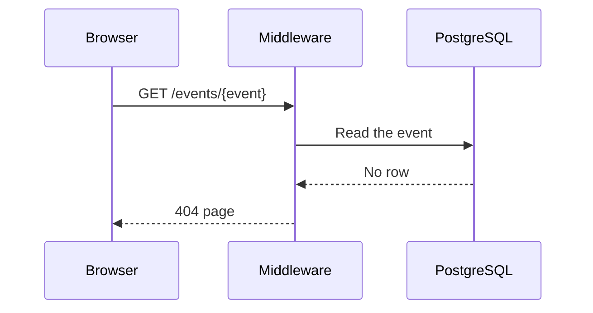

# M3 — GetEvent: the Event Page

> **For agentic workers:** REQUIRED SUB-SKILL: Use superpowers:executing-plans to implement this plan task-by-task. Steps use checkbox (`- [ ]`) syntax for tracking.

**Goal:** Each person who can see an event can open its page at `/events/{event}`. Other
people get a 404 page. Visitors see links to log in and to register.

**Architecture:** The route `events.show` checks `EventPolicy::view` with the `can`
middleware. The policy denies hidden events as "not found". `EventController@show` calls
the `GetEvent` Action, which returns the data for the page. The React page
`events/show` shows the data in the sidebar layout of the starter kit.

**Tech Stack:** Laravel 13, Inertia 3, React 19, TypeScript, Wayfinder, Pest.

**Spec:** `docs/superpowers/specs/2026-09-28-event-booking-design.md` (sections 3, 5, 7
and 8), `docs/design/business-rules.md`.

## Global Constraints

- A person who cannot see an event gets a 404 response, the same as for an event that
  does not exist. Other authorization failures stay 403.
- The route has no `auth` middleware. Visitors can open published events (BR-E14).
- The controller calls one Action and contains no queries.
- The Action directory is `app/Actions/GetEvent/` with `GetEvent.php` and `README.md`.
  The README has one sequence diagram for each outcome and no `alt` blocks. It is in
  Simple English.
- Page props use the snake_case names of the columns.
- The page shows the start time in the time zone of the viewer.
- The page has no edit, publish or cancel buttons. They come with their Actions.
- Logged-in users see no change in the sidebar.
- Each test that covers a business rule starts with the ID of the rule.
- Run commands inside the `app` container: `docker compose exec app <command>`. The
  tests use the test database. Do not run `migrate:fresh` against the development
  database.

## Review Focus

1. **Server rendering and the time zone.** SSR runs in UTC, and the browser can be in a
   different time zone. The first render must be the same on the server and in the
   browser, or React reports a hydration error. The page shows UTC first and then the
   local time.
2. **A visitor on a hidden event.** The `can` middleware calls the policy with no user.
   The response is 404, not a redirect to the login page.
3. **A long description.** Line breaks in the description stay visible. HTML in the
   description shows as text.
4. **A sold-out event.** "0 of 50 seats available" shows correctly.
5. **The sidebar for visitors.** The links "Log in" and "Register" show when the sidebar
   is open and when it is collapsed to icons.

---

### Task 1: Route, policy response, Action and page

**Files:**

- Modify: `app/Policies/EventPolicy.php`
- Modify: `app/Models/Event.php` (PHPDoc only)
- Create: `app/Actions/GetEvent/GetEvent.php`
- Create: `app/Http/Controllers/EventController.php`
- Modify: `routes/web.php`
- Create: `resources/js/types/event.ts`
- Modify: `resources/js/types/index.ts`
- Create: `resources/js/components/local-date-time.tsx`
- Create: `resources/js/pages/events/show.tsx`
- Test: `tests/Feature/GetEventTest.php`

**Interfaces:**

- Produces:
    - Route `events.show`: `GET /events/{event}`. Wayfinder function `show` in
      `@/routes/events`.
    - `GetEvent::handle(Event $event): array` with the keys `id`, `title`,
      `description`, `venue`, `starts_at` (ISO 8601), `capacity`, `seats_available`,
      `status` (`draft`, `published` or `cancelled`) and `organizer_name`.
    - Inertia page `events/show` with the prop `event` of type `EventDetails`.

- [ ] **Step 1: Write the failing test**

Create the file with `php artisan make:test --pest GetEventTest --no-interaction`, then
replace its content:

```php
<?php

use App\Models\Event;
use App\Models\User;
use Inertia\Testing\AssertableInertia as Assert;

beforeEach(function () {
    $this->organizer = User::factory()->create(['name' => 'Olivia Organizer']);
    $this->otherUser = User::factory()->create();
    $this->admin = User::factory()->admin()->create();
});

test('BR-E14: a visitor can see a published event', function () {
    $event = Event::factory()->published()->for($this->organizer, 'organizer')->create([
        'title' => 'Laravel Meetup',
        'description' => "Talks and pizza.\nBring a laptop.",
        'venue' => 'Main Hall',
        'starts_at' => '2030-05-01 18:30:00+00',
        'capacity' => 50,
        'seats_available' => 0,
    ]);

    $this->get(route('events.show', $event))
        ->assertOk()
        ->assertInertia(fn (Assert $page) => $page
            ->component('events/show')
            ->where('event', [
                'id' => $event->id,
                'title' => 'Laravel Meetup',
                'description' => "Talks and pizza.\nBring a laptop.",
                'venue' => 'Main Hall',
                'starts_at' => '2030-05-01T18:30:00+00:00',
                'capacity' => 50,
                'seats_available' => 0,
                'status' => 'published',
                'organizer_name' => 'Olivia Organizer',
            ])
        );
});

test('BR-E14: another user can see a published event', function () {
    $event = Event::factory()->published()->for($this->organizer, 'organizer')->create();

    $this->actingAs($this->otherUser)
        ->get(route('events.show', $event))
        ->assertOk();
});

test('BR-E15: the organizer can see their draft event', function () {
    $event = Event::factory()->for($this->organizer, 'organizer')->create();

    $this->actingAs($this->organizer)
        ->get(route('events.show', $event))
        ->assertOk()
        ->assertInertia(fn (Assert $page) => $page
            ->component('events/show')
            ->where('event.status', 'draft')
        );
});

test('BR-E15: another user gets a 404 for a draft event', function () {
    $event = Event::factory()->for($this->organizer, 'organizer')->create();

    $this->actingAs($this->otherUser)
        ->get(route('events.show', $event))
        ->assertNotFound();
});

test('BR-E15: a visitor gets a 404 for a draft event', function () {
    $event = Event::factory()->for($this->organizer, 'organizer')->create();

    $this->get(route('events.show', $event))
        ->assertNotFound();
});

test('BR-E16: the organizer can see their cancelled event', function () {
    $event = Event::factory()->cancelled()->for($this->organizer, 'organizer')->create();

    $this->actingAs($this->organizer)
        ->get(route('events.show', $event))
        ->assertOk()
        ->assertInertia(fn (Assert $page) => $page->where('event.status', 'cancelled'));
});

test('BR-E16: another user and a visitor get a 404 for a cancelled event', function () {
    $event = Event::factory()->cancelled()->for($this->organizer, 'organizer')->create();

    $this->actingAs($this->otherUser)
        ->get(route('events.show', $event))
        ->assertNotFound();

    auth()->logout();

    $this->get(route('events.show', $event))
        ->assertNotFound();
});

test('BR-A4: an admin can see the draft and cancelled events of other users', function () {
    $draft = Event::factory()->for($this->organizer, 'organizer')->create();
    $cancelled = Event::factory()->cancelled()->for($this->organizer, 'organizer')->create();

    $this->actingAs($this->admin)->get(route('events.show', $draft))->assertOk();
    $this->actingAs($this->admin)->get(route('events.show', $cancelled))->assertOk();
});

test('an event that does not exist gives a 404', function () {
    $this->get('/events/999999')->assertNotFound();
});
```

- [ ] **Step 2: Run the test to make sure it fails**

Run: `docker compose exec app php artisan test --compact tests/Feature/GetEventTest.php`
Expected: FAIL. The route `events.show` is not defined.

- [ ] **Step 3: Make the policy deny hidden events as "not found"**

In `app/Policies/EventPolicy.php`, add `use Illuminate\Auth\Access\Response;` and replace
the `view` method:

```php
/**
 * BR-E14, BR-E15, BR-E16 and BR-A4. Attendees of a cancelled event come in M4.
 * A person who cannot see the event gets a 404, so that hidden events stay unknown.
 */
public function view(?User $user, Event $event): Response
{
    if ($event->isPublished()) {
        return Response::allow();
    }

    if ($user !== null && ($user->is_admin || $event->isOrganizedBy($user))) {
        return Response::allow();
    }

    return Response::denyAsNotFound();
}
```

The tests in `tests/Feature/EventPolicyTest.php` use `can()` and `allows()`. They work
with a `Response` without changes.

In `app/Models/Event.php`, add this line to the class PHPDoc, after `$updated_at`:

```php
 * @property-read User $organizer
```

- [ ] **Step 4: Write the Action**

Create `app/Actions/GetEvent/GetEvent.php` with
`php artisan make:class Actions/GetEvent/GetEvent --no-interaction`, then replace its
content:

```php
<?php

namespace App\Actions\GetEvent;

use App\Models\Event;

class GetEvent
{
    /**
     * Get the data for the page of one event.
     *
     * @return array{id: int, title: string, description: string, venue: string, starts_at: string, capacity: int, seats_available: int, status: string, organizer_name: string}
     */
    public function handle(Event $event): array
    {
        $event->loadMissing('organizer:id,name');

        return [
            'id' => $event->id,
            'title' => $event->title,
            'description' => $event->description,
            'venue' => $event->venue,
            'starts_at' => $event->starts_at->toIso8601String(),
            'capacity' => $event->capacity,
            'seats_available' => $event->seats_available,
            'status' => $event->status->value,
            'organizer_name' => $event->organizer->name,
        ];
    }
}
```

- [ ] **Step 5: Write the controller and the route**

Run: `docker compose exec app php artisan make:controller EventController --no-interaction`,
then replace its content:

```php
<?php

namespace App\Http\Controllers;

use App\Actions\GetEvent\GetEvent;
use App\Models\Event;
use Inertia\Inertia;
use Inertia\Response;

class EventController extends Controller
{
    /**
     * Show the page of one event.
     */
    public function show(Event $event, GetEvent $getEvent): Response
    {
        return Inertia::render('events/show', [
            'event' => $getEvent->handle($event),
        ]);
    }
}
```

In `routes/web.php`, add `use App\Http\Controllers\EventController;` and add this route
after the `home` route:

```php
Route::get('events/{event}', [EventController::class, 'show'])
    ->name('events.show')
    ->can('view', 'event');
```

- [ ] **Step 6: Write the TypeScript type**

Create `resources/js/types/event.ts`:

```ts
export type EventStatus = 'draft' | 'published' | 'cancelled';

export type EventDetails = {
    id: number;
    title: string;
    description: string;
    venue: string;
    starts_at: string;
    capacity: number;
    seats_available: number;
    status: EventStatus;
    organizer_name: string;
};
```

Add `export type * from './event';` to `resources/js/types/index.ts`, in the same style
as the other lines in that file.

- [ ] **Step 7: Write the date component**

Create `resources/js/components/local-date-time.tsx`:

```tsx
import { useEffect, useState } from 'react';

const options: Intl.DateTimeFormatOptions = {
    weekday: 'long',
    year: 'numeric',
    month: 'long',
    day: 'numeric',
    hour: '2-digit',
    minute: '2-digit',
    timeZoneName: 'short',
};

function format(value: string, timeZone?: string): string {
    return new Intl.DateTimeFormat(undefined, { ...options, timeZone }).format(
        new Date(value),
    );
}

/**
 * Shows a date and time in the time zone of the viewer. The server renders the
 * page in UTC, so the first render uses UTC on both sides. After the page loads in
 * the browser, the component changes to the local time zone.
 */
export function LocalDateTime({ value }: { value: string }) {
    const [text, setText] = useState(() => format(value, 'UTC'));

    useEffect(() => {
        setText(format(value));
    }, [value]);

    return <time dateTime={value}>{text}</time>;
}
```

The options do not use `dateStyle`, because browsers reject `dateStyle` together with
`timeZoneName`.

- [ ] **Step 8: Write the page**

Create `resources/js/pages/events/show.tsx`:

```tsx
import { Head, setLayoutProps } from '@inertiajs/react';
import { CalendarDays, MapPin, User, Users } from 'lucide-react';
import { LocalDateTime } from '@/components/local-date-time';
import { Badge } from '@/components/ui/badge';
import { show } from '@/routes/events';
import type { BreadcrumbItem, EventDetails } from '@/types';

export default function ShowEvent({ event }: { event: EventDetails }) {
    setLayoutProps<{ breadcrumbs: BreadcrumbItem[] }>({
        breadcrumbs: [{ title: event.title, href: show(event.id) }],
    });

    return (
        <>
            <Head title={event.title} />
            <div className="flex flex-1 flex-col gap-6 p-4 md:max-w-3xl">
                <div className="flex flex-wrap items-center gap-3">
                    <h1 className="text-2xl font-semibold break-words">
                        {event.title}
                    </h1>
                    {event.status === 'draft' && (
                        <Badge variant="outline">Draft</Badge>
                    )}
                    {event.status === 'cancelled' && (
                        <Badge variant="destructive">Cancelled</Badge>
                    )}
                </div>

                <dl className="grid gap-3 text-sm">
                    <div className="flex items-center gap-2">
                        <CalendarDays className="size-4 text-muted-foreground" />
                        <dt className="sr-only">Starts</dt>
                        <dd>
                            <LocalDateTime value={event.starts_at} />
                        </dd>
                    </div>
                    <div className="flex items-center gap-2">
                        <MapPin className="size-4 text-muted-foreground" />
                        <dt className="sr-only">Venue</dt>
                        <dd>{event.venue}</dd>
                    </div>
                    <div className="flex items-center gap-2">
                        <User className="size-4 text-muted-foreground" />
                        <dt className="sr-only">Organizer</dt>
                        <dd>{event.organizer_name}</dd>
                    </div>
                    <div className="flex items-center gap-2">
                        <Users className="size-4 text-muted-foreground" />
                        <dt className="sr-only">Seats</dt>
                        <dd>
                            {event.seats_available} of {event.capacity} seats
                            available
                        </dd>
                    </div>
                </dl>

                <p className="whitespace-pre-line break-words">
                    {event.description}
                </p>
            </div>
        </>
    );
}
```

- [ ] **Step 9: Run the test to make sure it passes**

Run: `docker compose exec app php artisan test --compact tests/Feature/GetEventTest.php tests/Feature/EventPolicyTest.php`
Expected: PASS (9 tests in `GetEventTest.php`, 19 tests in `EventPolicyTest.php`).

- [ ] **Step 10: Check the types and the page**

Run: `docker compose exec app php artisan wayfinder:generate --with-form`
Run: `npm run types:check` and `docker compose exec app composer types:check`
Expected: no errors.

Open a published event in the browser at `http://localhost:8080/events/<id>`. The
development database has no events yet. Ask the reviewer before you create one with
the factory in `tinker`. Check:

- the page shows the title, the local start time, the venue, the organizer, the seats
  and the description with its line breaks;
- the browser console shows no hydration error;
- a draft event shows the badge "Draft".

- [ ] **Step 11: Commit**

```bash
git add app/Policies/EventPolicy.php app/Models/Event.php app/Actions/GetEvent/GetEvent.php \
  app/Http/Controllers/EventController.php routes/web.php resources/js/types/event.ts \
  resources/js/types/index.ts resources/js/components/local-date-time.tsx \
  resources/js/pages/events/show.tsx tests/Feature/GetEventTest.php
git commit -m "feat: show the page of an event"
```

### Task 2: Log in and register links for visitors

**Files:**

- Modify: `resources/js/components/nav-user.tsx`

**Interfaces:**

- Consumes: the Wayfinder functions `login` and `register` from `@/routes`.

- [ ] **Step 1: Show the links when there is no user**

In `resources/js/components/nav-user.tsx`, add the imports:

```tsx
import { Link } from '@inertiajs/react';
import { LogIn, UserPlus } from 'lucide-react';
import { login, register } from '@/routes';
```

Replace the block `if (!auth.user) { return null; }` with:

```tsx
if (!auth.user) {
    return (
        <SidebarMenu>
            <SidebarMenuItem>
                <SidebarMenuButton asChild tooltip="Log in">
                    <Link href={login()}>
                        <LogIn />
                        <span>Log in</span>
                    </Link>
                </SidebarMenuButton>
            </SidebarMenuItem>
            <SidebarMenuItem>
                <SidebarMenuButton asChild tooltip="Register">
                    <Link href={register()}>
                        <UserPlus />
                        <span>Register</span>
                    </Link>
                </SidebarMenuButton>
            </SidebarMenuItem>
        </SidebarMenu>
    );
}
```

Merge the `Link` import with the existing `@inertiajs/react` import.

- [ ] **Step 2: Check**

Run: `npm run types:check` and `npm run check`
Expected: no errors.

In a private browser window (no login), open a published event. Check that "Log in"
and "Register" show in the sidebar footer, also with the sidebar collapsed to icons,
and that they open the login and register pages. Log in and check that the user menu
shows as before.

- [ ] **Step 3: Commit**

```bash
git add resources/js/components/nav-user.tsx
git commit -m "feat: show log in and register links to visitors"
```

### Task 3: README, spec, checks and handoff

**Files:**

- Create: `app/Actions/GetEvent/README.md`
- Modify: `docs/superpowers/specs/2026-09-28-event-booking-design.md` (section 7)
- Modify: `HANDOFF.md`

- [ ] **Step 1: Write the README**

Create `app/Actions/GetEvent/README.md`:

````markdown
# GetEvent

Gets the data for the page of one event (`GET /events/{event}`).

The route checks the `view` ability of `EventPolicy` before the controller runs. A
person who cannot see the event gets a 404 response, the same as for an event that does
not exist. Thus, nobody can find hidden events by trying event IDs.

| Event status | Who can see it                                              | Rules         |
| ------------ | ----------------------------------------------------------- | ------------- |
| Published    | Everyone, also visitors                                     | BR-E14        |
| Draft        | The organizer and admins                                    | BR-E15, BR-A4 |
| Cancelled    | The organizer and admins (attendees after M4 adds bookings) | BR-E16, BR-A4 |

The middleware step includes the route model binding: Laravel reads the event row from
PostgreSQL before the policy check.

## The event is shown



## The person cannot see the event



## The event does not exist


````

Render each diagram locally to check it:
`npx -y @mermaid-js/mermaid-cli -i app/Actions/GetEvent/README.md -o <scratch-dir>/get-event.md`
Expected: three SVG files and no errors.

- [ ] **Step 2: Update the spec**

In section 7 of `docs/superpowers/specs/2026-09-28-event-booking-design.md`, replace:

```markdown
- Authorization failures → 403 page. Missing models → 404 page. Rate limit → see
  section 6.
```

with:

```markdown
- Authorization failures → 403 page. Missing models → 404 page. An event that the
  viewer cannot see → 404 page, so that hidden events stay unknown. Rate limit → see
  section 6.
```

- [ ] **Step 3: Format and run all checks**

Run: `docker compose exec app vendor/bin/pint --format agent`
Run: `npm run check:fix`
Run: `docker compose exec app composer ci:check`
Expected: Pint, PHPStan, `vp check`, `tsc` and all tests pass.

- [ ] **Step 4: Update `HANDOFF.md`**

"Where we are": the current PR is M3 PR 2 (`feat/get-event`), with its plan path.
"Next steps": the owner reviews this PR, then PR 3 (`CreateEvent`).

- [ ] **Step 5: Commit**

```bash
git add app/Actions/GetEvent/README.md docs/superpowers/specs/2026-09-28-event-booking-design.md \
  HANDOFF.md docs/superpowers/plans/2026-10-06-m3-get-event.md
git commit -m "docs: document GetEvent and update handoff"
```
