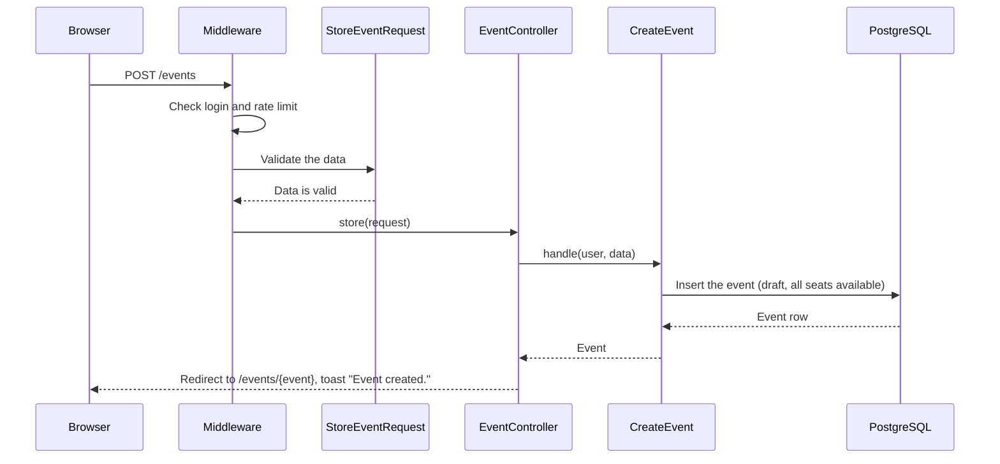
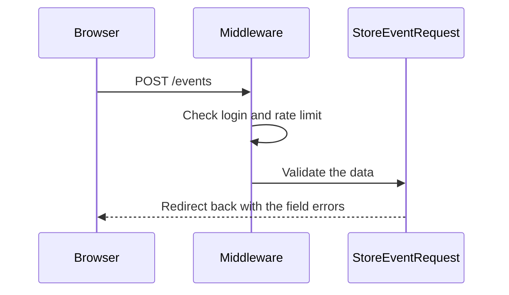
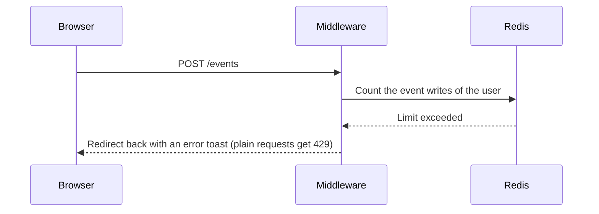

# M3 — CreateEvent: the Create Event Page

> **For agentic workers:** REQUIRED SUB-SKILL: Use superpowers:executing-plans to implement this plan task-by-task. Steps use checkbox (`- [ ]`) syntax for tracking.

**Goal:** A logged-in user can create an event on the page `/events/create`. The new
event is a draft, and the user is its organizer. After the create, the user sees the
event page and a toast "Event created.". Each user can do 20 event writes in each
minute.

**Architecture:** The routes `events.create` and `events.store` have the `auth`
middleware. `StoreEventRequest` validates the form (BR-E2, BR-E3). `EventController@store`
calls the `CreateEvent` Action, which inserts the draft (BR-E1). The named rate limiter
`event-writes` in `AppServiceProvider` limits `events.store`. When the limit is
exceeded, an Inertia request goes back to the form with an error toast, and all other
requests get a plain 429. The React page `events/create` converts the local start time
to UTC before it sends the form.

**Tech Stack:** Laravel 13, Inertia 3, React 19, TypeScript, Wayfinder, Pest.

**Spec:** `docs/superpowers/specs/2026-09-28-event-booking-design.md` (sections 3, 6, 7
and 8), `docs/design/business-rules.md`.

## Global Constraints

- The routes have the `auth` middleware only, not `verified`, because email
  verification is off in v1.
- Field limits: title max 255 characters, description max 5000, venue max 255,
  capacity from 1 to 10,000.
- The form sends the start time as ISO 8601 in UTC. The browser converts the local
  time of the organizer before it sends the form.
- The new event has `status = draft` and `seats_available = capacity`.
- The rate limiter `event-writes` allows 20 requests each minute for each user. Later
  PRs add it to the update, publish and cancel routes.
- The controller calls one Action and contains no queries.
- The Action directory is `app/Actions/CreateEvent/` with `CreateEvent.php` and
  `README.md`. The README has one sequence diagram for each outcome and no `alt` blocks.
  It is in Simple English.
- The sidebar shows the link "Create event" only to logged-in users.
- Each test that covers a business rule starts with the ID of the rule.
- Run commands inside the `app` container: `docker compose exec app <command>`. The
  tests use the test database. Do not run `migrate:fresh` against the development
  database.

## Review Focus

1. **The time zone of the start time.** The organizer types a local time. The event
   page must show the same local time after the create.
2. **A start time in the past.** The form shows the error under the field. The other
   fields keep their values.
3. **The rate limit.** The 21st create in one minute shows an error toast and keeps the
   form. A different user is not limited.
4. **The sidebar.** Visitors do not see "Create event". Logged-in users see it, also
   with the sidebar collapsed to icons.

---

### Task 1: Request, Action, routes and page

**Files:**

- Create: `app/Http/Requests/StoreEventRequest.php`
- Create: `app/Actions/CreateEvent/CreateEvent.php`
- Modify: `app/Models/Event.php` (PHPDoc only)
- Modify: `app/Http/Controllers/EventController.php`
- Modify: `routes/web.php`
- Create: `resources/js/components/ui/textarea.tsx`
- Create: `resources/js/pages/events/create.tsx`
- Test: `tests/Feature/CreateEventTest.php`

**Interfaces:**

- Produces:
    - Route `events.create`: `GET /events/create`. Route `events.store`:
      `POST /events`. Wayfinder functions `create` and `store` in `@/routes/events`.
    - `StoreEventRequest::eventAttributes(): array` gives the validated values with
      their types: `title`, `description` and `venue` (strings), `starts_at`
      (`CarbonImmutable`) and `capacity` (int).
    - `CreateEvent::handle(User $organizer, array $attributes): Event`. `$attributes`
      has the shape that `eventAttributes()` gives.
    - Inertia page `events/create` with no props.
    - Flash data `toast` with `type` `success` and `message` `Event created.`.

- [ ] **Step 1: Write the failing test**

Create the file with `php artisan make:test --pest CreateEventTest --no-interaction`,
then replace its content:

```php
<?php

use App\Enums\EventStatus;
use App\Models\Event;
use App\Models\User;
use Inertia\Testing\AssertableInertia as Assert;

beforeEach(function () {
    $this->user = User::factory()->create();

    $this->validData = [
        'title' => 'Laravel Meetup',
        'description' => "Talks and pizza.\nBring a laptop.",
        'venue' => 'Main Hall',
        'starts_at' => '2030-05-01T18:30:00.000Z',
        'capacity' => 50,
    ];
});

test('a user can open the create event page', function () {
    $this->actingAs($this->user)
        ->get(route('events.create'))
        ->assertOk()
        ->assertInertia(fn (Assert $page) => $page->component('events/create'));
});

test('a visitor is sent to the login page', function () {
    $this->get(route('events.create'))->assertRedirect(route('login'));
    $this->post(route('events.store'), $this->validData)->assertRedirect(route('login'));

    expect(Event::count())->toBe(0);
});

test('BR-E1: a user creates a draft event and is its organizer', function () {
    $response = $this->actingAs($this->user)
        ->post(route('events.store'), $this->validData);

    $event = Event::sole();

    $response
        ->assertRedirect(route('events.show', $event))
        ->assertInertiaFlash('toast', ['type' => 'success', 'message' => 'Event created.']);

    expect($event->organizer_id)->toBe($this->user->id)
        ->and($event->status)->toBe(EventStatus::Draft)
        ->and($event->title)->toBe('Laravel Meetup')
        ->and($event->description)->toBe("Talks and pizza.\nBring a laptop.")
        ->and($event->venue)->toBe('Main Hall')
        ->and($event->starts_at->utc()->toIso8601String())->toBe('2030-05-01T18:30:00+00:00')
        ->and($event->capacity)->toBe(50)
        ->and($event->seats_available)->toBe(50)
        ->and($event->published_at)->toBeNull();
});

test('BR-E2: the capacity must be 1 or more', function () {
    $this->actingAs($this->user)
        ->post(route('events.store'), [...$this->validData, 'capacity' => 0])
        ->assertSessionHasErrors('capacity');

    expect(Event::count())->toBe(0);
});

test('BR-E3: the start time must be in the future', function () {
    $this->actingAs($this->user)
        ->post(route('events.store'), [
            ...$this->validData,
            'starts_at' => now()->subMinute()->toIso8601String(),
        ])
        ->assertSessionHasErrors('starts_at');

    expect(Event::count())->toBe(0);
});

test('the form rejects invalid data', function (array $override, string $field) {
    $this->actingAs($this->user)
        ->post(route('events.store'), [...$this->validData, ...$override])
        ->assertSessionHasErrors($field);

    expect(Event::count())->toBe(0);
})->with([
    'no title' => [['title' => ''], 'title'],
    'title too long' => [['title' => str_repeat('a', 256)], 'title'],
    'no description' => [['description' => ''], 'description'],
    'description too long' => [['description' => str_repeat('a', 5001)], 'description'],
    'no venue' => [['venue' => ''], 'venue'],
    'venue too long' => [['venue' => str_repeat('a', 256)], 'venue'],
    'no start time' => [['starts_at' => ''], 'starts_at'],
    'start time not a date' => [['starts_at' => 'not a date'], 'starts_at'],
    'capacity not a number' => [['capacity' => 'ten'], 'capacity'],
    'capacity too large' => [['capacity' => 10001], 'capacity'],
]);
```

- [ ] **Step 2: Run the test to make sure it fails**

Run: `docker compose exec app php artisan test --compact tests/Feature/CreateEventTest.php`
Expected: FAIL. The route `events.create` is not defined.

- [ ] **Step 3: Write the form request**

Run: `docker compose exec app php artisan make:request StoreEventRequest --no-interaction`,
then replace its content:

```php
<?php

namespace App\Http\Requests;

use Carbon\CarbonImmutable;
use Illuminate\Contracts\Validation\ValidationRule;
use Illuminate\Foundation\Http\FormRequest;

class StoreEventRequest extends FormRequest
{
    /**
     * Any logged-in user can create an event (BR-E1). The route has the auth middleware.
     */
    public function authorize(): bool
    {
        return true;
    }

    /**
     * BR-E2 (capacity) and BR-E3 (start time in the future).
     *
     * @return array<string, ValidationRule|array<mixed>|string>
     */
    public function rules(): array
    {
        return [
            'title' => ['required', 'string', 'max:255'],
            'description' => ['required', 'string', 'max:5000'],
            'venue' => ['required', 'string', 'max:255'],
            'starts_at' => ['required', 'date', 'after:now'],
            'capacity' => ['required', 'integer', 'min:1', 'max:10000'],
        ];
    }

    /**
     * Get the validated attributes of the event with their types.
     *
     * @return array{title: string, description: string, venue: string, starts_at: CarbonImmutable, capacity: int}
     */
    public function eventAttributes(): array
    {
        return [
            'title' => $this->string('title')->toString(),
            'description' => $this->string('description')->toString(),
            'venue' => $this->string('venue')->toString(),
            'starts_at' => CarbonImmutable::parse($this->string('starts_at')->toString()),
            'capacity' => $this->integer('capacity'),
        ];
    }
}
```

`validated()` returns `array<string, mixed>`, which PHPStan does not accept for the
array shape of the Action. `eventAttributes()` gives the values with their types.

- [ ] **Step 4: Write the Action**

Run: `docker compose exec app php artisan make:class Actions/CreateEvent/CreateEvent --no-interaction`,
then replace its content:

```php
<?php

namespace App\Actions\CreateEvent;

use App\Enums\EventStatus;
use App\Models\Event;
use App\Models\User;
use Carbon\CarbonImmutable;

class CreateEvent
{
    /**
     * Create a draft event for the organizer (BR-E1). All seats are available.
     *
     * @param  array{title: string, description: string, venue: string, starts_at: CarbonImmutable, capacity: int}  $attributes
     */
    public function handle(User $organizer, array $attributes): Event
    {
        $event = new Event;
        $event->organizer_id = $organizer->id;
        $event->title = $attributes['title'];
        $event->description = $attributes['description'];
        $event->venue = $attributes['venue'];
        $event->starts_at = $attributes['starts_at'];
        $event->capacity = $attributes['capacity'];
        $event->seats_available = $attributes['capacity'];
        $event->status = EventStatus::Draft;
        $event->save();

        return $event;
    }
}
```

The model has no `$fillable`, so the Action sets each column.

`AppServiceProvider` calls `Date::use(CarbonImmutable::class)`, so the date casts of
`Event` give `CarbonImmutable`. In the class PHPDoc of `app/Models/Event.php`, replace
`Illuminate\Support\Carbon` with `Carbon\CarbonImmutable` for `starts_at`,
`published_at`, `created_at` and `updated_at`. Otherwise PHPStan rejects the
assignment of `starts_at`.

- [ ] **Step 5: Write the controller methods and the routes**

In `app/Http/Controllers/EventController.php`, add the imports
`App\Actions\CreateEvent\CreateEvent`, `App\Http\Requests\StoreEventRequest` and
`Illuminate\Http\RedirectResponse`, and add these methods before `show`:

```php
/**
 * Show the form to create an event.
 */
public function create(): Response
{
    return Inertia::render('events/create');
}

/**
 * Create a draft event and show its page.
 */
public function store(StoreEventRequest $request, CreateEvent $createEvent): RedirectResponse
{
    $event = $createEvent->handle($request->user(), $request->eventAttributes());

    Inertia::flash('toast', ['type' => 'success', 'message' => __('Event created.')]);

    return to_route('events.show', $event);
}
```

In `routes/web.php`, add a group before the `dashboard` group:

```php
Route::middleware('auth')->group(function () {
    Route::get('events/create', [EventController::class, 'create'])->name('events.create');
    Route::post('events', [EventController::class, 'store'])->name('events.store');
});
```

The route `events/{event}` accepts only numbers (`whereNumber`), so it does not catch
`events/create`. Task 2 adds the rate limit to `events.store`.

- [ ] **Step 6: Write the textarea component**

The starter kit has no textarea. Create `resources/js/components/ui/textarea.tsx` in
the style of `input.tsx` (the shadcn/ui textarea, no new package):

```tsx
import * as React from 'react';

import { cn } from '@/lib/utils';

function Textarea({ className, ...props }: React.ComponentProps<'textarea'>) {
    return (
        <textarea
            data-slot="textarea"
            className={cn(
                'border-input placeholder:text-muted-foreground flex field-sizing-content min-h-16 w-full rounded-md border bg-transparent px-3 py-2 text-base shadow-xs transition-[color,box-shadow] outline-none disabled:cursor-not-allowed disabled:opacity-50 md:text-sm',
                'focus-visible:border-ring focus-visible:ring-ring/50 focus-visible:ring-[3px]',
                'aria-invalid:ring-destructive/20 dark:aria-invalid:ring-destructive/40 aria-invalid:border-destructive',
                className,
            )}
            {...props}
        />
    );
}

export { Textarea };
```

- [ ] **Step 7: Write the page**

Create `resources/js/pages/events/create.tsx`:

```tsx
import { Form, Head, setLayoutProps } from '@inertiajs/react';
import InputError from '@/components/input-error';
import { Button } from '@/components/ui/button';
import { Input } from '@/components/ui/input';
import { Label } from '@/components/ui/label';
import { Textarea } from '@/components/ui/textarea';
import { create, store } from '@/routes/events';
import type { BreadcrumbItem } from '@/types';

/**
 * The input `datetime-local` gives a local time with no time zone. The browser knows
 * the time zone of the organizer, so it converts the value to UTC here.
 */
function toUtc(localDateTime: string): string {
    if (localDateTime === '') {
        return localDateTime;
    }

    return new Date(localDateTime).toISOString();
}

export default function CreateEvent() {
    setLayoutProps<{ breadcrumbs: BreadcrumbItem[] }>({
        breadcrumbs: [{ title: 'Create event', href: create() }],
    });

    return (
        <>
            <Head title="Create event" />
            <div className="flex flex-1 flex-col gap-6 p-4 md:max-w-3xl">
                <h1 className="text-2xl font-semibold">Create event</h1>

                <Form
                    {...store.form()}
                    transform={(data) => ({
                        ...data,
                        starts_at: toUtc(String(data.starts_at ?? '')),
                    })}
                    className="space-y-6"
                >
                    {({ processing, errors }) => (
                        <>
                            <div className="grid gap-2">
                                <Label htmlFor="title">Title</Label>
                                <Input
                                    id="title"
                                    name="title"
                                    required
                                    maxLength={255}
                                />
                                <InputError message={errors.title} />
                            </div>

                            <div className="grid gap-2">
                                <Label htmlFor="description">Description</Label>
                                <Textarea
                                    id="description"
                                    name="description"
                                    required
                                    maxLength={5000}
                                    rows={6}
                                />
                                <InputError message={errors.description} />
                            </div>

                            <div className="grid gap-2">
                                <Label htmlFor="venue">Venue</Label>
                                <Input
                                    id="venue"
                                    name="venue"
                                    required
                                    maxLength={255}
                                />
                                <InputError message={errors.venue} />
                            </div>

                            <div className="grid gap-2">
                                <Label htmlFor="starts_at">
                                    Starts at (your local time)
                                </Label>
                                <Input
                                    id="starts_at"
                                    name="starts_at"
                                    type="datetime-local"
                                    required
                                />
                                <InputError message={errors.starts_at} />
                            </div>

                            <div className="grid gap-2">
                                <Label htmlFor="capacity">Seats</Label>
                                <Input
                                    id="capacity"
                                    name="capacity"
                                    type="number"
                                    required
                                    min={1}
                                    max={10000}
                                />
                                <InputError message={errors.capacity} />
                            </div>

                            <Button type="submit" disabled={processing}>
                                Create event
                            </Button>
                        </>
                    )}
                </Form>
            </div>
        </>
    );
}
```

The new event is a draft. The organizer publishes it in PR 6.

- [ ] **Step 8: Run the test to make sure it passes**

Run: `docker compose exec app php artisan test --compact tests/Feature/CreateEventTest.php`
Expected: PASS (15 tests: 5 single tests and 10 dataset cases).

- [ ] **Step 9: Check the types and the page**

Run: `docker compose exec app php artisan wayfinder:generate --with-form`
Run: `npm run types:check` and `docker compose exec app composer types:check`
Expected: no errors. If `transform` has a type error, check the type of
`FormComponentProps` in `@inertiajs/core` and adapt the callback.

The reviewer checks in the browser at `http://localhost:8080/events/create`:

- a create with valid data opens the event page with the badge "Draft" and the toast
  "Event created.", and the page shows the same local start time as the form;
- a start time in the past shows the error under the field, and the other fields keep
  their values.

- [ ] **Step 10: Commit**

```bash
git add app/Http/Requests/StoreEventRequest.php app/Actions/CreateEvent/CreateEvent.php \
  app/Models/Event.php app/Http/Controllers/EventController.php routes/web.php \
  resources/js/components/ui/textarea.tsx resources/js/pages/events/create.tsx \
  tests/Feature/CreateEventTest.php
git commit -m "feat: let users create draft events"
```

### Task 2: The `event-writes` rate limiter

**Files:**

- Modify: `app/Providers/AppServiceProvider.php`
- Modify: `routes/web.php`
- Test: `tests/Feature/EventWritesRateLimitTest.php`

**Interfaces:**

- Produces: the named limiter `event-writes` (20 requests each minute, by user ID).
  Use it on a route with `->middleware('throttle:event-writes')`.
- Flash data `toast` with `type` `error` and `message`
  `Too many changes. Wait one minute and try again.`.

- [ ] **Step 1: Write the failing test**

Create the file with `php artisan make:test --pest EventWritesRateLimitTest --no-interaction`,
then replace its content:

```php
<?php

use App\Models\Event;
use App\Models\User;

beforeEach(function () {
    $this->user = User::factory()->create();

    $this->validData = [
        'title' => 'Laravel Meetup',
        'description' => 'Talks and pizza.',
        'venue' => 'Main Hall',
        'starts_at' => '2030-05-01T18:30:00.000Z',
        'capacity' => 50,
    ];

    foreach (range(1, 20) as $attempt) {
        $this->actingAs($this->user)->post(route('events.store'), $this->validData);
    }
});

test('an Inertia request over the limit goes back with an error toast', function () {
    $this->actingAs($this->user)
        ->from(route('events.create'))
        ->withHeaders(['X-Inertia' => 'true'])
        ->post(route('events.store'), $this->validData)
        ->assertRedirect(route('events.create'))
        ->assertInertiaFlash('toast', [
            'type' => 'error',
            'message' => 'Too many changes. Wait one minute and try again.',
        ]);

    expect(Event::count())->toBe(20);
});

test('a plain request over the limit gets a 429', function () {
    $this->actingAs($this->user)
        ->post(route('events.store'), $this->validData)
        ->assertTooManyRequests();

    expect(Event::count())->toBe(20);
});

test('the limit is for each user', function () {
    $this->actingAs(User::factory()->create())
        ->post(route('events.store'), $this->validData)
        ->assertRedirect();

    expect(Event::count())->toBe(21);
});
```

The tests use the `array` cache driver, so each test starts with an empty limiter.

- [ ] **Step 2: Run the test to make sure it fails**

Run: `docker compose exec app php artisan test --compact tests/Feature/EventWritesRateLimitTest.php`
Expected: FAIL. The 21st request creates an event.

- [ ] **Step 3: Write the limiter**

In `app/Providers/AppServiceProvider.php`, add the imports
`Illuminate\Cache\RateLimiting\Limit`, `Illuminate\Http\Request`,
`Illuminate\Support\Facades\RateLimiter`, `Inertia\Inertia` and
`Symfony\Component\HttpFoundation\Response`. Call `$this->configureRateLimiting();`
in `boot()`, after `configureDefaults()`, and add:

```php
/**
 * Configure the named rate limiters of the application.
 */
protected function configureRateLimiting(): void
{
    RateLimiter::for('event-writes', fn (Request $request): Limit => Limit::perMinute(20)
        ->by((string) $request->user()?->id)
        ->response(function (Request $request, array $headers): Response {
            if (! $request->header('X-Inertia')) {
                return response('Too Many Attempts.', 429, $headers);
            }

            Inertia::flash('toast', [
                'type' => 'error',
                'message' => __('Too many changes. Wait one minute and try again.'),
            ]);

            return back()->withHeaders($headers);
        }));
}
```

The limiter runs after the `auth` middleware, so the user is always known.

- [ ] **Step 4: Add the limiter to the route**

In `routes/web.php`, change the `events.store` route:

```php
Route::post('events', [EventController::class, 'store'])
    ->middleware('throttle:event-writes')
    ->name('events.store');
```

- [ ] **Step 5: Run the tests to make sure they pass**

Run: `docker compose exec app php artisan test --compact tests/Feature/EventWritesRateLimitTest.php tests/Feature/CreateEventTest.php`
Expected: PASS (3 and 15 tests).

- [ ] **Step 6: Commit**

```bash
git add app/Providers/AppServiceProvider.php routes/web.php \
  tests/Feature/EventWritesRateLimitTest.php
git commit -m "feat: limit event writes for each user"
```

### Task 3: The "Create event" link in the sidebar

**Files:**

- Modify: `resources/js/components/app-sidebar.tsx`

- [ ] **Step 1: Show the link to logged-in users**

In `resources/js/components/app-sidebar.tsx`, import `usePage` from
`@inertiajs/react`, `CalendarPlus` from `lucide-react` and `create` from
`@/routes/events`. In `AppSidebar`, build the items from the user:

```tsx
const { auth } = usePage().props;

const navItems: NavItem[] = auth.user
    ? [
          ...mainNavItems,
          { title: 'Create event', href: create(), icon: CalendarPlus },
      ]
    : mainNavItems;
```

Pass `navItems` to `<NavMain items={navItems} />`. The page props are typed globally,
so `usePage()` needs no type argument (the same as in `nav-user.tsx`).

- [ ] **Step 2: Check**

Run: `npm run types:check` and `npm run check`
Expected: no errors.

The reviewer checks in the browser: logged in, "Create event" shows in the sidebar,
also when it is collapsed to icons, and it opens the form. In a private window (no
login), the link does not show on an event page.

- [ ] **Step 3: Commit**

```bash
git add resources/js/components/app-sidebar.tsx
git commit -m "feat: add a create event link to the sidebar"
```

### Task 4: README, checks and handoff

**Files:**

- Create: `app/Actions/CreateEvent/README.md`
- Modify: `HANDOFF.md`

- [ ] **Step 1: Write the README**

Create `app/Actions/CreateEvent/README.md`:

````markdown
# CreateEvent

Creates a draft event for the logged-in user (`POST /events`). The user is the
organizer of the event (BR-E1). All seats are available.

Before the controller runs:

- The `auth` middleware sends visitors to the login page.
- The `event-writes` rate limiter allows 20 event writes each minute for each user.
- `StoreEventRequest` validates the data: the capacity is from 1 to 10,000 (BR-E2) and
  the start time is in the future (BR-E3).

The form sends the start time in UTC. The browser converts the local time of the
organizer before it sends the form.

## The event is created



## The data is not valid



## The user made too many event writes


````

Render each diagram locally to check it:
`npx -y @mermaid-js/mermaid-cli -i app/Actions/CreateEvent/README.md -o <scratch-dir>/create-event.md`
Expected: three SVG files and no errors.

- [ ] **Step 2: Format and run all checks**

Run: `docker compose exec app vendor/bin/pint --format agent`
Run: `npm run check:fix`
Run: `docker compose exec app composer ci:check`
Expected: Pint, PHPStan, `vp check`, `tsc` and all tests pass.

- [ ] **Step 3: Update `HANDOFF.md`**

"Where we are": PR 2 is merged. The current PR is M3 PR 3 (`feat/create-event`), with
the path of this plan. Add the decisions: the browser sends the start time in UTC; the
field limits; `auth` only, not `verified`; the `event-writes` limiter is in
`AppServiceProvider` and later write routes reuse it.
"Next steps": the owner reviews this PR, then PR 4 (`GetOrganizerEvents`).

- [ ] **Step 4: Commit**

```bash
git add app/Actions/CreateEvent/README.md HANDOFF.md \
  docs/superpowers/plans/2026-10-07-m3-create-event.md
git commit -m "docs: document CreateEvent and update handoff"
```
