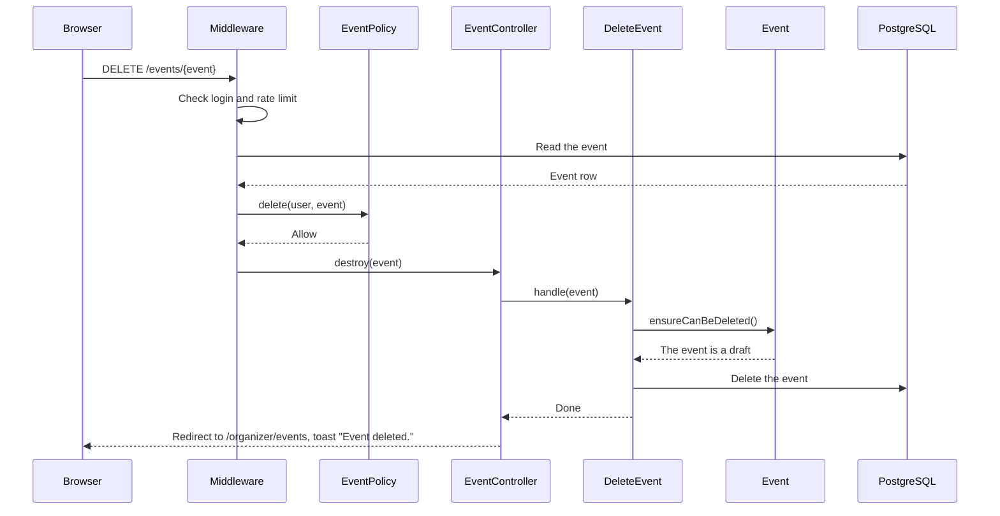
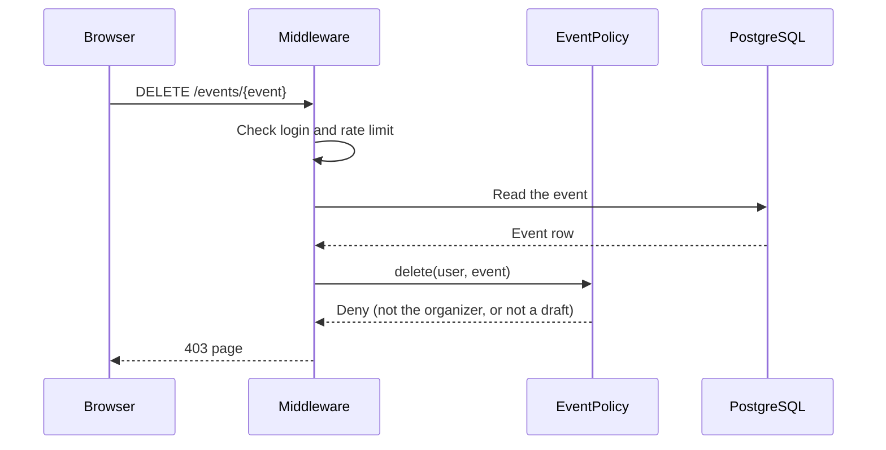
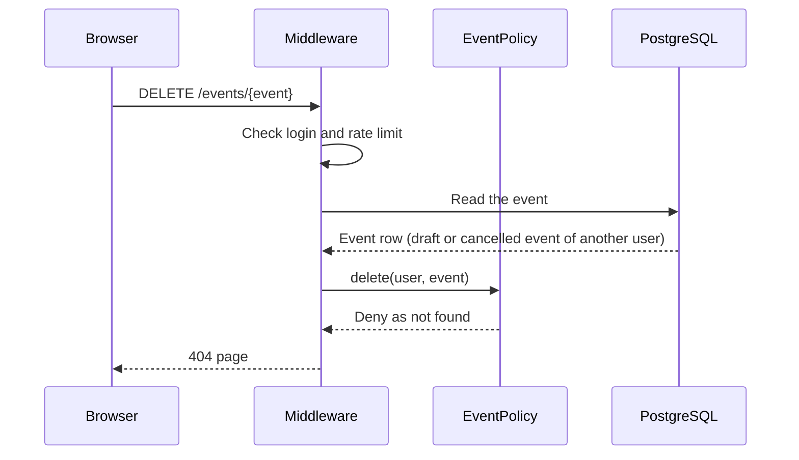
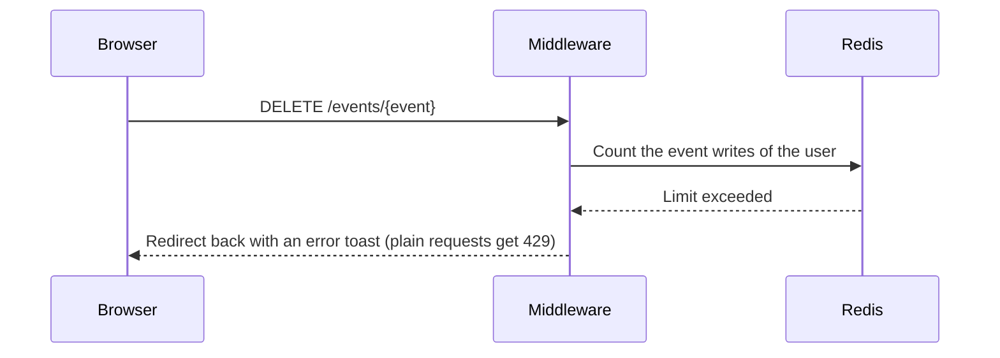

# M3 — DeleteEvent: Delete a Draft Event

> **For agentic workers:** REQUIRED SUB-SKILL: Use superpowers:executing-plans to implement this plan task-by-task. Steps use checkbox (`- [ ]`) syntax for tracking.

**Goal:** The organizer can delete a draft event. Nobody can delete a published or
cancelled event (BR-E17). A red "Delete" button on the page of a draft opens a confirm
dialog. After the delete, the user sees "My events" and the toast "Event deleted.".

**Architecture:** The route `DELETE /events/{event}` (`EventController@destroy`) checks
`EventPolicy::delete` with the `can` middleware and has the `event-writes` limit. The
policy allows only the organizer of a draft: 404 when the person cannot see the event,
403 for all other refusals. The `DeleteEvent` Action calls
`Event::ensureCanBeDeleted()`, which throws `InvalidStateTransition` when the event is
not a draft, and then deletes the row. The model check is a last line of defense,
because the policy already refuses events that are not drafts.

**Tech Stack:** Laravel 13, Inertia 3, React 19, TypeScript, Wayfinder, Pest.

**Spec:** `docs/superpowers/specs/2026-09-28-event-booking-design.md` (sections 3, 5, 6
and 8), `docs/design/business-rules.md` (BR-E17 and the state diagram).

## Global Constraints

- BR-E17 is enforced by the policy and by the model.
- `EventPolicy::delete` returns a `Response`: 404 when the person cannot see the event,
  allow for the organizer of a draft, 403 for all other refusals.
- `Event::ensureCanBeDeleted()` throws `InvalidStateTransition::cannotDelete()` when the
  event is not a draft. `Event::canBeDeleted()` gives the same answer as a bool.
- A draft can be deleted also when its start time is in the past. BR-E17 does not limit
  the start time.
- The route is `DELETE /events/{event}`, with the name `events.destroy`. It has the
  `auth` middleware and `throttle:event-writes`.
- `DeleteEvent` is a single delete, with no transaction (spec section 5). A draft has no
  bookings, so no other rows depend on it.
- After a delete, the user sees `organizer.events.index` and the toast
  "Event deleted.".
- The controller calls one Action and contains no queries.
- The Action directory is `app/Actions/DeleteEvent/` with `DeleteEvent.php` and
  `README.md`. The README has one sequence diagram for each outcome and no `alt` blocks.
  It is in Simple English.
- Each test that covers a business rule starts with the ID of the rule.
- Run commands inside the `app` container: `docker compose exec app <command>`. The
  tests use the test database. Do not run `migrate:fresh` against the development
  database.

## Review Focus

1. **The two checks of BR-E17.** The policy refuses events that are not drafts (403).
   The model check runs only if a request gets past the policy.
2. **404 or 403.** Another user's draft gives 404. An admin gets 403 on another user's
   draft, because admins can see drafts.
3. **The dialog.** "Cancel" changes nothing. "Delete" opens "My events" with the toast,
   and the event is not in the tables.

---

### Task 1: Policy response and model guard

**Files:**

- Modify: `app/Exceptions/Domain/InvalidStateTransition.php`
- Modify: `app/Models/Event.php`
- Modify: `app/Policies/EventPolicy.php`
- Test: `tests/Feature/EventModelTest.php`
- Test: `tests/Feature/EventPolicyTest.php`

**Interfaces:**

- Produces:
    - `InvalidStateTransition::cannotDelete(EventStatus $status): self` with the message
      `Only a draft event can be deleted. This event is {status}.`
    - `Event::canBeDeleted(): bool` and `Event::ensureCanBeDeleted(): void`.
    - `EventPolicy::delete(User $user, Event $event): Response`.

- [ ] **Step 1: Write the failing tests**

Add these tests to the end of `tests/Feature/EventModelTest.php`:

```php
test('BR-E17: a draft can be deleted', function () {
    $event = Event::factory()->make();

    expect($event->canBeDeleted())->toBeTrue();

    $event->ensureCanBeDeleted();
});

test('BR-E17: a published event cannot be deleted', function () {
    $event = Event::factory()->published()->make();

    expect($event->canBeDeleted())->toBeFalse()
        ->and(fn () => $event->ensureCanBeDeleted())
        ->toThrow(InvalidStateTransition::class, 'Only a draft event can be deleted. This event is published.');
});

test('BR-E17: a cancelled event cannot be deleted', function () {
    $event = Event::factory()->cancelled()->make();

    expect($event->canBeDeleted())->toBeFalse()
        ->and(fn () => $event->ensureCanBeDeleted())
        ->toThrow(InvalidStateTransition::class, 'Only a draft event can be deleted. This event is cancelled.');
});
```

The first test passes when `ensureCanBeDeleted()` throws nothing. Pest marks a test
with no assertion after `expect` as passed, because `expect` already ran.

Add these tests after the test `BR-E17: nobody can delete a published or cancelled
event` in `tests/Feature/EventPolicyTest.php`:

```php
test('BR-E17: another user gets a 404 for a draft event that they cannot see', function () {
    $event = Event::factory()->for($this->organizer, 'organizer')->create();

    expect(Gate::forUser($this->otherUser)->inspect('delete', $event)->status())->toBe(404);
});

test('BR-E17: an admin gets a 403 for the draft event of another user', function () {
    $event = Event::factory()->for($this->organizer, 'organizer')->create();

    $response = Gate::forUser($this->admin)->inspect('delete', $event);

    expect($response->denied())->toBeTrue()
        ->and($response->status())->toBeNull();
});
```

- [ ] **Step 2: Run the tests to make sure they fail**

Run: `docker compose exec app php artisan test --compact tests/Feature/EventModelTest.php tests/Feature/EventPolicyTest.php`
Expected: FAIL. The method `canBeDeleted` does not exist, and the policy gives no 404.

- [ ] **Step 3: Write the exception constructor**

In `app/Exceptions/Domain/InvalidStateTransition.php`, add after `cannotPublish()`:

```php
/**
 * BR-E17: only a draft event can be deleted.
 */
public static function cannotDelete(EventStatus $status): self
{
    return new self(__('Only a draft event can be deleted. This event is :status.', [
        'status' => $status->value,
    ]));
}
```

- [ ] **Step 4: Write the model methods**

In `app/Models/Event.php`, add after `publish()`:

```php
/**
 * Whether the event can be deleted (BR-E17). The page uses it with the policy.
 */
public function canBeDeleted(): bool
{
    return $this->isDraft();
}

/**
 * Check that the event can be deleted (BR-E17). The policy refuses the other events
 * first, so this is a last line of defense.
 *
 * @throws InvalidStateTransition
 */
public function ensureCanBeDeleted(): void
{
    if (! $this->canBeDeleted()) {
        throw InvalidStateTransition::cannotDelete($this->status);
    }
}
```

- [ ] **Step 5: Change the policy**

In `app/Policies/EventPolicy.php`, replace the `delete` method:

```php
/**
 * BR-E17. A person who cannot see the event gets a 404, so that hidden events stay
 * unknown. The model checks the state again before the delete.
 */
public function delete(User $user, Event $event): Response
{
    if ($this->view($user, $event)->denied()) {
        return Response::denyAsNotFound();
    }

    return $event->isOrganizedBy($user) && $event->canBeDeleted()
        ? Response::allow()
        : Response::deny();
}
```

- [ ] **Step 6: Run the tests to make sure they pass**

Run: `docker compose exec app php artisan test --compact tests/Feature/EventModelTest.php tests/Feature/EventPolicyTest.php`
Expected: PASS (27 tests in `EventModelTest.php`, 26 tests in `EventPolicyTest.php`).
The PR 1 tests for BR-E17 pass without changes.

Run: `docker compose exec app composer types:check`
Expected: no errors.

- [ ] **Step 7: Commit**

```bash
git add app/Exceptions/Domain/InvalidStateTransition.php app/Models/Event.php \
  app/Policies/EventPolicy.php tests/Feature/EventModelTest.php \
  tests/Feature/EventPolicyTest.php
git commit -m "feat: check the delete rule in the policy and in the model"
```

### Task 2: Action, route and controller

**Files:**

- Create: `app/Actions/DeleteEvent/DeleteEvent.php`
- Modify: `app/Http/Controllers/EventController.php`
- Modify: `routes/web.php`
- Test: `tests/Feature/DeleteEventTest.php`
- Test: `tests/Feature/EventWritesRateLimitTest.php`

**Interfaces:**

- Consumes: `Event::ensureCanBeDeleted()`.
- Produces:
    - `DeleteEvent::handle(Event $event): void`.
    - Route `events.destroy`: `DELETE /events/{event}`. Wayfinder function `destroy`
      in `@/routes/events`.
    - Flash data `toast` with `type` `success` and `message` `Event deleted.`.

- [ ] **Step 1: Write the failing tests**

Create the file with `php artisan make:test --pest DeleteEventTest --no-interaction`,
then replace its content:

```php
<?php

use App\Models\Event;
use App\Models\User;

beforeEach(function () {
    $this->organizer = User::factory()->create();
    $this->otherUser = User::factory()->create();

    $this->draft = Event::factory()->for($this->organizer, 'organizer')->create();
});

test('BR-E17: the organizer deletes a draft event', function () {
    $this->actingAs($this->organizer)
        ->delete(route('events.destroy', $this->draft))
        ->assertRedirect(route('organizer.events.index'))
        ->assertInertiaFlash('toast', ['type' => 'success', 'message' => 'Event deleted.']);

    expect(Event::find($this->draft->id))->toBeNull();
});

test('BR-E17: the organizer can delete a draft that has started', function () {
    $event = Event::factory()->started()->for($this->organizer, 'organizer')->create();

    $this->actingAs($this->organizer)
        ->delete(route('events.destroy', $event))
        ->assertRedirect(route('organizer.events.index'));

    expect(Event::find($event->id))->toBeNull();
});

test('a visitor is sent to the login page', function () {
    $this->delete(route('events.destroy', $this->draft))->assertRedirect(route('login'));

    expect(Event::find($this->draft->id))->not->toBeNull();
});

test('BR-E17: another user gets a 404 for a draft event', function () {
    $this->actingAs($this->otherUser)
        ->delete(route('events.destroy', $this->draft))
        ->assertNotFound();

    expect(Event::find($this->draft->id))->not->toBeNull();
});

test('BR-E17: an admin cannot delete the draft event of another user', function () {
    $admin = User::factory()->admin()->create();

    $this->actingAs($admin)
        ->delete(route('events.destroy', $this->draft))
        ->assertForbidden();

    expect(Event::find($this->draft->id))->not->toBeNull();
});

test('BR-E17: the organizer cannot delete a published event', function () {
    $event = Event::factory()->published()->for($this->organizer, 'organizer')->create();

    $this->actingAs($this->organizer)
        ->delete(route('events.destroy', $event))
        ->assertForbidden();

    expect(Event::find($event->id))->not->toBeNull();
});

test('BR-E17: the organizer cannot delete a cancelled event', function () {
    $event = Event::factory()->cancelled()->for($this->organizer, 'organizer')->create();

    $this->actingAs($this->organizer)
        ->delete(route('events.destroy', $event))
        ->assertForbidden();

    expect(Event::find($event->id))->not->toBeNull();
});
```

Add this test to `tests/Feature/EventWritesRateLimitTest.php`:

```php
test('the delete route uses the same limit', function () {
    $event = Event::factory()->for($this->user, 'organizer')->create();

    $this->actingAs($this->user)
        ->delete(route('events.destroy', $event))
        ->assertTooManyRequests();

    expect(Event::find($event->id))->not->toBeNull();
});
```

- [ ] **Step 2: Run the tests to make sure they fail**

Run: `docker compose exec app php artisan test --compact tests/Feature/DeleteEventTest.php`
Expected: FAIL. The route `events.destroy` is not defined.

- [ ] **Step 3: Write the Action**

Run: `docker compose exec app php artisan make:class Actions/DeleteEvent/DeleteEvent --no-interaction`,
then replace its content:

```php
<?php

namespace App\Actions\DeleteEvent;

use App\Exceptions\Domain\InvalidStateTransition;
use App\Models\Event;

class DeleteEvent
{
    /**
     * Delete a draft event (BR-E17). A draft has no bookings, so no other rows depend
     * on it.
     *
     * @throws InvalidStateTransition
     */
    public function handle(Event $event): void
    {
        $event->ensureCanBeDeleted();
        $event->delete();
    }
}
```

- [ ] **Step 4: Write the controller method and the route**

In `app/Http/Controllers/EventController.php`, add the import
`App\Actions\DeleteEvent\DeleteEvent` and add this method after `update`:

```php
/**
 * Delete a draft event and show the events of the user.
 */
public function destroy(Event $event, DeleteEvent $deleteEvent): RedirectResponse
{
    $deleteEvent->handle($event);

    Inertia::flash('toast', ['type' => 'success', 'message' => __('Event deleted.')]);

    return to_route('organizer.events.index');
}
```

In `routes/web.php`, add this route to the `auth` group, after the `events.update`
route:

```php
Route::delete('events/{event}', [EventController::class, 'destroy'])
    ->whereNumber('event')
    ->middleware('throttle:event-writes')
    ->name('events.destroy')
    ->can('delete', 'event');
```

- [ ] **Step 5: Run the tests to make sure they pass**

Run: `docker compose exec app php artisan test --compact tests/Feature/DeleteEventTest.php tests/Feature/EventWritesRateLimitTest.php`
Expected: PASS (7 tests in `DeleteEventTest.php`, 6 tests in
`EventWritesRateLimitTest.php`).

Run: `docker compose exec app php artisan wayfinder:generate --with-form` and
`docker compose exec app composer types:check`
Expected: no errors.

- [ ] **Step 6: Commit**

```bash
git add app/Actions/DeleteEvent/DeleteEvent.php app/Http/Controllers/EventController.php \
  routes/web.php tests/Feature/DeleteEventTest.php tests/Feature/EventWritesRateLimitTest.php
git commit -m "feat: let organizers delete their draft events"
```

### Task 3: The "Delete" button and the confirm dialog

**Files:**

- Modify: `app/Http/Controllers/EventController.php`
- Create: `resources/js/components/delete-event-dialog.tsx`
- Modify: `resources/js/pages/events/show.tsx`
- Test: `tests/Feature/GetEventTest.php`

**Interfaces:**

- Consumes: the Wayfinder function `destroy` in `@/routes/events`.
- Produces: the key `delete` (bool) in the prop `can` of the page `events/show`.

- [ ] **Step 1: Write the failing tests**

Add these tests to the end of `tests/Feature/GetEventTest.php`:

```php
test('BR-E17: the organizer sees the delete button on a draft', function () {
    $event = Event::factory()->for($this->organizer, 'organizer')->create();

    $this->actingAs($this->organizer)
        ->get(route('events.show', $event))
        ->assertInertia(fn (Assert $page) => $page->where('can.delete', true));
});

test('BR-E17: the organizer does not see the delete button on a published event', function () {
    $event = Event::factory()->published()->for($this->organizer, 'organizer')->create();

    $this->actingAs($this->organizer)
        ->get(route('events.show', $event))
        ->assertInertia(fn (Assert $page) => $page->where('can.delete', false));
});

test('BR-E17: an admin does not see the delete button on the draft of another user', function () {
    $event = Event::factory()->for($this->organizer, 'organizer')->create();

    $this->actingAs($this->admin)
        ->get(route('events.show', $event))
        ->assertInertia(fn (Assert $page) => $page->where('can.delete', false));
});
```

- [ ] **Step 2: Run the tests to make sure they fail**

Run: `docker compose exec app php artisan test --compact tests/Feature/GetEventTest.php`
Expected: FAIL. The prop `can.delete` does not exist.

- [ ] **Step 3: Pass the result to the page**

In `app/Http/Controllers/EventController.php`, add this key to the `can` array of
`show`:

```php
'delete' => $request->user()?->can('delete', $event) ?? false,
```

The policy checks the person and the state (BR-E17), so the controller needs no other
check.

- [ ] **Step 4: Write the dialog**

Create `resources/js/components/delete-event-dialog.tsx`:

```tsx
import { Form } from '@inertiajs/react';
import { Trash2 } from 'lucide-react';
import { useState } from 'react';
import { Button } from '@/components/ui/button';
import {
    Dialog,
    DialogClose,
    DialogContent,
    DialogDescription,
    DialogFooter,
    DialogTitle,
    DialogTrigger,
} from '@/components/ui/dialog';
import { destroy } from '@/routes/events';

/**
 * A button that asks for a confirmation and then deletes the draft event. The dialog
 * closes when the request ends, also when the server refuses with an error toast.
 */
export function DeleteEventDialog({ eventId }: { eventId: number }) {
    const [open, setOpen] = useState(false);

    return (
        <Dialog open={open} onOpenChange={setOpen}>
            <DialogTrigger asChild>
                <Button size="sm" variant="destructive">
                    <Trash2 />
                    Delete
                </Button>
            </DialogTrigger>
            <DialogContent>
                <DialogTitle>Delete this draft?</DialogTitle>
                <DialogDescription>This cannot be undone.</DialogDescription>
                <Form
                    {...destroy.form(eventId)}
                    onFinish={() => setOpen(false)}
                >
                    {({ processing }) => (
                        <DialogFooter className="gap-2">
                            <DialogClose asChild>
                                <Button variant="secondary">Cancel</Button>
                            </DialogClose>
                            <Button
                                type="submit"
                                variant="destructive"
                                disabled={processing}
                            >
                                Delete
                            </Button>
                        </DialogFooter>
                    )}
                </Form>
            </DialogContent>
        </Dialog>
    );
}
```

`DialogClose` gives its child `type="button"`, so "Cancel" does not submit the form.

- [ ] **Step 5: Show the button**

In `resources/js/pages/events/show.tsx`:

- Import `DeleteEventDialog` from `@/components/delete-event-dialog`.
- Change the type of `can` to `{ update: boolean; publish: boolean; delete: boolean }`.
- Change the condition of the button group to
  `(can.publish || can.update || can.delete)`.
- Add `{can.delete && <DeleteEventDialog eventId={event.id} />}` at the end of the
  group, after the publish dialog.

- [ ] **Step 6: Run the tests and the checks**

Run: `docker compose exec app php artisan test --compact tests/Feature/GetEventTest.php`
Expected: PASS (19 tests).

Run: `npm run types:check`, `npm run check:fix` and `docker compose exec app composer types:check`
Expected: no errors.

The reviewer checks in the browser with a draft of `organizer@example.com`:

- the page shows "Edit", "Publish" and a red "Delete";
- "Delete" opens the dialog, and "Cancel" closes it with no change;
- "Delete" in the dialog opens "My events" with the toast "Event deleted.", and the
  event is not in the tables;
- a published event shows no "Delete".

- [ ] **Step 7: Commit**

```bash
git add app/Http/Controllers/EventController.php \
  resources/js/components/delete-event-dialog.tsx resources/js/pages/events/show.tsx \
  tests/Feature/GetEventTest.php
git commit -m "feat: add a delete button with a confirm dialog"
```

### Task 4: README, spec, checks and handoff

**Files:**

- Create: `app/Actions/DeleteEvent/README.md`
- Modify: `docs/superpowers/specs/2026-09-28-event-booking-design.md` (section 6)
- Modify: `HANDOFF.md`

- [ ] **Step 1: Write the README**

Create `app/Actions/DeleteEvent/README.md`:

````markdown
# DeleteEvent

Deletes a draft event (`DELETE /events/{event}`). After the delete, the user sees the
"My events" page.

Before the controller runs:

- The `auth` middleware sends visitors to the login page.
- The `event-writes` rate limiter allows 20 event writes each minute for each user.
- The `delete` ability of `EventPolicy` checks the person and the event. Only the
  organizer can delete the event, and only when it is a draft (BR-E17). A person who
  cannot see the event gets 404, so that hidden events stay unknown. Other refusals
  give 403.

The Action calls `Event::ensureCanBeDeleted()` before the delete. The policy already
refuses events that are not drafts, so this check is a last line of defense. If it
fails, the model throws `InvalidStateTransition`, and the handler in
`bootstrap/app.php` shows an error toast.

The Action makes one delete, with no transaction. A draft has no bookings, so no other
rows depend on it. The start time does not matter: a draft that has started can be
deleted.

## The event is deleted



## The person cannot delete the event



## The person cannot see the event



## The user made too many event writes


````

Render each diagram locally to check it:
`npx -y @mermaid-js/mermaid-cli -i app/Actions/DeleteEvent/README.md -o <scratch-dir>/delete-event.md`
Expected: four SVG files and no errors.

- [ ] **Step 2: Update the spec**

In section 6 of `docs/superpowers/specs/2026-09-28-event-booking-design.md`, replace:

```markdown
    - `event-writes`: 20 per minute per user, on create, update, publish and cancel.
```

with:

```markdown
    - `event-writes`: 20 per minute per user, on create, update, publish, delete and
      cancel.
```

- [ ] **Step 3: Format and run all checks**

Run: `docker compose exec app vendor/bin/pint --format agent app bootstrap/app.php routes tests`
Run: `npm run check:fix`
Run: `docker compose exec app composer ci:check`
Expected: Pint, PHPStan, `vp check`, `tsc` and all tests pass.

- [ ] **Step 4: Update `HANDOFF.md`**

"Where we are": PRs 1 to 6 are merged. The current PR is M3 PR 7
(`feat/delete-event`), with the path of this plan. Add the decisions: BR-E17 is checked
by the policy (403, 404 for hidden events) and by the model
(`Event::ensureCanBeDeleted()`, a last line of defense); the delete route is REST
(`DELETE /events/{event}`) and has the `event-writes` limit; a started draft can be
deleted; the confirm dialog; after the delete the user sees "My events".
"Next steps": the owner reviews this PR, then PR 8 (`GetUpcomingEvents`), the last PR
of M3.

- [ ] **Step 5: Commit**

```bash
git add app/Actions/DeleteEvent/README.md \
  docs/superpowers/specs/2026-09-28-event-booking-design.md HANDOFF.md \
  docs/superpowers/plans/2026-10-07-m3-delete-event.md
git commit -m "docs: document DeleteEvent and update handoff"
```
