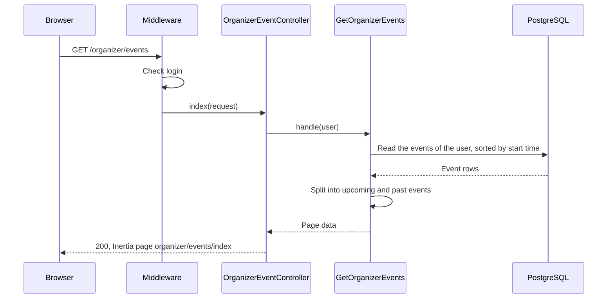
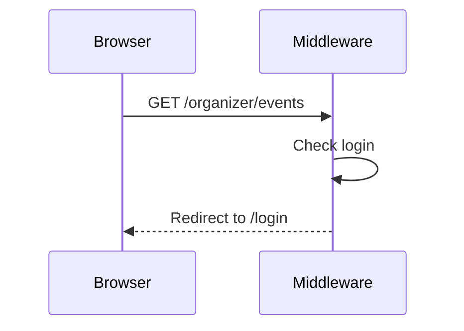

# M3 — GetOrganizerEvents: the "My events" Page

> **For agentic workers:** REQUIRED SUB-SKILL: Use superpowers:executing-plans to implement this plan task-by-task. Steps use checkbox (`- [ ]`) syntax for tracking.

**Goal:** A logged-in user can see all the events that they organize on the page
`/organizer/events`. The page has two tables: "Upcoming" and "Past". Each row shows the
title, the status, the start time and the booked seats.

**Architecture:** The route `organizer.events.index` has the `auth` middleware.
`OrganizerEventController@index` calls the `GetOrganizerEvents` Action. The Action reads
the events of the user with one query and splits them into upcoming and past events.
`Event::seatsBooked()` gives the number of booked seats. The React page
`organizer/events/index` shows the two tables in the sidebar layout of the starter kit.

**Tech Stack:** Laravel 13, Inertia 3, React 19, TypeScript, Wayfinder, Pest.

**Spec:** `docs/superpowers/specs/2026-09-28-event-booking-design.md` (sections 3, 5 and
8), `docs/design/erd.md` (index `events(organizer_id)`).

## Global Constraints

- The page shows only the events of the logged-in user, for all users. Admins also see
  only their own events on this page.
- The page shows events with all statuses: draft, published and cancelled.
- "Upcoming" has the events that have not started, earliest first. "Past" has the
  events that have started, most recent first. The Action uses `Event::hasStarted()`
  for the split.
- No pagination.
- Booked seats = capacity − available seats (`Event::seatsBooked()`).
- The route has the `auth` middleware only, not `verified`.
- The controller calls one Action and contains no queries.
- The Action directory is `app/Actions/GetOrganizerEvents/` with
  `GetOrganizerEvents.php` and `README.md`. The README has one sequence diagram for each
  outcome and no `alt` blocks. It is in Simple English.
- Page props use the snake_case names of the columns.
- The sidebar shows the link "My events" only to logged-in users.
- When the user has no events, the page shows "You have no events yet." and a link to
  the create page.
- Run commands inside the `app` container: `docker compose exec app <command>`. The
  tests use the test database. Do not run `migrate:fresh` against the development
  database.

## Review Focus

1. **The split between upcoming and past.** An event that starts now is in "Past", the
   same as `Event::hasStarted()`.
2. **The order in each table.** "Upcoming" is earliest first. "Past" is most recent
   first.
3. **Events of other users.** They do not show, also for an admin.
4. **The table on a phone.** The table scrolls horizontally, and the page does not.
5. **The empty state.** A new user sees the message and the link to the create page.

---

### Task 1: Model method, Action, route and page

**Files:**

- Modify: `app/Models/Event.php`
- Create: `app/Actions/GetOrganizerEvents/GetOrganizerEvents.php`
- Create: `app/Http/Controllers/OrganizerEventController.php`
- Modify: `routes/web.php`
- Modify: `resources/js/types/event.ts`
- Create: `resources/js/components/event-status-badge.tsx`
- Create: `resources/js/pages/organizer/events/index.tsx`
- Test: `tests/Feature/EventModelTest.php`
- Test: `tests/Feature/GetOrganizerEventsTest.php`

**Interfaces:**

- Produces:
    - `Event::seatsBooked(): int`.
    - Route `organizer.events.index`: `GET /organizer/events`. Wayfinder function
      `index` in `@/routes/organizer/events`.
    - `GetOrganizerEvents::handle(User $organizer): array` with the keys `upcoming` and
      `past`. Each one is a list of rows with the keys `id`, `title`, `starts_at`
      (ISO 8601), `status`, `capacity` and `seats_booked`.
    - Inertia page `organizer/events/index` with the props `upcoming` and `past` of
      type `OrganizerEventRow[]`.
    - Component `EventStatusBadge` with the prop `status`.

- [ ] **Step 1: Write the failing tests**

Add this test to the end of `tests/Feature/EventModelTest.php`:

```php
test('an event knows how many seats are booked', function () {
    $event = Event::factory()->create(['capacity' => 50, 'seats_available' => 38]);

    expect($event->seatsBooked())->toBe(12);
});
```

Create the file with `php artisan make:test --pest GetOrganizerEventsTest --no-interaction`,
then replace its content:

```php
<?php

use App\Models\Event;
use App\Models\User;
use Inertia\Testing\AssertableInertia as Assert;

beforeEach(function () {
    $this->freezeTime();

    $this->organizer = User::factory()->create();
});

/**
 * Create an event of the organizer that starts at the given time.
 */
function eventOf(User $organizer, string $title, DateTimeInterface $startsAt, string $state = 'draft'): Event
{
    $factory = Event::factory()->for($organizer, 'organizer');

    if ($state !== 'draft') {
        $factory = $factory->{$state}();
    }

    return $factory->create(['title' => $title, 'starts_at' => $startsAt]);
}

test('a visitor is sent to the login page', function () {
    $this->get(route('organizer.events.index'))->assertRedirect(route('login'));
});

test('the organizer sees the data of each event', function () {
    $event = eventOf($this->organizer, 'Laravel Meetup', now()->addDays(2), 'published');
    $event->forceFill(['capacity' => 50, 'seats_available' => 38])->save();

    $this->actingAs($this->organizer)
        ->get(route('organizer.events.index'))
        ->assertOk()
        ->assertInertia(fn (Assert $page) => $page
            ->component('organizer/events/index')
            ->where('upcoming', [[
                'id' => $event->id,
                'title' => 'Laravel Meetup',
                'starts_at' => now()->addDays(2)->toIso8601String(),
                'status' => 'published',
                'capacity' => 50,
                'seats_booked' => 12,
            ]])
            ->where('past', [])
        );
});

test('upcoming events come earliest first and past events most recent first', function () {
    eventOf($this->organizer, 'In ten days', now()->addDays(10), 'published');
    eventOf($this->organizer, 'In two days', now()->addDays(2));
    eventOf($this->organizer, 'In five days', now()->addDays(5), 'cancelled');
    eventOf($this->organizer, 'Three days ago', now()->subDays(3), 'published');
    eventOf($this->organizer, 'Now', now());
    eventOf($this->organizer, 'One day ago', now()->subDay(), 'cancelled');

    $this->actingAs($this->organizer)
        ->get(route('organizer.events.index'))
        ->assertInertia(fn (Assert $page) => $page
            ->where('upcoming', fn ($rows) => collect($rows)->pluck('title')->all()
                === ['In two days', 'In five days', 'In ten days'])
            ->where('past', fn ($rows) => collect($rows)->pluck('title')->all()
                === ['Now', 'One day ago', 'Three days ago'])
        );
});

test('the page does not show the events of other users', function () {
    eventOf($this->organizer, 'Mine', now()->addDay());
    eventOf(User::factory()->create(), 'Not mine', now()->addDay(), 'published');

    $this->actingAs($this->organizer)
        ->get(route('organizer.events.index'))
        ->assertInertia(fn (Assert $page) => $page
            ->where('upcoming', fn ($rows) => collect($rows)->pluck('title')->all() === ['Mine'])
        );
});

test('an admin sees only their own events', function () {
    $admin = User::factory()->admin()->create();
    eventOf($this->organizer, 'Not mine', now()->addDay());

    $this->actingAs($admin)
        ->get(route('organizer.events.index'))
        ->assertInertia(fn (Assert $page) => $page
            ->where('upcoming', [])
            ->where('past', [])
        );
});
```

- [ ] **Step 2: Run the tests to make sure they fail**

Run: `docker compose exec app php artisan test --compact tests/Feature/GetOrganizerEventsTest.php tests/Feature/EventModelTest.php`
Expected: FAIL. The method `seatsBooked` and the route `organizer.events.index` are
not defined.

- [ ] **Step 3: Write the model method**

In `app/Models/Event.php`, add after `isCancelled()`:

```php
/**
 * The number of seats that attendees have booked.
 */
public function seatsBooked(): int
{
    return $this->capacity - $this->seats_available;
}
```

- [ ] **Step 4: Write the Action**

Run: `docker compose exec app php artisan make:class Actions/GetOrganizerEvents/GetOrganizerEvents --no-interaction`,
then replace its content:

```php
<?php

namespace App\Actions\GetOrganizerEvents;

use App\Models\Event;
use App\Models\User;

class GetOrganizerEvents
{
    /**
     * Get the events of the organizer, split into upcoming events (earliest first) and
     * past events (most recent first).
     *
     * @return array{upcoming: array<int, array{id: int, title: string, starts_at: string, status: string, capacity: int, seats_booked: int}>, past: array<int, array{id: int, title: string, starts_at: string, status: string, capacity: int, seats_booked: int}>}
     */
    public function handle(User $organizer): array
    {
        $events = Event::query()
            ->whereBelongsTo($organizer, 'organizer')
            ->orderBy('starts_at')
            ->orderBy('id')
            ->get(['id', 'title', 'starts_at', 'status', 'capacity', 'seats_available']);

        [$past, $upcoming] = $events->partition(fn (Event $event): bool => $event->hasStarted());

        return [
            'upcoming' => $upcoming->map($this->row(...))->values()->all(),
            'past' => $past->reverse()->map($this->row(...))->values()->all(),
        ];
    }

    /**
     * Get the data of one row of the table.
     *
     * @return array{id: int, title: string, starts_at: string, status: string, capacity: int, seats_booked: int}
     */
    private function row(Event $event): array
    {
        return [
            'id' => $event->id,
            'title' => $event->title,
            'starts_at' => $event->starts_at->toIso8601String(),
            'status' => $event->status->value,
            'capacity' => $event->capacity,
            'seats_booked' => $event->seatsBooked(),
        ];
    }
}
```

The query uses the index `events(organizer_id)`. The PHPDoc uses `array<int, ...>`, not
`list<...>`, because Larastan types `values()->all()` as `array<int, ...>`. The values
are still indexed from 0, so the page gets JSON arrays.

- [ ] **Step 5: Write the controller and the route**

Run: `docker compose exec app php artisan make:controller OrganizerEventController --no-interaction`,
then replace its content:

```php
<?php

namespace App\Http\Controllers;

use App\Actions\GetOrganizerEvents\GetOrganizerEvents;
use Illuminate\Http\Request;
use Inertia\Inertia;
use Inertia\Response;

class OrganizerEventController extends Controller
{
    /**
     * Show the events of the logged-in user.
     */
    public function index(Request $request, GetOrganizerEvents $getOrganizerEvents): Response
    {
        return Inertia::render('organizer/events/index', $getOrganizerEvents->handle($request->user()));
    }
}
```

In `routes/web.php`, add `use App\Http\Controllers\OrganizerEventController;` and add
this route to the `auth` group, after the `events.store` route:

```php
Route::get('organizer/events', [OrganizerEventController::class, 'index'])
    ->name('organizer.events.index');
```

- [ ] **Step 6: Write the TypeScript type**

In `resources/js/types/event.ts`, add:

```ts
export type OrganizerEventRow = {
    id: number;
    title: string;
    starts_at: string;
    status: EventStatus;
    capacity: number;
    seats_booked: number;
};
```

- [ ] **Step 7: Write the status badge**

Create `resources/js/components/event-status-badge.tsx`:

```tsx
import { Badge } from '@/components/ui/badge';
import type { EventStatus } from '@/types';

const labels: Record<EventStatus, string> = {
    draft: 'Draft',
    published: 'Published',
    cancelled: 'Cancelled',
};

const variants = {
    draft: 'outline',
    published: 'secondary',
    cancelled: 'destructive',
} as const;

export function EventStatusBadge({ status }: { status: EventStatus }) {
    return <Badge variant={variants[status]}>{labels[status]}</Badge>;
}
```

The event page (`events/show`) keeps its own badges. It shows no badge for a published
event.

- [ ] **Step 8: Write the page**

Create `resources/js/pages/organizer/events/index.tsx`:

```tsx
import { Head, Link, setLayoutProps } from '@inertiajs/react';
import { EventStatusBadge } from '@/components/event-status-badge';
import { LocalDateTime } from '@/components/local-date-time';
import { create, show } from '@/routes/events';
import { index } from '@/routes/organizer/events';
import type { BreadcrumbItem, OrganizerEventRow } from '@/types';

function EventTable({
    title,
    events,
}: {
    title: string;
    events: OrganizerEventRow[];
}) {
    return (
        <section className="flex flex-col gap-3">
            <h2 className="text-lg font-semibold">{title}</h2>
            {events.length === 0 ? (
                <p className="text-sm text-muted-foreground">No events.</p>
            ) : (
                <div className="overflow-x-auto rounded-md border">
                    <table className="w-full text-sm">
                        <thead className="bg-muted/50 text-left">
                            <tr>
                                <th className="px-3 py-2 font-medium">Title</th>
                                <th className="px-3 py-2 font-medium">
                                    Status
                                </th>
                                <th className="px-3 py-2 font-medium">
                                    Starts
                                </th>
                                <th className="px-3 py-2 text-right font-medium">
                                    Seats booked
                                </th>
                            </tr>
                        </thead>
                        <tbody>
                            {events.map((event) => (
                                <tr key={event.id} className="border-t">
                                    <td className="px-3 py-2">
                                        <Link
                                            href={show(event.id)}
                                            className="font-medium underline-offset-4 hover:underline"
                                        >
                                            {event.title}
                                        </Link>
                                    </td>
                                    <td className="px-3 py-2">
                                        <EventStatusBadge
                                            status={event.status}
                                        />
                                    </td>
                                    <td className="px-3 py-2 whitespace-nowrap">
                                        <LocalDateTime
                                            value={event.starts_at}
                                        />
                                    </td>
                                    <td className="px-3 py-2 text-right whitespace-nowrap">
                                        {event.seats_booked} / {event.capacity}
                                    </td>
                                </tr>
                            ))}
                        </tbody>
                    </table>
                </div>
            )}
        </section>
    );
}

export default function OrganizerEvents({
    upcoming,
    past,
}: {
    upcoming: OrganizerEventRow[];
    past: OrganizerEventRow[];
}) {
    setLayoutProps<{ breadcrumbs: BreadcrumbItem[] }>({
        breadcrumbs: [{ title: 'My events', href: index() }],
    });

    const hasEvents = upcoming.length > 0 || past.length > 0;

    return (
        <>
            <Head title="My events" />
            <div className="flex min-w-0 flex-1 flex-col gap-6 p-4">
                <h1 className="text-2xl font-semibold">My events</h1>

                {hasEvents ? (
                    <>
                        <EventTable title="Upcoming" events={upcoming} />
                        <EventTable title="Past" events={past} />
                    </>
                ) : (
                    <p className="text-sm">
                        You have no events yet.{' '}
                        <Link
                            href={create()}
                            className="font-medium underline underline-offset-4"
                        >
                            Create an event
                        </Link>
                    </p>
                )}
            </div>
        </>
    );
}
```

The page uses `LocalDateTime` from the event page, so the start time shows in the time
zone of the viewer with no hydration error.

- [ ] **Step 9: Run the tests to make sure they pass**

Run: `docker compose exec app php artisan test --compact tests/Feature/GetOrganizerEventsTest.php tests/Feature/EventModelTest.php`
Expected: PASS (5 tests in `GetOrganizerEventsTest.php`, 7 tests in
`EventModelTest.php`).

- [ ] **Step 10: Check the types and the page**

Run: `docker compose exec app php artisan wayfinder:generate --with-form`
Run: `npm run types:check` and `docker compose exec app composer types:check`
Expected: no errors.

The reviewer checks in the browser at `http://localhost:8080/organizer/events`:

- the events of the user show in the two tables, in the correct order, with the status
  badges and the booked seats;
- the title opens the event page;
- on a narrow window, the table scrolls and the page does not;
- a new user sees "You have no events yet." and the link to the create page.

- [ ] **Step 11: Commit**

```bash
git add app/Models/Event.php app/Actions/GetOrganizerEvents/GetOrganizerEvents.php \
  app/Http/Controllers/OrganizerEventController.php routes/web.php \
  resources/js/types/event.ts resources/js/components/event-status-badge.tsx \
  resources/js/pages/organizer/events/index.tsx tests/Feature/EventModelTest.php \
  tests/Feature/GetOrganizerEventsTest.php
git commit -m "feat: show the events of the organizer"
```

### Task 2: The "My events" link in the sidebar

**Files:**

- Modify: `resources/js/components/app-sidebar.tsx`

- [ ] **Step 1: Add the link**

In `resources/js/components/app-sidebar.tsx`, import `CalendarDays` from
`lucide-react` and `index as organizerEvents` from `@/routes/organizer/events`. Add
"My events" before "Create event" in the items for logged-in users:

```tsx
const navItems: NavItem[] = auth.user
    ? [
          ...mainNavItems,
          { title: 'My events', href: organizerEvents(), icon: CalendarDays },
          { title: 'Create event', href: create(), icon: CalendarPlus },
      ]
    : mainNavItems;
```

- [ ] **Step 2: Check**

Run: `npm run types:check` and `npm run check`
Expected: no errors.

The reviewer checks in the browser: logged in, "My events" shows in the sidebar, also
when it is collapsed to icons, and it opens the page. Visitors do not see the link.

- [ ] **Step 3: Commit**

```bash
git add resources/js/components/app-sidebar.tsx
git commit -m "feat: add a my events link to the sidebar"
```

### Task 3: README, checks and handoff

**Files:**

- Create: `app/Actions/GetOrganizerEvents/README.md`
- Modify: `HANDOFF.md`

- [ ] **Step 1: Write the README**

Create `app/Actions/GetOrganizerEvents/README.md`:

````markdown
# GetOrganizerEvents

Gets the events of the logged-in user for the "My events" page
(`GET /organizer/events`).

The page shows only the events of the user, with all statuses. Admins also see only
their own events on this page.

The Action reads the events with one query, sorted by start time. Then it splits them:

- "Upcoming": the events that have not started, earliest first.
- "Past": the events that have started, most recent first. An event that starts now
  has started.

For each event, the page shows the title, the status, the start time and the booked
seats (capacity − available seats).

## The events are shown



## The person is not logged in


````

Render each diagram locally to check it:
`npx -y @mermaid-js/mermaid-cli -i app/Actions/GetOrganizerEvents/README.md -o <scratch-dir>/organizer-events.md`
Expected: two SVG files and no errors.

- [ ] **Step 2: Format and run all checks**

Run: `docker compose exec app vendor/bin/pint --format agent`
Run: `npm run check:fix`
Run: `docker compose exec app composer ci:check`
Expected: Pint, PHPStan, `vp check`, `tsc` and all tests pass.

- [ ] **Step 3: Update `HANDOFF.md`**

"Where we are": PRs 1 to 3 are merged. The current PR is M3 PR 4
(`feat/organizer-events`), with the path of this plan. Add the decisions: upcoming and
past tables, no pagination, only the events of the user (also for admins),
`Event::seatsBooked()`, the "My events" link in the sidebar.
"Next steps": the owner reviews this PR, then PR 5 (`UpdateEvent`).

- [ ] **Step 4: Commit**

```bash
git add app/Actions/GetOrganizerEvents/README.md HANDOFF.md \
  docs/superpowers/plans/2026-10-07-m3-organizer-events.md
git commit -m "docs: document GetOrganizerEvents and update handoff"
```
