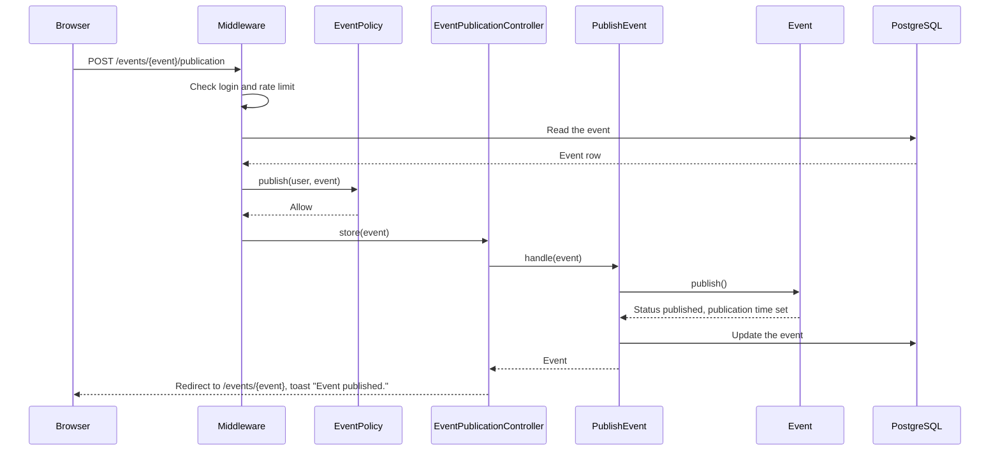
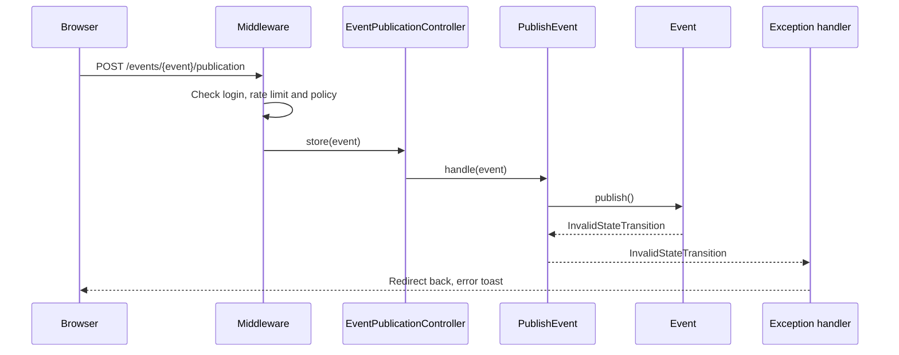
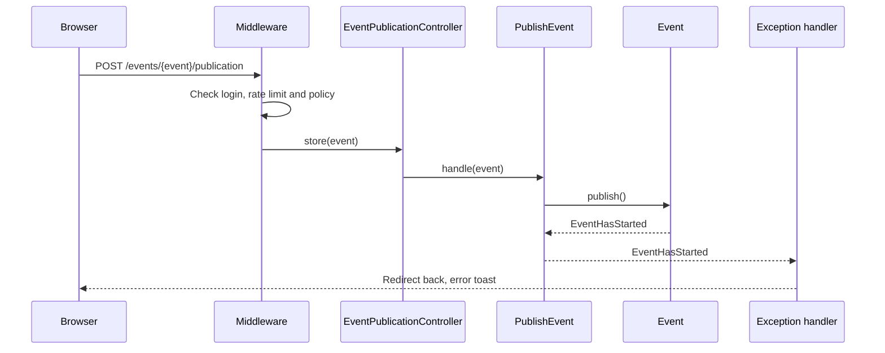
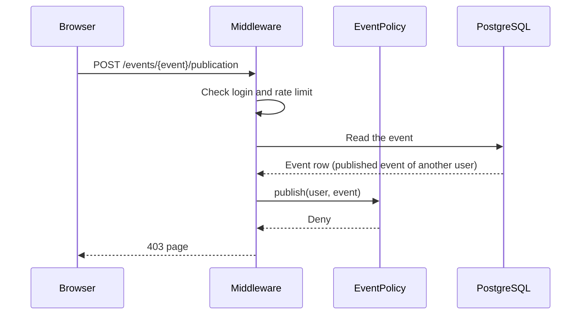
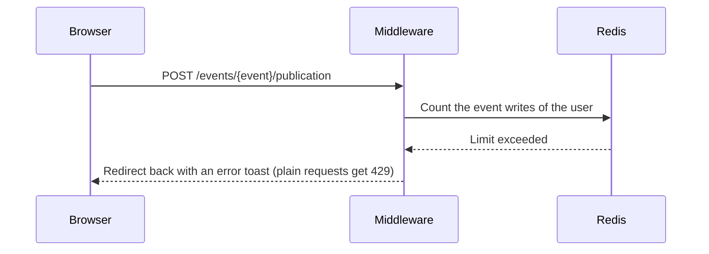

# M3 — PublishEvent: Publish a Draft Event

> **For agentic workers:** REQUIRED SUB-SKILL: Use superpowers:executing-plans to implement this plan task-by-task. Steps use checkbox (`- [ ]`) syntax for tracking.

**Goal:** The organizer can publish a draft event that has not started. After the
publish, everyone can see the event. A "Publish" button on the event page opens a
confirm dialog.

**Architecture:** `EventStatus::canTransitionTo()` describes the allowed status changes.
`Event::publish()` checks the status and the start time (BR-E10) and throws a domain
exception when the event cannot be published. The route
`POST /events/{event}/publication` (`EventPublicationController@store`) checks
`EventPolicy::publish` (BR-E9, BR-A3) with the `can` middleware and has the
`event-writes` limit. The `PublishEvent` Action calls `Event::publish()` and saves the
event. The handler from PR 5 shows the domain exceptions as error toasts.

**Tech Stack:** Laravel 13, Inertia 3, React 19, TypeScript, Wayfinder, Pest.

**Spec:** `docs/superpowers/specs/2026-09-28-event-booking-design.md` (sections 3, 4, 5,
6, 7 and 8), `docs/design/business-rules.md` (BR-E9, BR-E10, BR-A3 and the state
diagram).

## Global Constraints

- REST: publishing creates the "publication" of an event. The route is
  `POST /events/{event}/publication`, with the name `events.publication.store`. Cancel
  in M4 follows the same pattern (`POST /events/{event}/cancellation`).
- `EventStatus::canTransitionTo()` follows the state diagram: draft → published,
  draft → cancelled, published → cancelled. Cancelled is final.
- `Event::publish()` throws `InvalidStateTransition` when the event is not a draft, and
  `EventHasStarted` when the start time is now or in the past. It sets `status` and
  `published_at`. It does not save the event.
- `EventPolicy::publish` returns a `Response`: 404 when the person cannot see the event,
  403 when the person is not the organizer. The model checks the state of the event.
- The route has the `auth` middleware and `throttle:event-writes`.
- `PublishEvent` is a single update, with no transaction and no row lock (spec section
  5). Two publish requests at the same time both set the same status.
- After a publish, the user sees the event page and the toast "Event published.". When
  the model refuses, the user sees the event page and an error toast.
- The controller calls one Action and contains no queries.
- The Action directory is `app/Actions/PublishEvent/` with `PublishEvent.php` and
  `README.md`. The README has one sequence diagram for each outcome and no `alt` blocks.
  It is in Simple English.
- Each test that covers a business rule starts with the ID of the rule.
- Run commands inside the `app` container: `docker compose exec app <command>`. The
  tests use the test database. Do not run `migrate:fresh` against the development
  database.

## Review Focus

1. **The state rules.** `canTransitionTo()` matches the state diagram in
   `docs/design/business-rules.md`.
2. **The error messages.** A published, cancelled or started event shows a clear
   toast.
3. **The dialog.** It closes after the publish and after an error. The page then shows
   the badge and the buttons for the new state.
4. **404 or 403.** Another user's draft gives 404. Another user's published event
   gives 403.

---

### Task 1: State transitions, exceptions and `Event::publish()`

**Files:**

- Modify: `app/Enums/EventStatus.php`
- Create: `app/Exceptions/Domain/InvalidStateTransition.php`
- Create: `app/Exceptions/Domain/EventHasStarted.php`
- Modify: `app/Models/Event.php`
- Test: `tests/Feature/EventModelTest.php`

**Interfaces:**

- Produces:
    - `EventStatus::canTransitionTo(EventStatus $status): bool`.
    - `InvalidStateTransition::cannotPublish(EventStatus $status): self` with the
      message `Only a draft event can be published. This event is {status}.`
    - `EventHasStarted::cannotPublish(): self` with the message
      `The event has started, so it cannot be published.`
    - `Event::canBePublished(): bool` and `Event::publish(): void`.

- [ ] **Step 1: Write the failing tests**

Add `use App\Exceptions\Domain\EventHasStarted;` and
`use App\Exceptions\Domain\InvalidStateTransition;` to
`tests/Feature/EventModelTest.php`, and add these tests to the end of the file:

```php
test('BR-E10: the status follows the state diagram', function (EventStatus $from, EventStatus $to, bool $allowed) {
    expect($from->canTransitionTo($to))->toBe($allowed);
})->with([
    'draft to published' => [EventStatus::Draft, EventStatus::Published, true],
    'draft to cancelled' => [EventStatus::Draft, EventStatus::Cancelled, true],
    'draft to draft' => [EventStatus::Draft, EventStatus::Draft, false],
    'published to cancelled' => [EventStatus::Published, EventStatus::Cancelled, true],
    'published to draft' => [EventStatus::Published, EventStatus::Draft, false],
    'published to published' => [EventStatus::Published, EventStatus::Published, false],
    'cancelled to draft' => [EventStatus::Cancelled, EventStatus::Draft, false],
    'cancelled to published' => [EventStatus::Cancelled, EventStatus::Published, false],
    'cancelled to cancelled' => [EventStatus::Cancelled, EventStatus::Cancelled, false],
]);

test('BR-E10: a draft that has not started can be published', function () {
    $this->freezeSecond();
    $event = Event::factory()->make(['starts_at' => now()->addDay()]);

    expect($event->canBePublished())->toBeTrue();

    $event->publish();

    expect($event->status)->toBe(EventStatus::Published)
        ->and($event->published_at->equalTo(now()))->toBeTrue();
});

test('BR-E10: a published event cannot be published again', function () {
    $event = Event::factory()->published()->make();

    expect($event->canBePublished())->toBeFalse()
        ->and(fn () => $event->publish())
        ->toThrow(InvalidStateTransition::class, 'Only a draft event can be published. This event is published.');
});

test('BR-E10: a cancelled event cannot be published', function () {
    $event = Event::factory()->cancelled()->make();

    expect($event->canBePublished())->toBeFalse()
        ->and(fn () => $event->publish())
        ->toThrow(InvalidStateTransition::class, 'Only a draft event can be published. This event is cancelled.');
});

test('BR-E10: a draft that has started cannot be published', function () {
    $event = Event::factory()->started()->make();

    expect($event->canBePublished())->toBeFalse()
        ->and(fn () => $event->publish())
        ->toThrow(EventHasStarted::class, 'The event has started, so it cannot be published.');

    expect($event->status)->toBe(EventStatus::Draft)
        ->and($event->published_at)->toBeNull();
});
```

- [ ] **Step 2: Run the tests to make sure they fail**

Run: `docker compose exec app php artisan test --compact tests/Feature/EventModelTest.php`
Expected: FAIL. The classes `EventHasStarted` and `InvalidStateTransition` do not
exist.

- [ ] **Step 3: Write the state transitions**

Replace the content of `app/Enums/EventStatus.php`:

```php
<?php

namespace App\Enums;

enum EventStatus: string
{
    case Draft = 'draft';
    case Published = 'published';
    case Cancelled = 'cancelled';

    /**
     * Whether an event with this status can change to the given status. See the state
     * diagram in docs/design/business-rules.md.
     */
    public function canTransitionTo(self $status): bool
    {
        return match ($this) {
            self::Draft => in_array($status, [self::Published, self::Cancelled], true),
            self::Published => $status === self::Cancelled,
            self::Cancelled => false,
        };
    }
}
```

- [ ] **Step 4: Write the exceptions**

Create `app/Exceptions/Domain/InvalidStateTransition.php`:

```php
<?php

namespace App\Exceptions\Domain;

use App\Enums\EventStatus;

/**
 * The status of the event does not allow the change (see EventStatus::canTransitionTo()).
 */
class InvalidStateTransition extends DomainException
{
    /**
     * BR-E10: only a draft event can be published.
     */
    public static function cannotPublish(EventStatus $status): self
    {
        return new self(__('Only a draft event can be published. This event is :status.', [
            'status' => $status->value,
        ]));
    }
}
```

Create `app/Exceptions/Domain/EventHasStarted.php`:

```php
<?php

namespace App\Exceptions\Domain;

/**
 * The event has started, so the change is not allowed.
 */
class EventHasStarted extends DomainException
{
    /**
     * BR-E10: only an event that has not started can be published.
     */
    public static function cannotPublish(): self
    {
        return new self(__('The event has started, so it cannot be published.'));
    }
}
```

Cancel in M4 adds `cannotCancel()` to both classes.

- [ ] **Step 5: Write the model methods**

In `app/Models/Event.php`, add the imports
`App\Exceptions\Domain\EventHasStarted` and
`App\Exceptions\Domain\InvalidStateTransition`, and add after `changeCapacity()`:

```php
/**
 * Whether the event can be published now (BR-E10). The page uses it to show the
 * publish button.
 */
public function canBePublished(): bool
{
    return $this->status->canTransitionTo(EventStatus::Published) && ! $this->hasStarted();
}

/**
 * Publish the event (BR-E10). It does not save the event.
 *
 * @throws InvalidStateTransition
 * @throws EventHasStarted
 */
public function publish(): void
{
    if (! $this->status->canTransitionTo(EventStatus::Published)) {
        throw InvalidStateTransition::cannotPublish($this->status);
    }

    if ($this->hasStarted()) {
        throw EventHasStarted::cannotPublish();
    }

    $this->status = EventStatus::Published;
    $this->published_at = now();
}
```

- [ ] **Step 6: Run the tests to make sure they pass**

Run: `docker compose exec app php artisan test --compact tests/Feature/EventModelTest.php`
Expected: PASS (24 tests: 15 single tests and 9 dataset cases).

Run: `docker compose exec app composer types:check`
Expected: no errors.

- [ ] **Step 7: Commit**

```bash
git add app/Enums/EventStatus.php app/Exceptions/Domain/InvalidStateTransition.php \
  app/Exceptions/Domain/EventHasStarted.php app/Models/Event.php \
  tests/Feature/EventModelTest.php
git commit -m "feat: add event status transitions and the publish rule"
```

### Task 2: Policy, Action, route and controller

**Files:**

- Modify: `app/Policies/EventPolicy.php`
- Create: `app/Actions/PublishEvent/PublishEvent.php`
- Create: `app/Http/Controllers/EventPublicationController.php`
- Modify: `routes/web.php`
- Test: `tests/Feature/EventPolicyTest.php`
- Test: `tests/Feature/PublishEventTest.php`
- Test: `tests/Feature/EventWritesRateLimitTest.php`

**Interfaces:**

- Consumes: `Event::publish()`.
- Produces:
    - `EventPolicy::publish(User $user, Event $event): Response`.
    - `PublishEvent::handle(Event $event): Event`.
    - Route `events.publication.store`: `POST /events/{event}/publication`. Wayfinder
      function `store` in `@/routes/events/publication`.
    - Flash data `toast` with `type` `success` and `message` `Event published.`.

- [ ] **Step 1: Write the failing tests**

Add these tests after the test `BR-E9: only the organizer can publish an event` in
`tests/Feature/EventPolicyTest.php`:

```php
test('BR-E9: another user gets a 404 for a draft event that they cannot see', function () {
    $event = Event::factory()->for($this->organizer, 'organizer')->create();

    expect(Gate::forUser($this->otherUser)->inspect('publish', $event)->status())->toBe(404);
});

test('BR-E9: another user gets a 403 for a published event', function () {
    $event = Event::factory()->published()->for($this->organizer, 'organizer')->create();

    $response = Gate::forUser($this->otherUser)->inspect('publish', $event);

    expect($response->denied())->toBeTrue()
        ->and($response->status())->toBeNull();
});
```

Create the file with `php artisan make:test --pest PublishEventTest --no-interaction`,
then replace its content:

```php
<?php

use App\Enums\EventStatus;
use App\Models\Event;
use App\Models\User;

beforeEach(function () {
    $this->organizer = User::factory()->create();
    $this->otherUser = User::factory()->create();

    $this->draft = Event::factory()->for($this->organizer, 'organizer')->create();
});

test('BR-E9: the organizer publishes a draft event', function () {
    $this->freezeSecond();

    $this->actingAs($this->organizer)
        ->post(route('events.publication.store', $this->draft))
        ->assertRedirect(route('events.show', $this->draft))
        ->assertInertiaFlash('toast', ['type' => 'success', 'message' => 'Event published.']);

    $event = $this->draft->fresh();

    expect($event->status)->toBe(EventStatus::Published)
        ->and($event->published_at->equalTo(now()))->toBeTrue();
});

test('a visitor is sent to the login page', function () {
    $this->post(route('events.publication.store', $this->draft))->assertRedirect(route('login'));

    expect($this->draft->fresh()->status)->toBe(EventStatus::Draft);
});

test('BR-E9: another user gets a 404 for a draft event', function () {
    $this->actingAs($this->otherUser)
        ->post(route('events.publication.store', $this->draft))
        ->assertNotFound();

    expect($this->draft->fresh()->status)->toBe(EventStatus::Draft);
});

test('BR-E9: another user gets a 403 for a published event', function () {
    $event = Event::factory()->published()->for($this->organizer, 'organizer')->create();

    $this->actingAs($this->otherUser)
        ->post(route('events.publication.store', $event))
        ->assertForbidden();
});

test('BR-A3: an admin cannot publish the event of another user', function () {
    $admin = User::factory()->admin()->create();

    $this->actingAs($admin)
        ->post(route('events.publication.store', $this->draft))
        ->assertForbidden();

    expect($this->draft->fresh()->status)->toBe(EventStatus::Draft);
});

test('BR-E10: a published event cannot be published again', function () {
    $event = Event::factory()->published()->for($this->organizer, 'organizer')->create();
    $publishedAt = $event->published_at;

    $this->actingAs($this->organizer)
        ->from(route('events.show', $event))
        ->withHeaders(['X-Inertia' => 'true'])
        ->post(route('events.publication.store', $event))
        ->assertRedirect(route('events.show', $event))
        ->assertInertiaFlash('toast', [
            'type' => 'error',
            'message' => 'Only a draft event can be published. This event is published.',
        ]);

    expect($event->fresh()->published_at->equalTo($publishedAt))->toBeTrue();
});

test('BR-E10: a cancelled event cannot be published', function () {
    $event = Event::factory()->cancelled()->for($this->organizer, 'organizer')->create();

    $this->actingAs($this->organizer)
        ->from(route('events.show', $event))
        ->withHeaders(['X-Inertia' => 'true'])
        ->post(route('events.publication.store', $event))
        ->assertRedirect(route('events.show', $event))
        ->assertInertiaFlash('toast', [
            'type' => 'error',
            'message' => 'Only a draft event can be published. This event is cancelled.',
        ]);

    expect($event->fresh()->status)->toBe(EventStatus::Cancelled);
});

test('BR-E10: a draft that has started cannot be published', function () {
    $event = Event::factory()->started()->for($this->organizer, 'organizer')->create();

    $this->actingAs($this->organizer)
        ->from(route('events.show', $event))
        ->withHeaders(['X-Inertia' => 'true'])
        ->post(route('events.publication.store', $event))
        ->assertRedirect(route('events.show', $event))
        ->assertInertiaFlash('toast', [
            'type' => 'error',
            'message' => 'The event has started, so it cannot be published.',
        ]);

    expect($event->fresh()->status)->toBe(EventStatus::Draft);
});
```

Add this test to `tests/Feature/EventWritesRateLimitTest.php`:

```php
test('the publish route uses the same limit', function () {
    $event = Event::factory()->for($this->user, 'organizer')->create();

    $this->actingAs($this->user)
        ->post(route('events.publication.store', $event))
        ->assertTooManyRequests();
});
```

- [ ] **Step 2: Run the tests to make sure they fail**

Run: `docker compose exec app php artisan test --compact tests/Feature/PublishEventTest.php tests/Feature/EventPolicyTest.php`
Expected: FAIL. The route `events.publication.store` is not defined, and the policy
gives no 404.

- [ ] **Step 3: Change the policy**

In `app/Policies/EventPolicy.php`, replace the `publish` method:

```php
/**
 * BR-E9 and BR-A3. The model checks the state of the event (BR-E10). A person who
 * cannot see the event gets a 404, so that hidden events stay unknown.
 */
public function publish(User $user, Event $event): Response
{
    if ($this->view($user, $event)->denied()) {
        return Response::denyAsNotFound();
    }

    return $event->isOrganizedBy($user) ? Response::allow() : Response::deny();
}
```

- [ ] **Step 4: Write the Action**

Run: `docker compose exec app php artisan make:class Actions/PublishEvent/PublishEvent --no-interaction`,
then replace its content:

```php
<?php

namespace App\Actions\PublishEvent;

use App\Exceptions\Domain\EventHasStarted;
use App\Exceptions\Domain\InvalidStateTransition;
use App\Models\Event;

class PublishEvent
{
    /**
     * Publish the event (BR-E10). After this, everyone can see it (BR-E14).
     *
     * @throws InvalidStateTransition
     * @throws EventHasStarted
     */
    public function handle(Event $event): Event
    {
        $event->publish();
        $event->save();

        return $event;
    }
}
```

- [ ] **Step 5: Write the controller and the route**

Run: `docker compose exec app php artisan make:controller EventPublicationController --no-interaction`,
then replace its content:

```php
<?php

namespace App\Http\Controllers;

use App\Actions\PublishEvent\PublishEvent;
use App\Models\Event;
use Illuminate\Http\RedirectResponse;
use Inertia\Inertia;

class EventPublicationController extends Controller
{
    /**
     * Publish the event and show its page.
     */
    public function store(Event $event, PublishEvent $publishEvent): RedirectResponse
    {
        $publishEvent->handle($event);

        Inertia::flash('toast', ['type' => 'success', 'message' => __('Event published.')]);

        return to_route('events.show', $event);
    }
}
```

In `routes/web.php`, add `use App\Http\Controllers\EventPublicationController;` and add
this route to the `auth` group, after the `events.update` route:

```php
Route::post('events/{event}/publication', [EventPublicationController::class, 'store'])
    ->whereNumber('event')
    ->middleware('throttle:event-writes')
    ->name('events.publication.store')
    ->can('publish', 'event');
```

- [ ] **Step 6: Run the tests to make sure they pass**

Run: `docker compose exec app php artisan test --compact tests/Feature/PublishEventTest.php tests/Feature/EventPolicyTest.php tests/Feature/EventWritesRateLimitTest.php`
Expected: PASS (8 tests in `PublishEventTest.php`, 24 tests in `EventPolicyTest.php`,
5 tests in `EventWritesRateLimitTest.php`).

Run: `docker compose exec app php artisan wayfinder:generate --with-form` and
`docker compose exec app composer types:check`
Expected: no errors.

- [ ] **Step 7: Commit**

```bash
git add app/Policies/EventPolicy.php app/Actions/PublishEvent/PublishEvent.php \
  app/Http/Controllers/EventPublicationController.php routes/web.php \
  tests/Feature/EventPolicyTest.php tests/Feature/PublishEventTest.php \
  tests/Feature/EventWritesRateLimitTest.php
git commit -m "feat: let organizers publish their draft events"
```

### Task 3: The "Publish" button and the confirm dialog

**Files:**

- Modify: `app/Http/Controllers/EventController.php`
- Create: `resources/js/components/publish-event-dialog.tsx`
- Modify: `resources/js/pages/events/show.tsx`
- Test: `tests/Feature/GetEventTest.php`

**Interfaces:**

- Consumes: `Event::canBePublished()`, the Wayfinder function `store` in
  `@/routes/events/publication`.
- Produces: the key `publish` (bool) in the prop `can` of the page `events/show`.

- [ ] **Step 1: Write the failing tests**

Add these tests to the end of `tests/Feature/GetEventTest.php`:

```php
test('BR-E9: the organizer sees the publish button on a draft that has not started', function () {
    $event = Event::factory()->for($this->organizer, 'organizer')->create();

    $this->actingAs($this->organizer)
        ->get(route('events.show', $event))
        ->assertInertia(fn (Assert $page) => $page->where('can.publish', true));
});

test('BR-E10: the organizer does not see the publish button on a published or started event', function () {
    $published = Event::factory()->published()->for($this->organizer, 'organizer')->create();
    $started = Event::factory()->started()->for($this->organizer, 'organizer')->create();

    $this->actingAs($this->organizer)
        ->get(route('events.show', $published))
        ->assertInertia(fn (Assert $page) => $page->where('can.publish', false));

    $this->actingAs($this->organizer)
        ->get(route('events.show', $started))
        ->assertInertia(fn (Assert $page) => $page->where('can.publish', false));
});

test('BR-A3: an admin does not see the publish button on the draft of another user', function () {
    $event = Event::factory()->for($this->organizer, 'organizer')->create();

    $this->actingAs($this->admin)
        ->get(route('events.show', $event))
        ->assertInertia(fn (Assert $page) => $page->where('can.publish', false));
});
```

- [ ] **Step 2: Run the tests to make sure they fail**

Run: `docker compose exec app php artisan test --compact tests/Feature/GetEventTest.php`
Expected: FAIL. The prop `can.publish` does not exist.

- [ ] **Step 3: Pass the result to the page**

In `app/Http/Controllers/EventController.php`, change the `can` array of `show`:

```php
'can' => [
    'update' => $request->user()?->can('update', $event) ?? false,
    'publish' => ($request->user()?->can('publish', $event) ?? false) && $event->canBePublished(),
],
```

The policy checks the person (BR-E9, BR-A3). `canBePublished()` checks the event
(BR-E10).

- [ ] **Step 4: Write the dialog**

Create `resources/js/components/publish-event-dialog.tsx`:

```tsx
import { Form } from '@inertiajs/react';
import { Send } from 'lucide-react';
import { useState } from 'react';
import { Button } from '@/components/ui/button';
import {
    Dialog,
    DialogClose,
    DialogContent,
    DialogDescription,
    DialogFooter,
    DialogTitle,
    DialogTrigger,
} from '@/components/ui/dialog';
import { store } from '@/routes/events/publication';

/**
 * A button that asks for a confirmation and then publishes the event. The dialog
 * closes when the request ends, also when the server refuses with an error toast.
 */
export function PublishEventDialog({ eventId }: { eventId: number }) {
    const [open, setOpen] = useState(false);

    return (
        <Dialog open={open} onOpenChange={setOpen}>
            <DialogTrigger asChild>
                <Button size="sm">
                    <Send />
                    Publish
                </Button>
            </DialogTrigger>
            <DialogContent>
                <DialogTitle>Publish this event?</DialogTitle>
                <DialogDescription>
                    Everyone can see a published event. You cannot make it a
                    draft again.
                </DialogDescription>
                <Form {...store.form(eventId)} onFinish={() => setOpen(false)}>
                    {({ processing }) => (
                        <DialogFooter className="gap-2">
                            <DialogClose asChild>
                                <Button variant="secondary">Cancel</Button>
                            </DialogClose>
                            <Button type="submit" disabled={processing}>
                                Publish
                            </Button>
                        </DialogFooter>
                    )}
                </Form>
            </DialogContent>
        </Dialog>
    );
}
```

If `onFinish` is not a prop of `Form` in this Inertia version, use `onSuccess` and
`onError` with the same callback.

- [ ] **Step 5: Show the button**

In `resources/js/pages/events/show.tsx`:

- Import `PublishEventDialog` from `@/components/publish-event-dialog`.
- Change the type of `can` to `{ update: boolean; publish: boolean }`.
- Put the buttons in a group at the end of the title row. Replace the `can.update`
  block with:

```tsx
{
    (can.publish || can.update) && (
        <div className="ml-auto flex gap-2">
            {can.update && (
                <Button asChild variant="outline" size="sm">
                    <Link href={edit(event.id)}>
                        <Pencil />
                        Edit
                    </Link>
                </Button>
            )}
            {can.publish && <PublishEventDialog eventId={event.id} />}
        </div>
    );
}
```

- [ ] **Step 6: Run the tests and the checks**

Run: `docker compose exec app php artisan test --compact tests/Feature/GetEventTest.php`
Expected: PASS (16 tests).

Run: `npm run types:check`, `npm run check:fix` and `docker compose exec app composer types:check`
Expected: no errors.

The reviewer checks in the browser with a future draft of `organizer@example.com`:

- the page shows "Edit" and "Publish";
- "Publish" opens the dialog, and "Cancel" closes it with no change;
- "Publish" in the dialog closes it, shows the toast "Event published.", removes the
  badge "Draft" and the button "Publish", and keeps "Edit";
- the event shows to a visitor in a private window.

- [ ] **Step 7: Commit**

```bash
git add app/Http/Controllers/EventController.php \
  resources/js/components/publish-event-dialog.tsx resources/js/pages/events/show.tsx \
  tests/Feature/GetEventTest.php
git commit -m "feat: add a publish button with a confirm dialog"
```

### Task 4: README, checks and handoff

**Files:**

- Create: `app/Actions/PublishEvent/README.md`
- Modify: `HANDOFF.md`

- [ ] **Step 1: Write the README**

Create `app/Actions/PublishEvent/README.md`:

````markdown
# PublishEvent

Publishes a draft event (`POST /events/{event}/publication`). After this, everyone can
see the event (BR-E14).

Before the controller runs:

- The `auth` middleware sends visitors to the login page.
- The `event-writes` rate limiter allows 20 event writes each minute for each user.
- The `publish` ability of `EventPolicy` checks the person. Only the organizer can
  publish the event (BR-E9, BR-A3). A person who cannot see the event gets 404, so that
  hidden events stay unknown. Other refusals give 403.

`Event::publish()` checks the event (BR-E10). The event must be a draft
(`EventStatus::canTransitionTo()`), and its start time must be in the future.
Otherwise the model throws `InvalidStateTransition` or `EventHasStarted`. The handler
in `bootstrap/app.php` turns them into a redirect back with an error toast.

The Action makes one update, with no transaction. If two publish requests come at the
same time, both set the same status.

## The event is published



## The event is not a draft



## The event has started



## The person is not the organizer



## The person cannot see the event


## The user made too many event writes


````

Render each diagram locally to check it:
`npx -y @mermaid-js/mermaid-cli -i app/Actions/PublishEvent/README.md -o <scratch-dir>/publish-event.md`
Expected: six SVG files and no errors.

- [ ] **Step 2: Format and run all checks**

Run: `docker compose exec app vendor/bin/pint --format agent app bootstrap/app.php routes tests`
Run: `npm run check:fix`
Run: `docker compose exec app composer ci:check`
Expected: Pint, PHPStan, `vp check`, `tsc` and all tests pass.

- [ ] **Step 3: Update `HANDOFF.md`**

"Where we are": PRs 1 to 5 are merged. The current PR is M3 PR 6
(`feat/publish-event`), with the path of this plan. Add the decisions: REST
sub-resource routes for state changes (`POST /events/{event}/publication`, and
`/cancellation` in M4); `EventStatus::canTransitionTo()`; the exceptions
`InvalidStateTransition` and `EventHasStarted` with named constructors for each change;
`Event::canBePublished()` for the button; the publish policy gives 404 for hidden
events; the confirm dialog.
"Next steps": the owner reviews this PR, then PR 7 (`DeleteEvent`).

- [ ] **Step 4: Commit**

```bash
git add app/Actions/PublishEvent/README.md HANDOFF.md \
  docs/superpowers/plans/2026-10-07-m3-publish-event.md
git commit -m "docs: document PublishEvent and update handoff"
```
