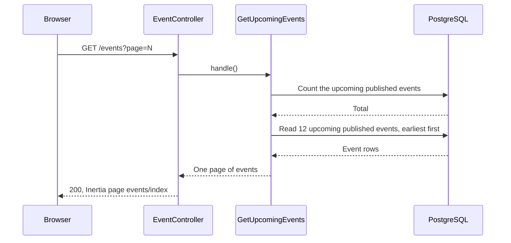
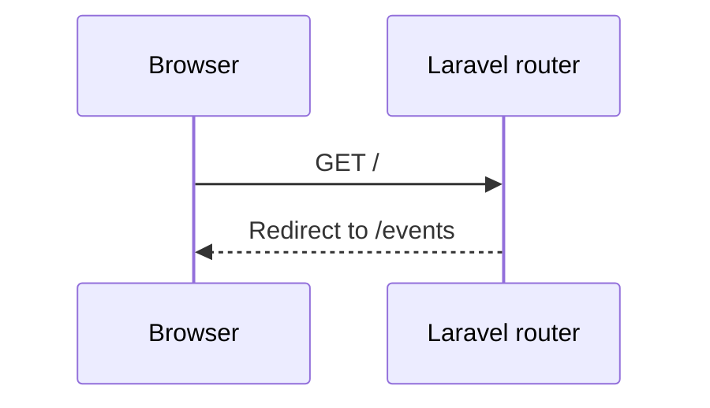

# M3 — GetUpcomingEvents: the Public List of Events

> **For agentic workers:** REQUIRED SUB-SKILL: Use superpowers:executing-plans to implement this plan task-by-task. Steps use checkbox (`- [ ]`) syntax for tracking.

**Goal:** Everyone, also visitors, can see the upcoming published events on the page
`/events`, 12 on each page. The home page `/` redirects to this list. This is the last
PR of M3.

**Architecture:** The model gets two query scopes: `published()` and `upcoming()`. The
`GetUpcomingEvents` Action uses them, sorts by start time and paginates. The public
route `events.index` (`EventController@index`) has no `auth` middleware. The React page
`events/index` shows one card for each event and Previous and Next links. The route
`home` (`/`) becomes a redirect to `/events`, and the starter kit welcome page is
deleted.

**Tech Stack:** Laravel 13, Inertia 3, React 19, TypeScript, Wayfinder, Pest.

**Spec:** `docs/superpowers/specs/2026-09-28-event-booking-design.md` (sections 3, 5 and
8), `docs/design/business-rules.md` (BR-E14, BR-E15, BR-E16),
`docs/design/erd.md` (index `events(status, starts_at)`).

## Global Constraints

- The list shows only published events whose start time is in the future (BR-E14).
  Drafts (BR-E15), cancelled events (BR-E16) and started events are not in the list.
  An event that starts now has started.
- The list is the same for visitors, users and admins.
- Earliest start time first. Events with the same start time are sorted by ID.
- 12 events on each page, with `?page=N` in the URL (Laravel `paginate(12)`).
- Sold-out events stay in the list, with a "Sold out" badge.
- The route is `GET /events`, with the name `events.index`. It has no `auth`
  middleware.
- The route `home` stays, as a redirect from `/` to `/events`. The auth layouts and
  the logout redirect use it.
- The query uses the scopes, so that the index `events(status, starts_at)` can serve
  it.
- The controller calls one Action and contains no queries.
- The Action directory is `app/Actions/GetUpcomingEvents/` with `GetUpcomingEvents.php`
  and `README.md`. The README has one sequence diagram for each outcome and no `alt`
  blocks. It is in Simple English.
- Page props use the snake_case names of the columns.
- Each test that covers a business rule starts with the ID of the rule.
- Run commands inside the `app` container: `docker compose exec app <command>`. The
  tests use the test database. Do not run `migrate:fresh` against the development
  database.

## Review Focus

1. **Which events show.** Only published events that have not started. A draft, a
   cancelled event and a started event do not show.
2. **Pagination.** Page 2 shows the 13th event. The links show "Page 2 of 2".
3. **The cards on a phone.** One column, and long titles and venues wrap.
4. **The home page.** `/` opens the list. The logo in the sidebar opens the list.
5. **The deleted welcome page.** Nothing else uses it.

---

### Task 1: Scopes, Action, route and page

**Files:**

- Modify: `app/Models/Event.php`
- Create: `app/Actions/GetUpcomingEvents/GetUpcomingEvents.php`
- Modify: `app/Http/Controllers/EventController.php`
- Modify: `routes/web.php`
- Create: `resources/js/types/pagination.ts`
- Modify: `resources/js/types/index.ts`
- Modify: `resources/js/types/event.ts`
- Create: `resources/js/pages/events/index.tsx`
- Test: `tests/Feature/GetUpcomingEventsTest.php`

**Interfaces:**

- Produces:
    - Query scopes `Event::published()` and `Event::upcoming()`.
    - `GetUpcomingEvents::handle(): LengthAwarePaginator`. Each item has the keys
      `id`, `title`, `starts_at` (ISO 8601), `venue` and `seats_available`.
    - Route `events.index`: `GET /events`. Wayfinder function `index` in
      `@/routes/events`.
    - Inertia page `events/index` with the prop `events` of type
      `Paginated<UpcomingEvent>`.

- [ ] **Step 1: Write the failing test**

Create the file with `php artisan make:test --pest GetUpcomingEventsTest --no-interaction`,
then replace its content:

```php
<?php

use App\Models\Event;
use App\Models\User;
use Inertia\Testing\AssertableInertia as Assert;

beforeEach(function () {
    $this->freezeSecond();

    $this->organizer = User::factory()->create();
});

/**
 * Create a published event of the organizer that starts at the given time.
 */
function publishedEvent(User $organizer, string $title, DateTimeInterface $startsAt): Event
{
    return Event::factory()->published()->for($organizer, 'organizer')
        ->create(['title' => $title, 'starts_at' => $startsAt]);
}

/**
 * The titles of the events on the page.
 *
 * @return list<string>
 */
function titlesOn(Assert $page): array
{
    return collect($page->toArray()['props']['events']['data'])->pluck('title')->all();
}

test('BR-E14: a visitor sees the upcoming published events', function () {
    $event = publishedEvent($this->organizer, 'Laravel Meetup', now()->addDays(2));
    $event->forceFill(['venue' => 'Main Hall', 'capacity' => 50, 'seats_available' => 0])->save();

    $this->get(route('events.index'))
        ->assertOk()
        ->assertInertia(fn (Assert $page) => $page
            ->component('events/index')
            ->where('events.data', [[
                'id' => $event->id,
                'title' => 'Laravel Meetup',
                'starts_at' => now()->addDays(2)->toIso8601String(),
                'venue' => 'Main Hall',
                'seats_available' => 0,
            ]])
            ->where('events.current_page', 1)
            ->where('events.last_page', 1)
        );
});

test('BR-E15: drafts are not in the list', function () {
    Event::factory()->for($this->organizer, 'organizer')->create(['starts_at' => now()->addDay()]);

    $this->get(route('events.index'))
        ->assertInertia(fn (Assert $page) => $page->where('events.data', []));
});

test('BR-E16: cancelled events are not in the list', function () {
    Event::factory()->cancelled()->for($this->organizer, 'organizer')->create(['starts_at' => now()->addDay()]);

    $this->get(route('events.index'))
        ->assertInertia(fn (Assert $page) => $page->where('events.data', []));
});

test('BR-E14: started events are not in the list', function () {
    publishedEvent($this->organizer, 'Yesterday', now()->subDay());
    publishedEvent($this->organizer, 'Now', now());

    $this->get(route('events.index'))
        ->assertInertia(fn (Assert $page) => $page->where('events.data', []));
});

test('the events come earliest first', function () {
    publishedEvent($this->organizer, 'In ten days', now()->addDays(10));
    publishedEvent($this->organizer, 'In two days', now()->addDays(2));
    publishedEvent($this->organizer, 'In five days', now()->addDays(5));

    $this->get(route('events.index'))
        ->assertInertia(fn (Assert $page) => expect(titlesOn($page))
            ->toBe(['In two days', 'In five days', 'In ten days']));
});

test('the list has 12 events on each page', function () {
    foreach (range(1, 13) as $day) {
        publishedEvent($this->organizer, "Day {$day}", now()->addDays($day));
    }

    $this->get(route('events.index'))
        ->assertInertia(fn (Assert $page) => $page
            ->has('events.data', 12)
            ->where('events.current_page', 1)
            ->where('events.last_page', 2)
        );

    $this->get(route('events.index', ['page' => 2]))
        ->assertInertia(fn (Assert $page) => expect(titlesOn($page))->toBe(['Day 13']));
});

test('a logged-in user sees the same list', function () {
    publishedEvent($this->organizer, 'Laravel Meetup', now()->addDay());
    Event::factory()->for($this->organizer, 'organizer')->create(['starts_at' => now()->addDay()]);

    $this->actingAs($this->organizer)
        ->get(route('events.index'))
        ->assertInertia(fn (Assert $page) => expect(titlesOn($page))->toBe(['Laravel Meetup']));
});
```

The organizer does not see their own draft in this list. It shows on "My events".

- [ ] **Step 2: Run the test to make sure it fails**

Run: `docker compose exec app php artisan test --compact tests/Feature/GetUpcomingEventsTest.php`
Expected: FAIL. The route `events.index` is not defined.

- [ ] **Step 3: Write the scopes**

In `app/Models/Event.php`, add the imports
`Illuminate\Database\Eloquent\Attributes\Scope` and
`Illuminate\Database\Eloquent\Builder`, and add after `organizer()`:

```php
/**
 * Only published events.
 *
 * @param  Builder<Event>  $query
 */
#[Scope]
protected function published(Builder $query): void
{
    $query->where('status', EventStatus::Published);
}

/**
 * Only events that have not started.
 *
 * @param  Builder<Event>  $query
 */
#[Scope]
protected function upcoming(Builder $query): void
{
    $query->where('starts_at', '>', now());
}
```

The `#[Scope]` attribute is the Laravel 12 and later way to write scopes. The scope
`upcoming()` uses the same rule as `Event::hasStarted()`: an event that starts now has
started.

- [ ] **Step 4: Write the Action**

Run: `docker compose exec app php artisan make:class Actions/GetUpcomingEvents/GetUpcomingEvents --no-interaction`,
then replace its content:

```php
<?php

namespace App\Actions\GetUpcomingEvents;

use App\Models\Event;
use Illuminate\Contracts\Pagination\LengthAwarePaginator;

class GetUpcomingEvents
{
    /**
     * Get one page of the upcoming published events, earliest first (BR-E14). The page
     * number comes from the `page` query parameter.
     *
     * @return LengthAwarePaginator<int, array{id: int, title: string, starts_at: string, venue: string, seats_available: int}>
     */
    public function handle(): LengthAwarePaginator
    {
        return Event::query()
            ->published()
            ->upcoming()
            ->orderBy('starts_at')
            ->orderBy('id')
            ->select(['id', 'title', 'starts_at', 'venue', 'seats_available'])
            ->paginate(12)
            ->withQueryString()
            ->through(fn (Event $event): array => [
                'id' => $event->id,
                'title' => $event->title,
                'starts_at' => $event->starts_at->toIso8601String(),
                'venue' => $event->venue,
                'seats_available' => $event->seats_available,
            ]);
    }
}
```

If PHPStan rejects the generic type of `through()`, adapt the PHPDoc. Do not change the
query.

- [ ] **Step 5: Write the controller method and the route**

In `app/Http/Controllers/EventController.php`, add the import
`App\Actions\GetUpcomingEvents\GetUpcomingEvents` and add this method before `create`:

```php
/**
 * Show the upcoming published events.
 */
public function index(GetUpcomingEvents $getUpcomingEvents): Response
{
    return Inertia::render('events/index', [
        'events' => $getUpcomingEvents->handle(),
    ]);
}
```

In `routes/web.php`, add this route before the `events.show` route:

```php
Route::get('events', [EventController::class, 'index'])->name('events.index');
```

- [ ] **Step 6: Write the TypeScript types**

Create `resources/js/types/pagination.ts`:

```ts
/**
 * One page of a Laravel `paginate()` result.
 */
export type Paginated<T> = {
    data: T[];
    current_page: number;
    last_page: number;
    prev_page_url: string | null;
    next_page_url: string | null;
    total: number;
};
```

Add `export type * from './pagination';` to `resources/js/types/index.ts`, in the same
style as the other lines.

In `resources/js/types/event.ts`, add:

```ts
export type UpcomingEvent = {
    id: number;
    title: string;
    starts_at: string;
    venue: string;
    seats_available: number;
};
```

- [ ] **Step 7: Write the page**

Create `resources/js/pages/events/index.tsx`:

```tsx
import { Head, Link, setLayoutProps } from '@inertiajs/react';
import { CalendarDays, MapPin } from 'lucide-react';
import { LocalDateTime } from '@/components/local-date-time';
import { Badge } from '@/components/ui/badge';
import { Button } from '@/components/ui/button';
import { index, show } from '@/routes/events';
import type { BreadcrumbItem, Paginated, UpcomingEvent } from '@/types';

function PageLink({ href, label }: { href: string | null; label: string }) {
    if (href === null) {
        return (
            <Button variant="outline" size="sm" disabled>
                {label}
            </Button>
        );
    }

    return (
        <Button asChild variant="outline" size="sm">
            <Link href={href}>{label}</Link>
        </Button>
    );
}

export default function UpcomingEvents({
    events,
}: {
    events: Paginated<UpcomingEvent>;
}) {
    setLayoutProps<{ breadcrumbs: BreadcrumbItem[] }>({
        breadcrumbs: [{ title: 'Events', href: index() }],
    });

    return (
        <>
            <Head title="Events" />
            <div className="flex flex-1 flex-col gap-6 p-4">
                <h1 className="text-2xl font-semibold">Upcoming events</h1>

                {events.data.length === 0 ? (
                    <p className="text-sm text-muted-foreground">
                        No upcoming events.
                    </p>
                ) : (
                    <ul className="grid gap-4 sm:grid-cols-2 lg:grid-cols-3">
                        {events.data.map((event) => (
                            <li
                                key={event.id}
                                className="flex flex-col gap-3 rounded-lg border p-4"
                            >
                                <Link
                                    href={show(event.id)}
                                    className="text-lg font-semibold break-words underline-offset-4 hover:underline"
                                >
                                    {event.title}
                                </Link>
                                <div className="flex items-center gap-2 text-sm">
                                    <CalendarDays className="size-4 shrink-0 text-muted-foreground" />
                                    <LocalDateTime value={event.starts_at} />
                                </div>
                                <div className="flex items-center gap-2 text-sm">
                                    <MapPin className="size-4 shrink-0 text-muted-foreground" />
                                    <span className="break-words">
                                        {event.venue}
                                    </span>
                                </div>
                                <div className="mt-auto">
                                    {event.seats_available === 0 ? (
                                        <Badge variant="destructive">
                                            Sold out
                                        </Badge>
                                    ) : (
                                        <span className="text-sm text-muted-foreground">
                                            {event.seats_available}{' '}
                                            {event.seats_available === 1
                                                ? 'seat'
                                                : 'seats'}{' '}
                                            left
                                        </span>
                                    )}
                                </div>
                            </li>
                        ))}
                    </ul>
                )}

                {events.last_page > 1 && (
                    <nav
                        aria-label="Pages"
                        className="flex items-center justify-between gap-4"
                    >
                        <PageLink
                            href={events.prev_page_url}
                            label="Previous"
                        />
                        <span className="text-sm text-muted-foreground">
                            Page {events.current_page} of {events.last_page}
                        </span>
                        <PageLink href={events.next_page_url} label="Next" />
                    </nav>
                )}
            </div>
        </>
    );
}
```

- [ ] **Step 8: Run the test to make sure it passes**

Run: `docker compose exec app php artisan test --compact tests/Feature/GetUpcomingEventsTest.php`
Expected: PASS (7 tests).

- [ ] **Step 9: Check the types and the page**

Run: `docker compose exec app php artisan wayfinder:generate --with-form`
Run: `npm run types:check`, `npm run check:fix` and `docker compose exec app composer types:check`
Expected: no errors.

The reviewer checks in the browser at `http://localhost:8080/events`, also as a visitor:

- only published events that have not started show, earliest first;
- a card shows the title, the local start time, the venue and the seats left, or
  "Sold out";
- the title opens the event page;
- on a narrow window, the cards are in one column.

- [ ] **Step 10: Commit**

```bash
git add app/Models/Event.php app/Actions/GetUpcomingEvents/GetUpcomingEvents.php \
  app/Http/Controllers/EventController.php routes/web.php \
  resources/js/types/pagination.ts resources/js/types/index.ts resources/js/types/event.ts \
  resources/js/pages/events/index.tsx tests/Feature/GetUpcomingEventsTest.php
git commit -m "feat: show the upcoming published events"
```

### Task 2: Home page, sidebar and the welcome page

**Files:**

- Modify: `routes/web.php`
- Modify: `tests/Feature/ExampleTest.php`
- Delete: `resources/js/pages/welcome.tsx`
- Modify: `resources/js/app.tsx`
- Modify: `resources/js/components/app-sidebar.tsx`

- [ ] **Step 1: Change the test of the home page**

In `tests/Feature/ExampleTest.php`, replace the test method:

```php
public function test_the_home_page_redirects_to_the_list_of_events()
{
    $response = $this->get(route('home'));

    $response->assertRedirect(route('events.index'));
}
```

Run: `docker compose exec app php artisan test --compact tests/Feature/ExampleTest.php`
Expected: FAIL. The home page returns 200.

- [ ] **Step 2: Redirect the home page**

In `routes/web.php`, replace `Route::inertia('/', 'welcome')->name('home');` with:

```php
Route::redirect('/', '/events')->name('home');
```

Run: `docker compose exec app php artisan test --compact tests/Feature/ExampleTest.php tests/Feature/Auth tests/Feature/Settings`
Expected: PASS. The tests that expect a redirect to `home` still pass.

- [ ] **Step 3: Delete the welcome page**

Run: `git rm resources/js/pages/welcome.tsx`

In `resources/js/app.tsx`, remove the `case name === 'welcome':` block and its
`return null;` from the `layout` switch.

Run: `grep -rn "welcome" resources/js --include=*.ts --include=*.tsx`
Expected: no results, except generated files in `resources/js/routes` or
`resources/js/actions` (regenerate them with `wayfinder:generate` if they mention it).

- [ ] **Step 4: Add the sidebar link and change the logo link**

In `resources/js/components/app-sidebar.tsx`:

- Import `Ticket` from `lucide-react`, and change the import from `@/routes/events`
  to `import { create, index as eventsIndex } from '@/routes/events';`.
- Add this item at the start of `mainNavItems`:

```tsx
{
    title: 'Events',
    href: eventsIndex(),
    icon: Ticket,
},
```

- Change the logo link from `href={dashboard()}` to `href={eventsIndex()}`.

The sidebar layout is the only layout that the app uses. `app-header.tsx` is not used,
so it stays as it is.

- [ ] **Step 5: Check**

Run: `docker compose exec app php artisan wayfinder:generate --with-form`
Run: `npm run types:check`, `npm run check:fix` and
`docker compose exec app php artisan test --compact`
Expected: no errors, all tests pass.

The reviewer checks in the browser: `/` opens the list; the logo opens the list;
"Events" shows in the sidebar for visitors and for users, also when the sidebar is
collapsed to icons; log out opens the list.

- [ ] **Step 6: Commit**

```bash
git add routes/web.php tests/Feature/ExampleTest.php resources/js/app.tsx \
  resources/js/components/app-sidebar.tsx
git commit -m "feat: make the list of events the home page"
```

`git rm` in Step 3 already staged the delete of `welcome.tsx`.

### Task 3: README, checks and handoff

**Files:**

- Create: `app/Actions/GetUpcomingEvents/README.md`
- Modify: `HANDOFF.md`

- [ ] **Step 1: Write the README**

Create `app/Actions/GetUpcomingEvents/README.md`:

````markdown
# GetUpcomingEvents

Gets one page of the upcoming published events for the public list
(`GET /events`). The home page `/` redirects to this list.

Everyone can see the list, also visitors (BR-E14). It shows only published events that
have not started. Drafts (BR-E15), cancelled events (BR-E16) and started events are not
in the list. An event that starts now has started.

The Action uses the model scopes `published()` and `upcoming()`, so that the index
`events(status, starts_at)` can serve the query. It sorts by start time, earliest
first, and then by ID. Each page has 12 events. The page number comes from the `page`
query parameter (`/events?page=2`).

A sold-out event stays in the list. The page shows "Sold out" for it.

## The list is shown



## The home page


````

Render each diagram locally to check it:
`npx -y @mermaid-js/mermaid-cli -i app/Actions/GetUpcomingEvents/README.md -o <scratch-dir>/upcoming-events.md`
Expected: two SVG files and no errors.

- [ ] **Step 2: Format and run all checks**

Run: `docker compose exec app vendor/bin/pint --format agent app bootstrap/app.php routes tests`
Run: `npm run check:fix`
Run: `docker compose exec app composer ci:check`
Expected: Pint, PHPStan, `vp check`, `tsc` and all tests pass.

- [ ] **Step 3: Update `HANDOFF.md`**

"Where we are": PRs 1 to 7 are merged. The current PR is M3 PR 8
(`feat/upcoming-events`), the last PR of M3, with the path of this plan. Add the
decisions: the model scopes `published()` and `upcoming()` (`#[Scope]`); the public
list at `/events` with 12 events on each page; `/` redirects to `/events` (the route
`home` stays); the welcome page is deleted; the sidebar has "Events" for everyone and
the logo opens the list.
"Next steps": the owner reviews this PR. After the merge, M3 is complete: check that
each M3 rule has a test, then plan M4 (bookings).

- [ ] **Step 4: Commit**

```bash
git add app/Actions/GetUpcomingEvents/README.md HANDOFF.md \
  docs/superpowers/plans/2026-10-07-m3-upcoming-events.md
git commit -m "docs: document GetUpcomingEvents and update handoff"
```
