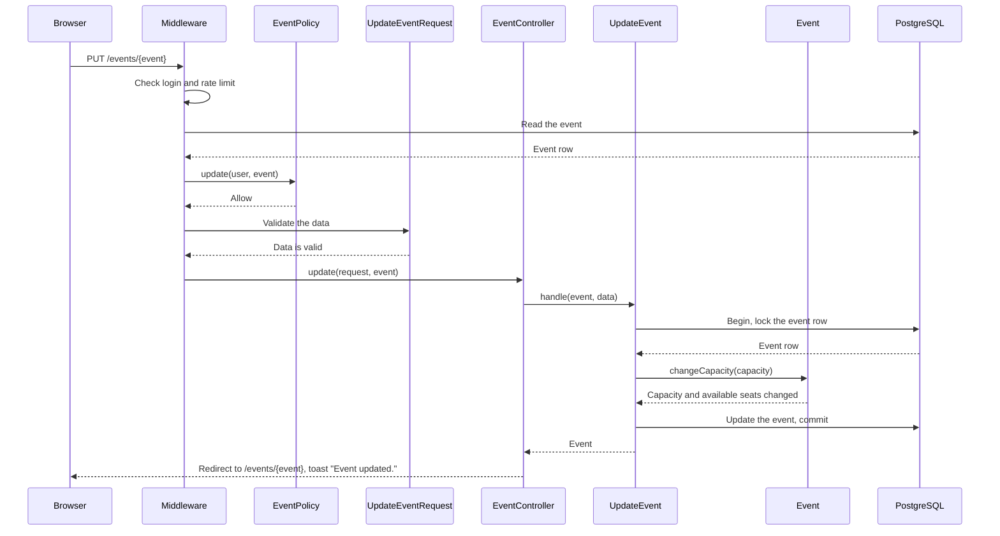
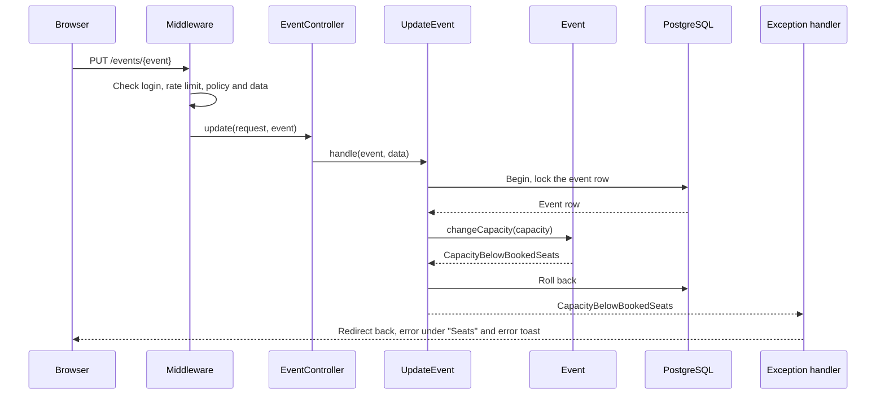
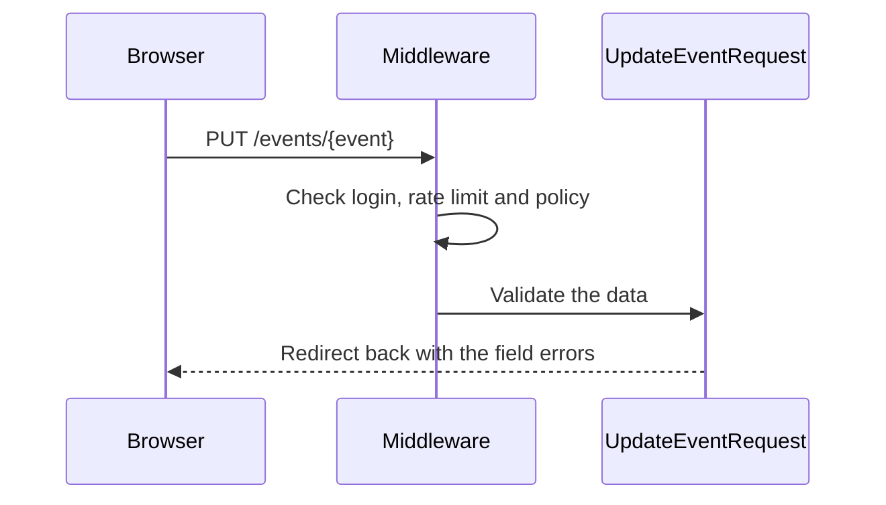
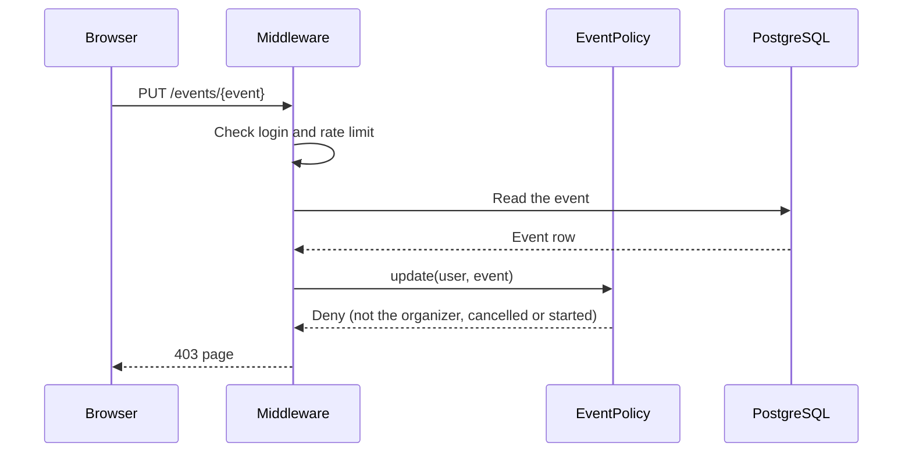
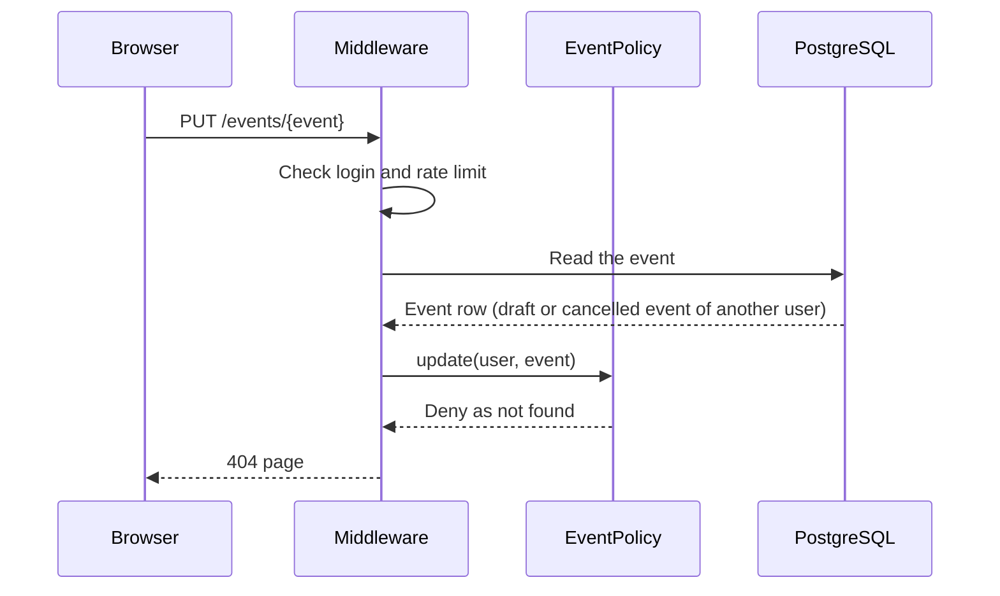
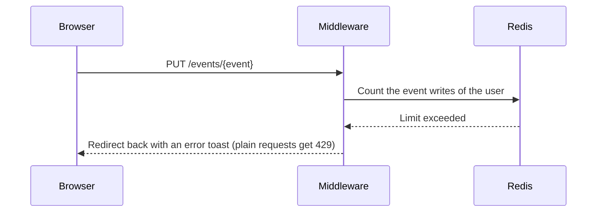

# M3 — UpdateEvent: the Edit Event Page

> **For agentic workers:** REQUIRED SUB-SKILL: Use superpowers:executing-plans to implement this plan task-by-task. Steps use checkbox (`- [ ]`) syntax for tracking.

**Goal:** The organizer can edit an event that is not cancelled and has not started, on
the page `/events/{event}/edit`. The new capacity must not be less than the booked seats.
Domain exceptions show as an error toast and, where one applies, as a field error.

**Architecture:** The routes `events.edit` and `events.update` check
`EventPolicy::update` with the `can` middleware. The policy gives 404 when the person
cannot see the event, and 403 for all other refusals. `UpdateEventRequest` validates the
form with the same rules as `StoreEventRequest`, from the trait
`App\Concerns\EventValidationRules`. The `UpdateEvent` Action locks the event row in a
transaction and calls `Event::changeCapacity()`, which throws
`CapacityBelowBookedSeats` when the new capacity is too low. A handler in
`bootstrap/app.php` turns each `App\Exceptions\Domain\DomainException` into a redirect
back with an error toast (and a field error), or into a 422 JSON response. The create
and edit pages share the component `EventForm`. The event page and the "My events" page
show an "Edit" link when the policy allows it.

**Tech Stack:** Laravel 13, Inertia 3, React 19, TypeScript, Wayfinder, Pest.

**Spec:** `docs/superpowers/specs/2026-09-28-event-booking-design.md` (sections 3, 4, 5,
6, 7 and 8), `docs/design/business-rules.md`.

## Global Constraints

- Rules in this PR: BR-E2 and BR-E3 (request), BR-E4, BR-E5 and BR-A3 (policy), BR-E6,
  BR-E7 and BR-E8 (model).
- `EventPolicy::update` returns a `Response`. A person who cannot see the event gets 404. Other refusals give 403.
- The edit routes have the `auth` middleware, not `verified`. `events.update` also has
  `throttle:event-writes`.
- The update form has the same fields and the same rules as the create form. The start
  time must be in the future also when the organizer does not change it.
- The status does not change. `published_at` does not change.
- All domain exceptions extend `App\Exceptions\Domain\DomainException`. A domain
  exception can name a form field. The handler then also sets the field error.
- A JSON request that causes a domain exception gets 422 with `{ "message": "..." }`.
- The controller calls one Action and contains no queries.
- The Action directory is `app/Actions/UpdateEvent/` with `UpdateEvent.php` and
  `README.md`. The README has one sequence diagram for each outcome and no `alt` blocks.
  It is in Simple English.
- The edit form shows the start time in the local time zone of the organizer. The first
  render is the same on the server and in the browser (no hydration error).
- Each test that covers a business rule starts with the ID of the rule.
- Run commands inside the `app` container: `docker compose exec app <command>`. The
  tests use the test database. Do not run `migrate:fresh` against the development
  database.

## Review Focus

1. **404 or 403.** Another user's draft gives 404 on the edit routes. Another user's
   published event gives 403. An admin gets 403 on another user's draft, because admins
   can see it.
2. **The capacity rule.** In M3 there are no bookings, so the booked seats are always 0.
   The tests set `seats_available` directly to check BR-E6 and BR-E7.
3. **The domain exception handler.** The field error and the toast show together. The
   other fields keep their values.
4. **The start time in the edit form.** The form shows the same local time as the event
   page, and the browser console shows no hydration error.
5. **The refactor of the create page.** The create page works as before.

---

### Task 1: Domain exceptions, the handler and `Event::changeCapacity()`

**Files:**

- Create: `app/Exceptions/Domain/DomainException.php`
- Create: `app/Exceptions/Domain/CapacityBelowBookedSeats.php`
- Modify: `bootstrap/app.php`
- Modify: `app/Models/Event.php`
- Test: `tests/Feature/EventModelTest.php`
- Test: `tests/Feature/DomainExceptionHandlerTest.php`

**Interfaces:**

- Produces:
    - `abstract class App\Exceptions\Domain\DomainException extends RuntimeException`
      with `field(): ?string` (default `null`).
    - `App\Exceptions\Domain\CapacityBelowBookedSeats` with the constructor
      `(int $seatsBooked)`, the message
      `The capacity cannot be less than the {n} booked seats.` and the field `capacity`.
    - `Event::changeCapacity(int $capacity): void`. It does not save the event.

- [ ] **Step 1: Write the failing tests**

Add `use App\Exceptions\Domain\CapacityBelowBookedSeats;` to
`tests/Feature/EventModelTest.php` and add these tests to the end of the file:

```php
test('BR-E7: a larger capacity adds the same number of available seats', function () {
    $event = Event::factory()->make(['capacity' => 50, 'seats_available' => 38]);

    $event->changeCapacity(60);

    expect($event->capacity)->toBe(60)
        ->and($event->seats_available)->toBe(48);
});

test('BR-E6: the capacity can decrease to the number of booked seats', function () {
    $event = Event::factory()->make(['capacity' => 50, 'seats_available' => 38]);

    $event->changeCapacity(12);

    expect($event->capacity)->toBe(12)
        ->and($event->seats_available)->toBe(0);
});

test('BR-E6: the capacity cannot be less than the booked seats', function () {
    $event = Event::factory()->make(['capacity' => 50, 'seats_available' => 38]);

    expect(fn () => $event->changeCapacity(11))
        ->toThrow(CapacityBelowBookedSeats::class, 'The capacity cannot be less than the 12 booked seats.');

    expect($event->capacity)->toBe(50)
        ->and($event->seats_available)->toBe(38);
});

test('BR-E8: the available seats stay from 0 to the capacity', function () {
    $event = Event::factory()->create(['capacity' => 50, 'seats_available' => 38]);

    $event->changeCapacity(12);
    $event->save();

    expect($event->fresh()->seats_available)->toBe(0);
});
```

Create the file with `php artisan make:test --pest DomainExceptionHandlerTest --no-interaction`,
then replace its content:

```php
<?php

use App\Exceptions\Domain\DomainException;
use Illuminate\Support\Facades\Route;

/**
 * A domain exception for the tests, with or without a form field.
 */
class TestDomainException extends DomainException
{
    public function __construct(private ?string $formField = null)
    {
        parent::__construct('The rule does not allow this.');
    }

    public function field(): ?string
    {
        return $this->formField;
    }
}

beforeEach(function () {
    Route::middleware('web')->post('/test/domain-exception', function () {
        throw new TestDomainException(request()->string('field')->toString() ?: null);
    });
});

test('an Inertia request goes back with an error toast', function () {
    $this->from('/test/form')
        ->withHeaders(['X-Inertia' => 'true'])
        ->post('/test/domain-exception')
        ->assertRedirect('/test/form')
        ->assertSessionHasNoErrors()
        ->assertInertiaFlash('toast', ['type' => 'error', 'message' => 'The rule does not allow this.']);
});

test('an Inertia request also gets the field error when the exception names a field', function () {
    $this->from('/test/form')
        ->withHeaders(['X-Inertia' => 'true'])
        ->post('/test/domain-exception', ['field' => 'capacity'])
        ->assertRedirect('/test/form')
        ->assertSessionHasErrors(['capacity' => 'The rule does not allow this.'])
        ->assertInertiaFlash('toast', ['type' => 'error', 'message' => 'The rule does not allow this.']);
});

test('a JSON request gets 422 with the message', function () {
    $this->postJson('/test/domain-exception')
        ->assertUnprocessable()
        ->assertExactJson(['message' => 'The rule does not allow this.']);
});
```

- [ ] **Step 2: Run the tests to make sure they fail**

Run: `docker compose exec app php artisan test --compact tests/Feature/EventModelTest.php tests/Feature/DomainExceptionHandlerTest.php`
Expected: FAIL. The classes `CapacityBelowBookedSeats` and `DomainException` do not
exist.

- [ ] **Step 3: Write the exceptions**

Create `app/Exceptions/Domain/DomainException.php`:

```php
<?php

namespace App\Exceptions\Domain;

use RuntimeException;

/**
 * A business rule does not allow the action. The message is for the user.
 */
abstract class DomainException extends RuntimeException
{
    /**
     * The form field that the error belongs to, if any.
     */
    public function field(): ?string
    {
        return null;
    }
}
```

Create `app/Exceptions/Domain/CapacityBelowBookedSeats.php`:

```php
<?php

namespace App\Exceptions\Domain;

/**
 * BR-E6: the new capacity is less than the booked seats.
 */
class CapacityBelowBookedSeats extends DomainException
{
    public function __construct(int $seatsBooked)
    {
        parent::__construct(__('The capacity cannot be less than the :count booked seats.', [
            'count' => $seatsBooked,
        ]));
    }

    /**
     * The error belongs to the capacity field.
     */
    public function field(): ?string
    {
        return 'capacity';
    }
}
```

- [ ] **Step 4: Write the handler**

In `bootstrap/app.php`, add the imports `App\Exceptions\Domain\DomainException` and
`Inertia\Inertia`, and add this to the `withExceptions` callback, after
`shouldRenderJsonWhen`:

```php
$exceptions->render(function (DomainException $exception, Request $request) {
    if ($request->expectsJson()) {
        return response()->json(['message' => $exception->getMessage()], 422);
    }

    Inertia::flash('toast', ['type' => 'error', 'message' => $exception->getMessage()]);

    $field = $exception->field();

    return $field === null
        ? back()
        : back()->withErrors([$field => $exception->getMessage()]);
});
```

An Inertia request does not expect JSON (its `Accept` header is `text/html`), so it
gets the redirect.

- [ ] **Step 5: Write the model method**

In `app/Models/Event.php`, add `use App\Exceptions\Domain\CapacityBelowBookedSeats;`
and add after `seatsBooked()`:

```php
/**
 * Change the capacity and the available seats by the same number (BR-E6, BR-E7, BR-E8).
 *
 * @throws CapacityBelowBookedSeats
 */
public function changeCapacity(int $capacity): void
{
    $seatsBooked = $this->seatsBooked();

    if ($capacity < $seatsBooked) {
        throw new CapacityBelowBookedSeats($seatsBooked);
    }

    $this->seats_available += $capacity - $this->capacity;
    $this->capacity = $capacity;
}
```

- [ ] **Step 6: Run the tests to make sure they pass**

Run: `docker compose exec app php artisan test --compact tests/Feature/EventModelTest.php tests/Feature/DomainExceptionHandlerTest.php`
Expected: PASS (11 tests in `EventModelTest.php`, 3 tests in
`DomainExceptionHandlerTest.php`).

Run: `docker compose exec app composer types:check`
Expected: no errors.

- [ ] **Step 7: Commit**

```bash
git add app/Exceptions/Domain app/Models/Event.php bootstrap/app.php \
  tests/Feature/EventModelTest.php tests/Feature/DomainExceptionHandlerTest.php
git commit -m "feat: show domain errors as toasts and limit capacity changes"
```

### Task 2: Policy response, shared rules and shared form

**Files:**

- Modify: `app/Policies/EventPolicy.php`
- Create: `app/Concerns/EventValidationRules.php`
- Modify: `app/Http/Requests/StoreEventRequest.php`
- Create: `resources/js/components/event-form.tsx`
- Modify: `resources/js/pages/events/create.tsx`
- Test: `tests/Feature/EventPolicyTest.php`

**Interfaces:**

- Produces:
    - `EventPolicy::update(User $user, Event $event): Response`.
    - Trait `App\Concerns\EventValidationRules` with `eventRules(): array` (protected)
      and `eventAttributes(): array` (public, same shape as before).
    - Component `EventForm` with the props `form` (a Wayfinder form definition),
      `defaults` (optional: `title`, `description`, `venue`, `starts_at` in ISO 8601,
      `capacity`) and `submitLabel`.

- [ ] **Step 1: Write the failing policy test**

Add these tests after the test `BR-A3: an admin can edit their own events` in
`tests/Feature/EventPolicyTest.php`:

```php
test('BR-E4: another user gets a 404 for a draft event that they cannot see', function () {
    $event = Event::factory()->for($this->organizer, 'organizer')->create();

    expect(Gate::forUser($this->otherUser)->inspect('update', $event)->status())->toBe(404);
});

test('BR-E4: another user gets a 403 for a published event', function () {
    $event = Event::factory()->published()->for($this->organizer, 'organizer')->create();

    $response = Gate::forUser($this->otherUser)->inspect('update', $event);

    expect($response->denied())->toBeTrue()
        ->and($response->status())->toBeNull();
});

test('BR-A3: an admin gets a 403 for the draft event of another user', function () {
    $event = Event::factory()->for($this->organizer, 'organizer')->create();

    $response = Gate::forUser($this->admin)->inspect('update', $event);

    expect($response->denied())->toBeTrue()
        ->and($response->status())->toBeNull();
});
```

A plain `Response::deny()` has no status, and Laravel renders it as 403.

- [ ] **Step 2: Run the test to make sure it fails**

Run: `docker compose exec app php artisan test --compact tests/Feature/EventPolicyTest.php`
Expected: FAIL. The 404 test gets no status.

- [ ] **Step 3: Change the policy**

In `app/Policies/EventPolicy.php`, replace the `update` method:

```php
/**
 * BR-E4, BR-E5 and BR-A3. A person who cannot see the event gets a 404, so that
 * hidden events stay unknown.
 */
public function update(User $user, Event $event): Response
{
    if ($this->view($user, $event)->denied()) {
        return Response::denyAsNotFound();
    }

    if ($event->isOrganizedBy($user) && ! $event->isCancelled() && ! $event->hasStarted()) {
        return Response::allow();
    }

    return Response::deny();
}
```

Run: `docker compose exec app php artisan test --compact tests/Feature/EventPolicyTest.php`
Expected: PASS. The old tests use `can()` and work with a `Response`.

- [ ] **Step 4: Move the rules into a trait**

Create `app/Concerns/EventValidationRules.php` with
`php artisan make:trait EventValidationRules --no-interaction` (the command puts traits in
`app/Concerns`), then replace its content:

```php
<?php

namespace App\Concerns;

use Carbon\CarbonImmutable;
use Illuminate\Contracts\Validation\ValidationRule;

trait EventValidationRules
{
    /**
     * Get the validation rules of an event: BR-E2 (capacity) and BR-E3 (start time in
     * the future).
     *
     * @return array<string, array<int, ValidationRule|array<mixed>|string>>
     */
    protected function eventRules(): array
    {
        return [
            'title' => ['required', 'string', 'max:255'],
            'description' => ['required', 'string', 'max:5000'],
            'venue' => ['required', 'string', 'max:255'],
            'starts_at' => ['required', 'date', 'after:now'],
            'capacity' => ['required', 'integer', 'min:1', 'max:10000'],
        ];
    }

    /**
     * Get the validated attributes of the event with their types.
     *
     * @return array{title: string, description: string, venue: string, starts_at: CarbonImmutable, capacity: int}
     */
    public function eventAttributes(): array
    {
        return [
            'title' => $this->string('title')->toString(),
            'description' => $this->string('description')->toString(),
            'venue' => $this->string('venue')->toString(),
            'starts_at' => CarbonImmutable::parse($this->string('starts_at')->toString()),
            'capacity' => $this->integer('capacity'),
        ];
    }
}
```

PHPStan knows `$this->string()` in the trait from the classes that use it, so the
trait needs no extra PHPDoc.

Replace the content of `app/Http/Requests/StoreEventRequest.php`:

```php
<?php

namespace App\Http\Requests;

use App\Concerns\EventValidationRules;
use Illuminate\Contracts\Validation\ValidationRule;
use Illuminate\Foundation\Http\FormRequest;

class StoreEventRequest extends FormRequest
{
    use EventValidationRules;

    /**
     * Any logged-in user can create an event (BR-E1). The route has the auth middleware.
     */
    public function authorize(): bool
    {
        return true;
    }

    /**
     * Get the validation rules that apply to the request.
     *
     * @return array<string, ValidationRule|array<mixed>|string>
     */
    public function rules(): array
    {
        return $this->eventRules();
    }
}
```

Run: `docker compose exec app php artisan test --compact tests/Feature/CreateEventTest.php`
Expected: PASS (15 tests, no change).

- [ ] **Step 5: Move the fields into a shared form**

Create `resources/js/components/event-form.tsx`:

```tsx
import { Form } from '@inertiajs/react';
import { useEffect, useRef } from 'react';
import InputError from '@/components/input-error';
import { Button } from '@/components/ui/button';
import { Input } from '@/components/ui/input';
import { Label } from '@/components/ui/label';
import { Textarea } from '@/components/ui/textarea';
import type { RouteFormDefinition } from '@/wayfinder';

export type EventFormDefaults = {
    title: string;
    description: string;
    venue: string;
    starts_at: string;
    capacity: number;
};

/**
 * The input `datetime-local` gives a local time with no time zone. The browser knows
 * the time zone of the organizer, so it converts the value to UTC here.
 */
function toUtc(localDateTime: string): string {
    if (localDateTime === '') {
        return localDateTime;
    }

    return new Date(localDateTime).toISOString();
}

/**
 * Converts an ISO 8601 time to the value of a `datetime-local` input, in the time zone
 * of the browser.
 */
function toLocalInputValue(isoDateTime: string): string {
    const date = new Date(isoDateTime);
    const pad = (value: number) => String(value).padStart(2, '0');

    return `${date.getFullYear()}-${pad(date.getMonth() + 1)}-${pad(date.getDate())}T${pad(date.getHours())}:${pad(date.getMinutes())}`;
}

export function EventForm({
    form,
    defaults,
    submitLabel,
}: {
    form: RouteFormDefinition<'post'>;
    defaults?: EventFormDefaults;
    submitLabel: string;
}) {
    const startsAtInput = useRef<HTMLInputElement>(null);
    const defaultStartsAt = defaults?.starts_at;

    /**
     * The server renders the page in UTC, so the start time input is empty on the first
     * render. After the page loads in the browser, the input gets the local time.
     */
    useEffect(() => {
        if (defaultStartsAt && startsAtInput.current) {
            startsAtInput.current.value = toLocalInputValue(defaultStartsAt);
        }
    }, [defaultStartsAt]);

    return (
        <Form
            {...form}
            transform={(data) => ({
                ...data,
                starts_at: toUtc(String(data.starts_at ?? '')),
            })}
            className="space-y-6"
        >
            {({ processing, errors }) => (
                <>
                    <div className="grid gap-2">
                        <Label htmlFor="title">Title</Label>
                        <Input
                            id="title"
                            name="title"
                            required
                            maxLength={255}
                            defaultValue={defaults?.title}
                        />
                        <InputError message={errors.title} />
                    </div>

                    <div className="grid gap-2">
                        <Label htmlFor="description">Description</Label>
                        <Textarea
                            id="description"
                            name="description"
                            required
                            maxLength={5000}
                            rows={6}
                            defaultValue={defaults?.description}
                        />
                        <InputError message={errors.description} />
                    </div>

                    <div className="grid gap-2">
                        <Label htmlFor="venue">Venue</Label>
                        <Input
                            id="venue"
                            name="venue"
                            required
                            maxLength={255}
                            defaultValue={defaults?.venue}
                        />
                        <InputError message={errors.venue} />
                    </div>

                    <div className="grid gap-2">
                        <Label htmlFor="starts_at">
                            Starts at (your local time)
                        </Label>
                        <Input
                            ref={startsAtInput}
                            id="starts_at"
                            name="starts_at"
                            type="datetime-local"
                            required
                        />
                        <InputError message={errors.starts_at} />
                    </div>

                    <div className="grid gap-2">
                        <Label htmlFor="capacity">Seats</Label>
                        <Input
                            id="capacity"
                            name="capacity"
                            type="number"
                            required
                            min={1}
                            max={10000}
                            defaultValue={defaults?.capacity}
                        />
                        <InputError message={errors.capacity} />
                    </div>

                    <Button type="submit" disabled={processing}>
                        {submitLabel}
                    </Button>
                </>
            )}
        </Form>
    );
}
```

Replace the content of `resources/js/pages/events/create.tsx`:

```tsx
import { Head, setLayoutProps } from '@inertiajs/react';
import { EventForm } from '@/components/event-form';
import { create, store } from '@/routes/events';
import type { BreadcrumbItem } from '@/types';

export default function CreateEvent() {
    setLayoutProps<{ breadcrumbs: BreadcrumbItem[] }>({
        breadcrumbs: [{ title: 'Create event', href: create() }],
    });

    return (
        <>
            <Head title="Create event" />
            <div className="flex flex-1 flex-col gap-6 p-4 md:max-w-3xl">
                <h1 className="text-2xl font-semibold">Create event</h1>
                <EventForm form={store.form()} submitLabel="Create event" />
            </div>
        </>
    );
}
```

- [ ] **Step 6: Check**

Run: `npm run types:check`, `npm run check:fix` and `docker compose exec app composer types:check`
Expected: no errors.

Run: `docker compose exec app php artisan test --compact tests/Feature/CreateEventTest.php tests/Feature/EventPolicyTest.php`
Expected: PASS.

The reviewer checks in the browser that the create page works as before.

- [ ] **Step 7: Commit**

```bash
git add app/Policies/EventPolicy.php app/Concerns/EventValidationRules.php \
  app/Http/Requests/StoreEventRequest.php resources/js/components/event-form.tsx \
  resources/js/pages/events/create.tsx tests/Feature/EventPolicyTest.php
git commit -m "refactor: share the event rules and form, and hide events in the update policy"
```

### Task 3: Request, Action, routes and edit page

**Files:**

- Create: `app/Http/Requests/UpdateEventRequest.php`
- Create: `app/Actions/UpdateEvent/UpdateEvent.php`
- Modify: `app/Http/Controllers/EventController.php`
- Modify: `routes/web.php`
- Create: `resources/js/pages/events/edit.tsx`
- Test: `tests/Feature/UpdateEventTest.php`
- Test: `tests/Feature/EventWritesRateLimitTest.php`

**Interfaces:**

- Consumes: `EventValidationRules`, `EventForm`, `Event::changeCapacity()`,
  `GetEvent::handle()`.
- Produces:
    - Route `events.edit`: `GET /events/{event}/edit`. Route `events.update`:
      `PUT /events/{event}`. Wayfinder functions `edit` and `update` in
      `@/routes/events`.
    - `UpdateEvent::handle(Event $event, array $attributes): Event`. `$attributes` has
      the shape of `eventAttributes()`.
    - Inertia page `events/edit` with the prop `event` of type `EventDetails`.
    - Flash data `toast` with `type` `success` and `message` `Event updated.`.

- [ ] **Step 1: Write the failing tests**

Create the file with `php artisan make:test --pest UpdateEventTest --no-interaction`,
then replace its content:

```php
<?php

use App\Enums\EventStatus;
use App\Models\Event;
use App\Models\User;
use Inertia\Testing\AssertableInertia as Assert;

beforeEach(function () {
    $this->organizer = User::factory()->create();
    $this->otherUser = User::factory()->create();

    $this->event = Event::factory()->published()->for($this->organizer, 'organizer')->create([
        'title' => 'Old title',
        'capacity' => 50,
        'seats_available' => 50,
    ]);

    $this->validData = [
        'title' => 'Laravel Meetup',
        'description' => "Talks and pizza.\nBring a laptop.",
        'venue' => 'Main Hall',
        'starts_at' => '2030-05-01T18:30:00.000Z',
        'capacity' => 60,
    ];
});

test('the organizer can open the edit page', function () {
    $this->actingAs($this->organizer)
        ->get(route('events.edit', $this->event))
        ->assertOk()
        ->assertInertia(fn (Assert $page) => $page
            ->component('events/edit')
            ->where('event.id', $this->event->id)
            ->where('event.title', 'Old title')
        );
});

test('a visitor is sent to the login page', function () {
    $this->get(route('events.edit', $this->event))->assertRedirect(route('login'));
    $this->put(route('events.update', $this->event), $this->validData)->assertRedirect(route('login'));
});

test('BR-E4: the organizer updates the event', function () {
    $this->actingAs($this->organizer)
        ->put(route('events.update', $this->event), $this->validData)
        ->assertRedirect(route('events.show', $this->event))
        ->assertInertiaFlash('toast', ['type' => 'success', 'message' => 'Event updated.']);

    $event = $this->event->fresh();

    expect($event->title)->toBe('Laravel Meetup')
        ->and($event->description)->toBe("Talks and pizza.\nBring a laptop.")
        ->and($event->venue)->toBe('Main Hall')
        ->and($event->starts_at->utc()->toIso8601String())->toBe('2030-05-01T18:30:00+00:00')
        ->and($event->capacity)->toBe(60)
        ->and($event->seats_available)->toBe(60)
        ->and($event->status)->toBe(EventStatus::Published);
});

test('BR-E4: another user gets a 403 for a published event', function () {
    $this->actingAs($this->otherUser)->get(route('events.edit', $this->event))->assertForbidden();
    $this->actingAs($this->otherUser)->put(route('events.update', $this->event), $this->validData)->assertForbidden();

    expect($this->event->fresh()->title)->toBe('Old title');
});

test('BR-E4: another user gets a 404 for a draft event', function () {
    $draft = Event::factory()->for($this->organizer, 'organizer')->create();

    $this->actingAs($this->otherUser)->get(route('events.edit', $draft))->assertNotFound();
    $this->actingAs($this->otherUser)->put(route('events.update', $draft), $this->validData)->assertNotFound();
});

test('BR-A3: an admin gets a 403 for the event of another user', function () {
    $admin = User::factory()->admin()->create();

    $this->actingAs($admin)->get(route('events.edit', $this->event))->assertForbidden();
    $this->actingAs($admin)->put(route('events.update', $this->event), $this->validData)->assertForbidden();
});

test('BR-E5: nobody can edit a cancelled event', function () {
    $event = Event::factory()->cancelled()->for($this->organizer, 'organizer')->create();

    $this->actingAs($this->organizer)->get(route('events.edit', $event))->assertForbidden();
    $this->actingAs($this->organizer)->put(route('events.update', $event), $this->validData)->assertForbidden();
});

test('BR-E5: nobody can edit a started event', function () {
    $event = Event::factory()->published()->started()->for($this->organizer, 'organizer')->create();

    $this->actingAs($this->organizer)->get(route('events.edit', $event))->assertForbidden();
    $this->actingAs($this->organizer)->put(route('events.update', $event), $this->validData)->assertForbidden();
});

test('BR-E3: the start time must be in the future', function () {
    $this->actingAs($this->organizer)
        ->put(route('events.update', $this->event), [
            ...$this->validData,
            'starts_at' => now()->subMinute()->toIso8601String(),
        ])
        ->assertSessionHasErrors('starts_at');

    expect($this->event->fresh()->title)->toBe('Old title');
});

test('BR-E2: the capacity must be 1 or more', function () {
    $this->actingAs($this->organizer)
        ->put(route('events.update', $this->event), [...$this->validData, 'capacity' => 0])
        ->assertSessionHasErrors('capacity');
});

test('BR-E7: a larger capacity adds available seats', function () {
    $this->event->forceFill(['seats_available' => 38])->save();

    $this->actingAs($this->organizer)
        ->put(route('events.update', $this->event), [...$this->validData, 'capacity' => 60]);

    expect($this->event->fresh()->seats_available)->toBe(48);
});

test('BR-E6: the capacity cannot be less than the booked seats', function () {
    $this->event->forceFill(['seats_available' => 38])->save();

    $this->actingAs($this->organizer)
        ->from(route('events.edit', $this->event))
        ->withHeaders(['X-Inertia' => 'true'])
        ->put(route('events.update', $this->event), [...$this->validData, 'capacity' => 11])
        ->assertRedirect(route('events.edit', $this->event))
        ->assertSessionHasErrors(['capacity' => 'The capacity cannot be less than the 12 booked seats.'])
        ->assertInertiaFlash('toast', [
            'type' => 'error',
            'message' => 'The capacity cannot be less than the 12 booked seats.',
        ]);

    $event = $this->event->fresh();

    expect($event->title)->toBe('Old title')
        ->and($event->capacity)->toBe(50)
        ->and($event->seats_available)->toBe(38);
});
```

Add this test to `tests/Feature/EventWritesRateLimitTest.php`:

```php
test('the update route uses the same limit', function () {
    $event = Event::factory()->for($this->user, 'organizer')->create();

    $this->actingAs($this->user)
        ->put(route('events.update', $event), $this->validData)
        ->assertTooManyRequests();
});
```

- [ ] **Step 2: Run the tests to make sure they fail**

Run: `docker compose exec app php artisan test --compact tests/Feature/UpdateEventTest.php`
Expected: FAIL. The route `events.edit` is not defined.

- [ ] **Step 3: Write the form request**

Run: `docker compose exec app php artisan make:request UpdateEventRequest --no-interaction`,
then replace its content:

```php
<?php

namespace App\Http\Requests;

use App\Concerns\EventValidationRules;
use Illuminate\Contracts\Validation\ValidationRule;
use Illuminate\Foundation\Http\FormRequest;

class UpdateEventRequest extends FormRequest
{
    use EventValidationRules;

    /**
     * The route checks the update ability of the event policy (BR-E4, BR-E5, BR-A3).
     */
    public function authorize(): bool
    {
        return true;
    }

    /**
     * Get the validation rules that apply to the request.
     *
     * @return array<string, ValidationRule|array<mixed>|string>
     */
    public function rules(): array
    {
        return $this->eventRules();
    }
}
```

- [ ] **Step 4: Write the Action**

Run: `docker compose exec app php artisan make:class Actions/UpdateEvent/UpdateEvent --no-interaction`,
then replace its content:

```php
<?php

namespace App\Actions\UpdateEvent;

use App\Exceptions\Domain\CapacityBelowBookedSeats;
use App\Models\Event;
use Carbon\CarbonImmutable;
use Illuminate\Support\Facades\DB;

class UpdateEvent
{
    /**
     * Update the event. The row lock keeps the capacity correct when bookings change the
     * available seats at the same time.
     *
     * @param  array{title: string, description: string, venue: string, starts_at: CarbonImmutable, capacity: int}  $attributes
     *
     * @throws CapacityBelowBookedSeats
     */
    public function handle(Event $event, array $attributes): Event
    {
        return DB::transaction(function () use ($event, $attributes): Event {
            $event = Event::query()->lockForUpdate()->findOrFail($event->id);

            $event->title = $attributes['title'];
            $event->description = $attributes['description'];
            $event->venue = $attributes['venue'];
            $event->starts_at = $attributes['starts_at'];
            $event->changeCapacity($attributes['capacity']);
            $event->save();

            return $event;
        });
    }
}
```

- [ ] **Step 5: Write the controller methods and the routes**

In `app/Http/Controllers/EventController.php`, add the imports
`App\Actions\UpdateEvent\UpdateEvent` and `App\Http\Requests\UpdateEventRequest`, and
add these methods after `show`:

```php
/**
 * Show the form to edit an event.
 */
public function edit(Event $event, GetEvent $getEvent): Response
{
    return Inertia::render('events/edit', [
        'event' => $getEvent->handle($event),
    ]);
}

/**
 * Update the event and show its page.
 */
public function update(UpdateEventRequest $request, Event $event, UpdateEvent $updateEvent): RedirectResponse
{
    $updateEvent->handle($event, $request->eventAttributes());

    Inertia::flash('toast', ['type' => 'success', 'message' => __('Event updated.')]);

    return to_route('events.show', $event);
}
```

In `routes/web.php`, add these routes to the `auth` group, after the `events.store`
route:

```php
Route::get('events/{event}/edit', [EventController::class, 'edit'])
    ->whereNumber('event')
    ->name('events.edit')
    ->can('update', 'event');
Route::put('events/{event}', [EventController::class, 'update'])
    ->whereNumber('event')
    ->middleware('throttle:event-writes')
    ->name('events.update')
    ->can('update', 'event');
```

The `auth` middleware runs before the `can` middleware, so a visitor goes to the login
page and does not get 404 or 403.

- [ ] **Step 6: Write the page**

Create `resources/js/pages/events/edit.tsx`:

```tsx
import { Head, setLayoutProps } from '@inertiajs/react';
import { EventForm } from '@/components/event-form';
import { edit, show, update } from '@/routes/events';
import type { BreadcrumbItem, EventDetails } from '@/types';

export default function EditEvent({ event }: { event: EventDetails }) {
    setLayoutProps<{ breadcrumbs: BreadcrumbItem[] }>({
        breadcrumbs: [
            { title: event.title, href: show(event.id) },
            { title: 'Edit', href: edit(event.id) },
        ],
    });

    return (
        <>
            <Head title={`Edit ${event.title}`} />
            <div className="flex flex-1 flex-col gap-6 p-4 md:max-w-3xl">
                <h1 className="text-2xl font-semibold">Edit event</h1>
                <EventForm
                    form={update.form(event.id)}
                    defaults={event}
                    submitLabel="Save changes"
                />
            </div>
        </>
    );
}
```

`EventDetails` has all the fields of `EventFormDefaults`, so the page passes the event
as the defaults.

- [ ] **Step 7: Run the tests to make sure they pass**

Run: `docker compose exec app php artisan test --compact tests/Feature/UpdateEventTest.php tests/Feature/EventWritesRateLimitTest.php`
Expected: PASS (12 tests in `UpdateEventTest.php`, 4 tests in
`EventWritesRateLimitTest.php`).

- [ ] **Step 8: Check the types and the page**

Run: `docker compose exec app php artisan wayfinder:generate --with-form`
Run: `npm run types:check`, `npm run check:fix` and `docker compose exec app composer types:check`
Expected: no errors.

The reviewer checks in the browser at `http://localhost:8080/events/<id>/edit` (an
event of `organizer@example.com` that has not started):

- the form shows the current values, and the start time is the same local time as on
  the event page;
- the browser console shows no hydration error;
- a save opens the event page with the new values and the toast "Event updated.";
- a start time in the past shows the error under the field.

- [ ] **Step 9: Commit**

```bash
git add app/Http/Requests/UpdateEventRequest.php app/Actions/UpdateEvent/UpdateEvent.php \
  app/Http/Controllers/EventController.php routes/web.php resources/js/pages/events/edit.tsx \
  tests/Feature/UpdateEventTest.php tests/Feature/EventWritesRateLimitTest.php
git commit -m "feat: let organizers edit their events"
```

### Task 4: "Edit" links on the event page and on "My events"

**Files:**

- Modify: `app/Http/Controllers/EventController.php`
- Modify: `app/Actions/GetOrganizerEvents/GetOrganizerEvents.php`
- Modify: `resources/js/types/event.ts`
- Modify: `resources/js/pages/events/show.tsx`
- Modify: `resources/js/pages/organizer/events/index.tsx`
- Test: `tests/Feature/GetEventTest.php`
- Test: `tests/Feature/GetOrganizerEventsTest.php`

**Interfaces:**

- Produces:
    - Prop `can` on the page `events/show`: `{ update: boolean }`.
    - Key `can_update` (bool) in each row of `GetOrganizerEvents`.

- [ ] **Step 1: Write the failing tests**

Add these tests to the end of `tests/Feature/GetEventTest.php`:

```php
test('BR-E4: the organizer sees the edit link', function () {
    $event = Event::factory()->published()->for($this->organizer, 'organizer')->create();

    $this->actingAs($this->organizer)
        ->get(route('events.show', $event))
        ->assertInertia(fn (Assert $page) => $page->where('can.update', true));
});

test('BR-E4: other users and visitors do not see the edit link', function () {
    $event = Event::factory()->published()->for($this->organizer, 'organizer')->create();

    $this->actingAs($this->otherUser)
        ->get(route('events.show', $event))
        ->assertInertia(fn (Assert $page) => $page->where('can.update', false));

    auth()->logout();

    $this->get(route('events.show', $event))
        ->assertInertia(fn (Assert $page) => $page->where('can.update', false));
});

test('BR-E5: the organizer does not see the edit link on a started event', function () {
    $event = Event::factory()->published()->started()->for($this->organizer, 'organizer')->create();

    $this->actingAs($this->organizer)
        ->get(route('events.show', $event))
        ->assertInertia(fn (Assert $page) => $page->where('can.update', false));
});
```

In `tests/Feature/GetOrganizerEventsTest.php`, add `'can_update' => true,` after
`'seats_booked' => 12,` in the test `the organizer sees the data of each event`, and add
this test:

```php
test('BR-E5: the rows of cancelled and started events have no edit link', function () {
    eventOf($this->organizer, 'Upcoming', now()->addDay(), 'published');
    eventOf($this->organizer, 'Cancelled', now()->addDay(), 'cancelled');
    eventOf($this->organizer, 'Started', now()->subDay(), 'published');

    $this->actingAs($this->organizer)
        ->get(route('organizer.events.index'))
        ->assertInertia(fn (Assert $page) => $page
            ->where('upcoming', fn ($rows) => collect($rows)->pluck('can_update', 'title')->all()
                === ['Upcoming' => true, 'Cancelled' => false])
            ->where('past', fn ($rows) => collect($rows)->pluck('can_update', 'title')->all()
                === ['Started' => false])
        );
});
```

- [ ] **Step 2: Run the tests to make sure they fail**

Run: `docker compose exec app php artisan test --compact tests/Feature/GetEventTest.php tests/Feature/GetOrganizerEventsTest.php`
Expected: FAIL. The prop `can` and the key `can_update` do not exist.

- [ ] **Step 3: Pass the policy result to the event page**

In `app/Http/Controllers/EventController.php`, add `use Illuminate\Http\Request;` and
change `show`:

```php
/**
 * Show the page of one event.
 */
public function show(Request $request, Event $event, GetEvent $getEvent): Response
{
    return Inertia::render('events/show', [
        'event' => $getEvent->handle($event),
        'can' => [
            'update' => $request->user()?->can('update', $event) ?? false,
        ],
    ]);
}
```

- [ ] **Step 4: Add `can_update` to the rows**

In `app/Actions/GetOrganizerEvents/GetOrganizerEvents.php`:

- Pass the organizer to `row()`. Replace `$this->row(...)` with
  `fn (Event $event): array => $this->row($event, $organizer)` in both places.
- Change the signature to `private function row(Event $event, User $organizer): array`.
- Add `'can_update' => $organizer->can('update', $event),` after `seats_booked`.
- Add `can_update: bool` to the row shape in the PHPDoc of `handle()` and `row()`.
- Add `organizer_id` to the selected columns. The policy calls `isOrganizedBy()`, so
  without this column `can_update` is always false.

The organizer is always the user, so the policy only checks the status and the start
time. It runs no query.

- [ ] **Step 5: Show the links**

In `resources/js/types/event.ts`, add `can_update: boolean;` to `OrganizerEventRow`.

In `resources/js/pages/events/show.tsx`:

- Import `Link` from `@inertiajs/react`, `Pencil` from `lucide-react`, `Button` from
  `@/components/ui/button` and `edit` from `@/routes/events`.
- Change the props to
  `{ event, can }: { event: EventDetails; can: { update: boolean } }`.
- Add the button at the end of the title row (the `div` with the `h1` and the badges):

```tsx
{
    can.update && (
        <Button asChild variant="outline" size="sm" className="ml-auto">
            <Link href={edit(event.id)}>
                <Pencil />
                Edit
            </Link>
        </Button>
    );
}
```

In `resources/js/pages/organizer/events/index.tsx`, import `edit` from
`@/routes/events`, add an empty header cell
`<th className="px-3 py-2"><span className="sr-only">Actions</span></th>` after
"Seats booked", and add this cell at the end of each row:

```tsx
<td className="px-3 py-2 text-right">
    {event.can_update && (
        <Link
            href={edit(event.id)}
            className="font-medium underline-offset-4 hover:underline"
        >
            Edit
        </Link>
    )}
</td>
```

- [ ] **Step 6: Run the tests and the checks**

Run: `docker compose exec app php artisan test --compact tests/Feature/GetEventTest.php tests/Feature/GetOrganizerEventsTest.php`
Expected: PASS (13 tests in `GetEventTest.php`, 6 tests in
`GetOrganizerEventsTest.php`).

Run: `npm run types:check`, `npm run check:fix` and `docker compose exec app composer types:check`
Expected: no errors.

The reviewer checks in the browser: the organizer sees "Edit" on the page of an
upcoming event and in the "Upcoming" rows that are not cancelled. Other users and
visitors do not see it.

- [ ] **Step 7: Commit**

```bash
git add app/Http/Controllers/EventController.php \
  app/Actions/GetOrganizerEvents/GetOrganizerEvents.php resources/js/types/event.ts \
  resources/js/pages/events/show.tsx resources/js/pages/organizer/events/index.tsx \
  tests/Feature/GetEventTest.php tests/Feature/GetOrganizerEventsTest.php
git commit -m "feat: show edit links to the organizer"
```

### Task 5: README, checks and handoff

**Files:**

- Create: `app/Actions/UpdateEvent/README.md`
- Modify: `app/Actions/GetOrganizerEvents/README.md`
- Modify: `HANDOFF.md`

- [ ] **Step 1: Write the README**

Create `app/Actions/UpdateEvent/README.md`:

````markdown
# UpdateEvent

Updates an event (`PUT /events/{event}`). The edit page is `GET /events/{event}/edit`.

Before the controller runs:

- The `auth` middleware sends visitors to the login page.
- The `event-writes` rate limiter allows 20 event writes each minute for each user.
- The `update` ability of `EventPolicy` checks the person and the event. Only the
  organizer can edit the event (BR-E4, BR-A3), and only when the event is not cancelled
  and has not started (BR-E5). A person who cannot see the event gets 404, so that
  hidden events stay unknown. Other refusals give 403.
- `UpdateEventRequest` validates the data with the same rules as the create form:
  the capacity is from 1 to 10,000 (BR-E2) and the start time is in the future (BR-E3).

The Action locks the event row in a transaction. `Event::changeCapacity()` changes the
available seats by the same number as the capacity (BR-E7, BR-E8). The new capacity
must not be less than the booked seats (BR-E6). Otherwise the model throws
`CapacityBelowBookedSeats`, and the transaction rolls back. The status of the event
does not change.

The handler in `bootstrap/app.php` turns each domain exception into a redirect back,
with an error toast and an error under the field. A JSON request gets 422 with the
message.

## The event is updated



## The capacity is less than the booked seats



## The data is not valid



## The person cannot edit the event



## The person cannot see the event



## The user made too many event writes


````

Render each diagram locally to check it:
`npx -y @mermaid-js/mermaid-cli -i app/Actions/UpdateEvent/README.md -o <scratch-dir>/update-event.md`
Expected: six SVG files and no errors.

In `app/Actions/GetOrganizerEvents/README.md`, add these sentences to the paragraph
about the booked seats: "Each row also tells if the user can edit the event
(`EventPolicy::update`), so that the page shows an "Edit" link. The policy reads the
organizer of the event, so the query also selects `organizer_id`."

- [ ] **Step 2: Format and run all checks**

Run: `docker compose exec app vendor/bin/pint --format agent`
Run: `npm run check:fix`
Run: `docker compose exec app composer ci:check`
Expected: Pint, PHPStan, `vp check`, `tsc` and all tests pass.

- [ ] **Step 3: Update `HANDOFF.md`**

"Where we are": PRs 1 to 4 are merged. The current PR is M3 PR 5
(`feat/update-event`), with the path of this plan. Add the decisions: the update policy
gives 404 for hidden events and 403 otherwise; the domain exception handler (toast, and
a field error from `field()`; 422 for JSON); `EventValidationRules` and `EventForm` are
shared by create and edit; the start time input gets the local time after the page
loads; the "Edit" links use the policy. Remove the next step about the
`EventValidationRules` trait.
"Next steps": the owner reviews this PR, then PR 6 (`PublishEvent`).

- [ ] **Step 4: Commit**

```bash
git add app/Actions/UpdateEvent/README.md app/Actions/GetOrganizerEvents/README.md \
  HANDOFF.md docs/superpowers/plans/2026-10-07-m3-update-event.md
git commit -m "docs: document UpdateEvent and update handoff"
```
